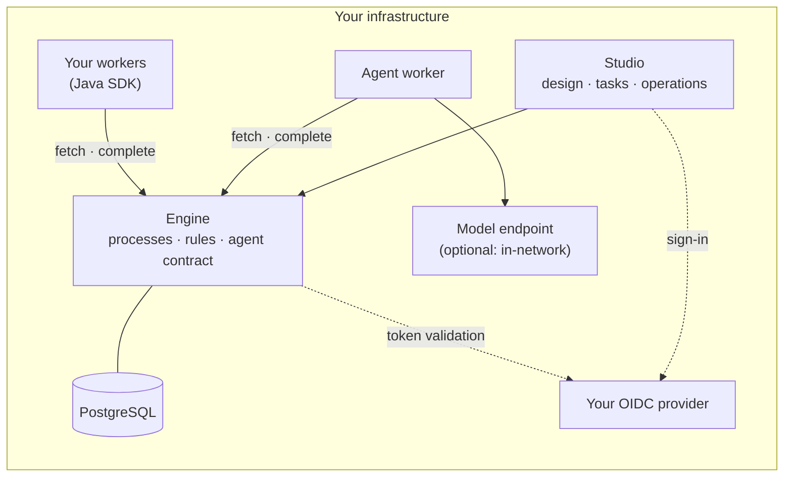

# Abada

**Governed AI-driven business processes, on infrastructure you control.**

[](LICENSE)
[](https://github.com/bashizip/abada-platform/releases)

Abada is an open-source runtime for business processes in which AI agents, deterministic
rules and people work together. It runs on your servers with PostgreSQL as its only
database, signs users in through your OIDC provider and calls only the model endpoint you
configure. The engine — not the model, the worker or the UI — decides what an AI answer
is allowed to change.

**Agents advise. Rules decide. Humans approve. PostgreSQL remembers.**

- **Sovereign.** No vendor cloud, no licence server, telemetry off by default. Models can
  run inside your network.
- **Open.** AGPL-3.0, with no enterprise edition. The worker SDK is Apache-2.0.
- **Governed.** Model output is validated by the engine against a declared schema and
  confidence threshold; invalid or low-confidence answers go to a person. Rules are
  sandboxed CEL.
- **Evidenced.** Every model call leaves an auditable record, and each release candidate
  passes a recorded gate, including an end-to-end test you can rerun.

Website: [abadaplatform.com](https://abadaplatform.com) · Documentation:
[docs.abadaplatform.com](https://docs.abadaplatform.com)

---

## Quick start

Docker is the only prerequisite.

```bash
curl -fsSL https://install.abadaplatform.com/install.sh | bash
```

The installer pulls the published images and starts Studio, the engine, the agent worker
and PostgreSQL, then prints the local URLs and development accounts. A Gemini key is
optional at install time; you can add a model provider later in Studio.

From a clone of this repository:

```bash
git clone https://github.com/bashizip/abada-platform.git
cd abada-platform
./release/abada-platform doctor dev
./release/abada-platform up dev
```

Add `--telemetry` to start the bundled Grafana, Prometheus, Jaeger and Loki stack. See
[`release/README.md`](release/README.md) for production deployment.

---

## A process in APL

Processes are written in **APL**, the Abada Process Language: YAML that you can review,
diff and keep in your own repository.

```yaml
version: abada.io/v1
metadata:
  key: lead_triage
  name: Lead Triage
flow:
  entry: receive-lead
  nodes:
    - id: receive-lead
      type: webhook
      next: classify

    - id: classify
      type: agent
      model: gemini-3.6-flash
      prompt: |
        Company size: ${lead.companySize}.
        Classify the lead priority as HIGH, MEDIUM or LOW.
      result_variable: lead_priority
      output_schema:
        type: object
        required: [priority]
        properties:
          priority: { enum: [HIGH, MEDIUM, LOW] }
      confidence_threshold: 85
      on_low_confidence: sales-review    # weak answers go to a person
      on_invalid_output: sales-review    # so do malformed ones
      next: route

    - id: route
      type: condition
      rules:
        - if: "${lead_priority.priority == 'HIGH'}"
          then: sales-review
        - else: crm
          then: crm

    - id: sales-review
      type: human-input
      description: Review the lead
      assignees: [sales-director]
      next: end

    - id: crm
      type: engine-task
      service: crm.sync
      next: end

    - id: end
      type: end
```

The model receives only the inputs the prompt declares. Its answer changes nothing until
the engine has checked it against `output_schema` and `confidence_threshold`; a failing
answer is routed to `sales-review` instead of the CRM. The whole run — state, tasks,
history and every model attempt — is committed to PostgreSQL and survives a restart.

A fuller version is in [`examples/apl/lead-triage-demo.apl.yaml`](examples/apl/lead-triage-demo.apl.yaml).
Every node type is described in the [APL node reference](docs/reference/apl-node-reference.md).

---

## Architecture



| Component | Role |
| --- | --- |
| **Engine** (`engine/`) | Java 21 / Spring Boot. Executes APL and imported BPMN; owns process, task, timer, job and variable state in PostgreSQL; validates agent output; REST API v1. |
| **Studio** (`studio/`) | React operator UI: visual and YAML authoring, dry runs, tasks, instance inspection, reviewed improvement proposals. |
| **Agent worker** (`agent-worker/`) | Calls the model outside the database transaction and reports the result back through the engine's worker protocol, with durable leases and lock heartbeats. |
| **Worker SDK** (`sdk/java/`) | Java client for building your own external workers (Apache-2.0). |

A model call never runs inside a workflow transaction. Its result enters process state
only through an engine command that validates it — see
[runtime state](docs/architecture/runtime-state.md) and
[runtime semantics](docs/reference/runtime-semantics.md).

---

## Capabilities

- **APL runtime:** agents, engine tasks, human tasks with forms, conditions, inclusive and
  parallel gateways, decision tables, messages, signals, timers and event gateways.
- **Agent governance:** output schema, confidence threshold and single result variable
  enforced by the engine; `on_low_confidence`, `on_invalid_output` and `on_error` routes;
  default-deny inputs; per-attempt evidence including token usage.
- **Deterministic rules:** CEL for conditions and decision tables, rejected at deployment
  when unsafe; script steps are opt-in and sandboxed.
- **Durable execution:** atomic commands, versioned immutable definitions, transactional
  outbox, durable leases and restart-safe work acquisition across engine replicas.
- **Governed improvement:** execution facts feed proposals that take effect only as new
  versions after human review.
- **Security:** OIDC JWT validation, backend role-based permissions and audit history.
- **Observability:** OpenTelemetry metrics, traces and structured logs, off by default.
- **BPMN import:** a [documented subset](docs/reference/bpmn-support.md); unsupported
  constructs are rejected at deployment.

---

## Status

The current release is **`1.0.0-rc.6`**, an evaluation release candidate
([release notes](docs/release-notes/1.0.0-rc.6-release-notes.md),
[gate report](docs/development/1.0-rc.6-gate-report-2026-09-23.md)). It targets
self-hosted Docker Compose deployments with one or more engine instances on PostgreSQL.

Next on the [roadmap](docs/development/roadmap.md): enforced SLAs, timeouts and bounded
rework loops (`1.1.0-rc.1`), then tool-using agents with human-approved writes
(`1.1.0-rc.2`). Public-cloud production certification and an independent security review
are not yet scheduled; see the [deployment support matrix](docs/reference/deployment-support.md).

---

## Documentation

- [Platform overview](docs/platform-overview.md) and [architecture](docs/architecture/overview.md)
- [APL specification](docs/reference/apl-specification.md) and [node reference](docs/reference/apl-node-reference.md)
- [Agent worker](docs/reference/agent-worker.md) and [external worker protocol](docs/reference/external-worker-protocol-v1.md)
- [API reference](docs/development/api.md) and [runtime semantics](docs/reference/runtime-semantics.md)
- [Observability](docs/operations/observability.md) · [Release notes](docs/release-notes/)

---

## Contributing

Read [`AGENTS.md`](AGENTS.md) for the working agreement: tests with every change,
PostgreSQL as the reference for persistence behaviour, documentation updated alongside
code, focused pull requests into `dev`, and Conventional Commit messages
(`feat(runtime): …`, `fix(api): …`).

---

## Licence

Copyright © 2025–2026 Patrick Bashizi.

Abada is licensed under the [GNU Affero General Public License v3.0 only](LICENSE). The
Java worker SDK in [`sdk/java`](sdk/java) is licensed under the
[Apache License 2.0](sdk/java/LICENSE). Releases up to and including `1.0.0-rc.5` were
published under the MIT License.
