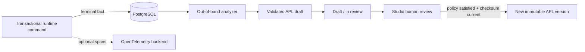

# ADR-003: PostgreSQL-authoritative Insight Loop and governed APL optimization

- Status: **Accepted and implemented for the v1 loop**
- Date: 2026-08-08
- Target: Abada 1.1 agentic workflow track
- Related: `reference/insight-loop.md`, `reference/apl-specification.md`,
  `reference/agent-worker.md`, ADR-002

## Context

Abada needs to turn execution evidence into useful workflow improvements
without adding Kafka, ClickHouse, or another mandatory state system. It must
also preserve immutable definitions, transactional runtime commands, and human
control over executable changes.

OpenTelemetry is valuable for distributed diagnostics, but sampled spans are
not a correctness-grade cursor. Requiring an external analytical stack would
contradict the self-contained PostgreSQL topology certified by the engine.

## Decision

The v1 Insight Loop uses compact terminal execution facts in PostgreSQL as its
authoritative signal. Facts are written in the same transaction as the runtime
command that makes a decision, user task, or external task terminal. They
contain identifiers, status, timing, topic/decision metadata, matched rule
indexes, and fallback usage; they do not contain process variables or prompts.

An out-of-band worker:

1. acquires a durable singleton lease;
2. consumes a bounded, non-overlapping fact window;
3. persists statistical findings;
4. calls the optional OpenAI-compatible optimizer outside database
   transactions;
5. validates the returned document with `AplParser`; and
6. creates at most one open proposal for the targeted immutable deployment.

The current source, deployment ID, version, and checksum are snapshotted on
the proposal. Approval never mutates that version. When the configured review
policy is satisfied, Abada checks that the target is still latest, deploys the
proposed APL through the normal engine command as a new immutable version, and
marks the proposal `ADOPTED`. A stale target becomes `SUPERSEDED`. There is no
auto-apply mode.

## Governance

Policies are keyed by definition and snapshot onto new proposals. The default
is one approval from `abada-insight-reviewer`. A policy lists distinct reviewer
groups and requires one approval per group:

- `PARALLEL`: groups may approve in any order;
- `SEQUENTIAL`: groups approve in the configured order.

One actor can review a proposal once. Rejection requires a comment and is
terminal. Reviews, status transitions, actor, and deployment result are stored
durably and emitted through normal history/outbox recording. Optimistic request
timestamps and entity versions prevent silent overwrites.

## Role of OpenTelemetry

OpenTelemetry remains an optional operational export for traces, cross-service
correlation, and future cost/token analysis. It is not the v1 Insight cursor,
does not authorize a proposal, and is not required for the certified standard
topology. A future analytics adapter may enrich PostgreSQL facts, but cannot
replace them silently or broaden current product claims.

## Consequences

- Standard operation remains PostgreSQL-only and ACID-backed.
- Fact ingestion adds small indexed writes to terminal commands; aggregation
  happens after the command transaction.
- Model calls cannot hold runtime or Insight database locks.
- LLM output is untrusted until it parses, preserves the process identity, is
  reviewed, and passes the stale-target check.
- External side effects remain at-least-once. Neither Insight nor agent work is
  described as globally exactly-once.
- BPMN deployments remain supported for compatibility, but Insight proposals
  are generated only for native APL definitions.

## Rejected alternatives

- **Mandatory Kafka/ClickHouse/OTel analytics:** rejected for v1 because it
  breaks zero-ops deployment and makes sampled telemetry authoritative.
- **Heavy analytical queries over runtime tables:** rejected; the dedicated
  fact table is bounded and contains only the signal required by the analyzer.
- **Automatic deployment of model output:** rejected; executable workflow
  changes require explicit, policy-compliant human approval.
