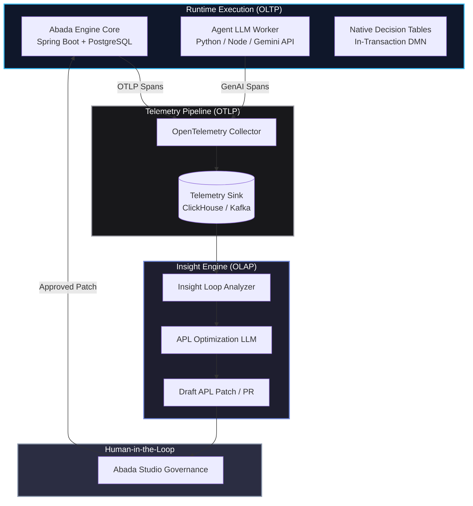

# ADR-003: The Autonomous Workflow Loop — AI Insight Engine on OpenTelemetry and APL

- Status: Proposed
- Date: 2026-08-07
- Target: Abada 1.1 agentic workflow track
- Related: `operations/observability.md`, `reference/apl-specification.md`,
  ADR-002

## Context

In legacy Business Process Management (BPM) systems, process optimization is a
manual, reactive exercise. DSI and process owners wait for end-of-month
reports, run heavy SQL queries against production databases, and attempt to
reconstruct where workflows stalled or failed.

In an AI-native orchestration engine like **Abada**, where probabilistic LLM
agents execute alongside deterministic rules, this legacy approach breaks down
completely. Agentic workflows execute across distributed polyglot boundaries
(Spring Boot cores, Kafka message buses, Python/Node LLM workers, and cloud
model endpoints). Bottlenecks are dynamic, token costs fluctuate, and
probabilistic failures require real-time observability.

## Decision

Implement the **Insight Loop Engine**: an autonomous feedback architecture
that uses **OpenTelemetry (OTel)** to continuously monitor workflow execution,
identify bottlenecks, and generate proposed workflow improvements in **APL
(Abada Process Language)** for human review.

The Insight Loop operates on a fundamental separation of concerns: the core
execution engine executes processes, while telemetry stream analyzers evaluate
performance out-of-band.



The loop operates in three phases:

1. **Observe (Runtime Telemetry):** Every state transition, LLM call, and DMN
   decision emits structured OpenTelemetry spans via OTLP.
2. **Evaluate (Insight Engine):** An asynchronous worker queries the telemetry
   sink to detect statistical anomalies, excessive token consumption, and
   recurring fallback paths.
3. **Optimize (Governance-Gated Patching):** The Insight Engine drafts an
   updated APL YAML definition featuring embedded comments (`#`) explaining the
   proposed optimization, which is submitted as a pull request for human
   validation.

## Rationale: Why OpenTelemetry is the foundation

Rather than building a proprietary tracing mechanism or cluttering production
databases with log tables, Abada leverages OpenTelemetry as its telemetry
backbone for four architectural reasons.

### Zero read contention on production OLTP

Executing analytical queries (`GROUP BY`, duration aggregations, error rate
calculations) against transactional process databases introduces lock
contention and degrades execution throughput. By streaming spans via OTLP to a
dedicated analytical sink (for example ClickHouse or an event stream), the
Insight Loop runs complex analytical pipelines completely out-of-band, and the
core engine keeps its operational velocity without performance penalties.

### Polyglot W3C context propagation

An agentic step in Abada typically originates in the Java/Spring Boot engine,
is published to a Kafka topic, is picked up by a Python worker, and invokes an
external LLM API. OpenTelemetry propagates distributed context across these
boundaries natively with W3C Trace Context headers (`traceparent`,
`tracestate`):

```
Engine Span (Java) ──[W3C traceparent]──► Kafka message ──[W3C traceparent]──► Worker Span (Python)
```

A multi-second delay or an API error inside a downstream worker is therefore
accurately attached to the parent APL process instance and node ID.

### Standardized GenAI semantic conventions

Abada workers emit metric spans carrying the OpenTelemetry GenAI semantic
conventions:

- `gen_ai.system`: model provider (for example, `gemini`)
- `gen_ai.request.model`: model version (for example, `gemini-3.6-flash`)
- `gen_ai.usage.prompt_tokens`: input token count
- `gen_ai.usage.completion_tokens`: output token count
- `gen_ai.server.address`: endpoint gateway

The Insight Engine uses these attributes to compute cost-per-execution and
latency trade-offs without custom log parsers.

### Structural DAG reconstruction via span hierarchies

Because OTel spans form a DAG through `parent_span_id`, the Insight Engine can
programmatically reconstruct execution topologies and detect:

- **Recursive loops:** an `agent` node executing *N* times sequentially inside
  one instance.
- **Latency anomalies:** nodes taking more than two standard deviations above
  their historical duration baseline.
- **Fallback thrashing:** frequent routing into `otherwise` branches in native
  DMN tables.

## Security and compliance boundaries

A critical enterprise requirement is a strict boundary between **execution
telemetry** and **sensitive business data (PII)**.

| Layer | Captured data | Storage location |
| --- | --- | --- |
| **OTel spans** | Node IDs, execution durations, status codes, token usage, `decisionKey`, matched rule indexes | Telemetry sink (ClickHouse / Tempo) |
| **Process state** | Customer identities, credit scores, financial payloads, PII | Encrypted PostgreSQL OLTP store |

OTel spans are the primary trigger for detecting *where* and *when* an anomaly
occurs. If business context is required to evaluate a rule change (for
example, whether a credit score threshold of 600 is too conservative), the
engine performs a scoped, audited lookup against the engine's
`DECISION_TABLE_APPLIED` history record using the `decisionKey`. PII is never
stored inside OpenTelemetry trace collectors.

## Operational walkthrough: an automated optimization cycle

Insight detects a process issue and proposes a patch.

### Step 1: Telemetry signal ingestion

The Insight Engine analyzes execution spans over a 24-hour window and sees that
an agent node (`extractAgent`) has a high failure rate on complex unstructured
inputs, causing downstream fallback tasks to trigger repeatedly.

```json
{
  "trace_id": "4bf92f3577b34da6a3ce929d0e0e4736",
  "span_id": "00f067aa0ba902b7",
  "name": "APL_NODE_EXECUTION: extractAgent",
  "attributes": {
    "abada.node.id": "extractAgent",
    "abada.node.type": "agent",
    "gen_ai.usage.prompt_tokens": 4200,
    "gen_ai.usage.completion_tokens": 12,
    "abada.execution.status": "ERROR",
    "error.type": "JSON_PARSING_FAILURE"
  }
}
```

### Step 2: Insight worker analysis

The Insight Engine determines that:

1. `extractAgent` fails JSON extraction on long documents 18% of the time.
2. Adding a lightweight pre-formatting node or lowering temperature reduces
   failure rates by an estimated 95%.

### Step 3: Generate the APL patch

The optimization engine drafts a candidate APL patch with inline YAML comments
explaining the change:

```diff
   nodes:
     - id: onStart
       type: webhook
       next: extractAgent

     - id: extractAgent
       type: agent
       description: Extract structured application data
-      model: gemini-3.6-flash
+      # OPTIMIZATION (Insight Engine - 2026-08-07):
+      # Switched to gemini-3.6-pro and updated the system prompt to enforce
+      # strict schema output, resolving an 18% JSON parsing failure rate.
+      model: gemini-3.6-pro
       prompt: |
         Extract {income, creditScore, requestedAmount} from the payload.
-        Return strict JSON only.
+        Return valid JSON adhering strictly to the schema. No markdown fences.
       confidence_threshold: 85
       next: creditRules
```

### Step 4: Human-in-the-loop governance

The proposed APL diff appears among the **Governance & Operations** tab of
Abada Studio as a pending pull request.

```
┌─────────────────────────────────────────────────────────────────────────────┐
│ PENDING OPTIMIZATION PR #104                                                │
│ Source: Insight Engine (OTel Analysis)                                      │
│ Target Workflow: kyc_onboarding_v1                                          │
│ Rationale: Reduces extractAgent failure rate from 18% to <1%                 │
│                                                                             │
│ [ View Visual Diff ]    [ Approve & Deploy ]    [ Reject Proposal ]         │
└─────────────────────────────────────────────────────────────────────────────┘
```

Once an administrator clicks **Approve & Deploy**, the new APL definition
version is committed to PostgreSQL, and new process instances immediately run
on the optimized graph.

## Alternatives considered

- **Reuse former SQL-based reporting queries:** rejected. Analytical queries
  against transactional OLTP DBs cause read contention and performance
  degradation during high load, slowing the productive runtime.
- **Adopt a custom tracing/monitoring framework:** rejected. Integrating with
  OpenTelemetry avoids proprietary tooling and enables polyglot W3C
  propagation and standardized GenAI attributes.
- **Full-automation updates without human review:** rejected. APL definitions
  remain the executable source of truth that humans own; the Insight Engine
  proposes, developers and administrators dispose.

## Consequences

- **Engine:** OTLP span emission is already built; during 1.1, process and
  decision-table events must be labeled with `abada.node.id`,
  `abada.instance.id`, and GenAI semantic attributes.
- **Observability:** a dedicated sink (ClickHouse / Kafka) is required for
  insight workloads; telemetry remains out-of-band and never RBO business
  state.
- **Studio:** a Governance & Operations surface must support validation,
  viewing, and Approve / Reject actions on proposed APL patches.
- **Security/Compliance:** PII must never be stored in open-loop memory; audit
  trail on decision lookups and patch approvals.
- **Boundary observability:** no changes to the execution engine run an update
  applies only on the next version — optimistic versioning on ProcessDefinition
  and instance version remain enforced.

## Related documents

- [`docs/development/roadmap-to-1.1.0-rc.md`](../../docs/development/roadmap-to-1.1.0-rc.md)
- [`docs/operations/observability.md`](../../docs/operations/observability.md)
- [`docs/reference/apl-specification.md`](../../docs/reference/apl-specification.md)