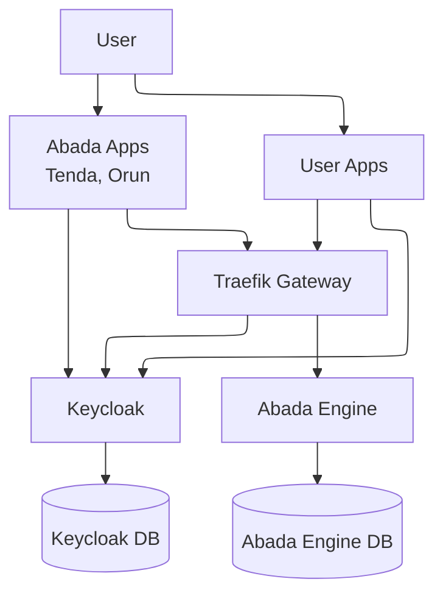
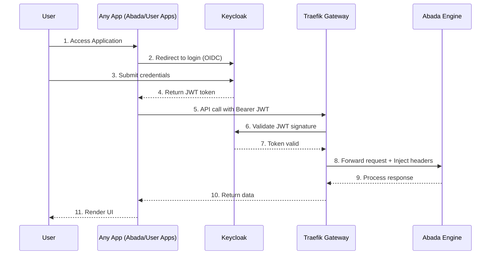
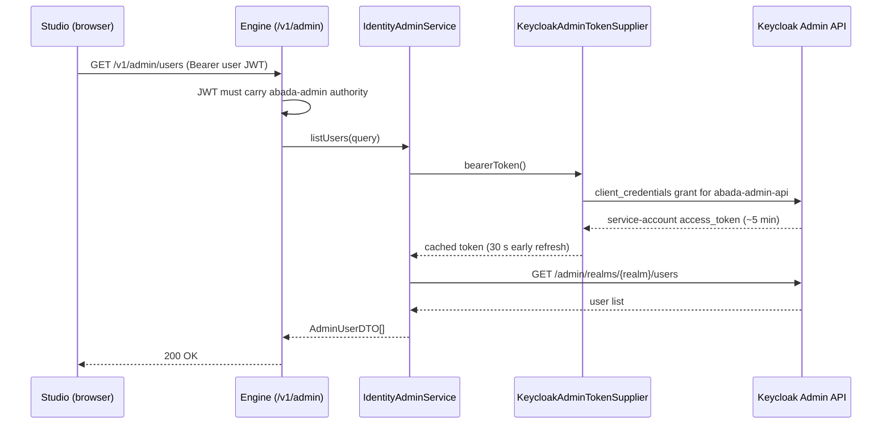

# Abada Engine Authentication & Authorization Architecture

This document explains how **authentication and authorization** are integrated into the **Abada Engine** ecosystem using **Keycloak** and **Traefik Gateway**.

---

> **Looking for the Developer Guide?** See the [Engine Authentication Guide](../ENGINE-AUTHENTICATION.md) for practical usage, URLs, and code examples.

## 🔐 Overview

The Abada Engine itself is **auth-agnostic**.
It only needs two identity facts at runtime:

* `username`
* `groups` (roles the user belongs to)

These values are used to evaluate BPMN attributes:
s
* `assignee="alice"`
* `candidateUsers="bob, charlie"`
* `candidateGroups="finance, hr"`

Authentication and group management are delegated to **Keycloak**, and security enforcement is handled by **Traefik Gateway**.

---

## ⚙️ Architecture

* **Keycloak** handles login, group membership, and token issuance.
* **Traefik Gateway** validates JWT tokens and injects `username + groups`.
* **Abada Engine** consumes identity info but does not implement auth logic.
* **Postgres** provides persistence (two DBs: one for Keycloak, one for Abada).

---

## 🔄 Sequence Flow

---

## 🏗️ Components

* **Keycloak**

  * Provides login, group management, and JWT issuance.
  * Stores its state in a dedicated PostgreSQL database.

* **Traefik Gateway**

  * Validates JWTs against Keycloak.
  * Extracts claims (`sub`, `groups`) and injects them into headers.
  * Routes requests to the correct backend service.

* **Abada Engine**

  * Stateless regarding authentication.
  * Reads `X-Auth-Request-User` and `X-Auth-Request-Groups` headers to evaluate BPMN assignments.
  * Uses its own PostgreSQL database for process state and audit.

* **PostgreSQL Cluster**

  * `abada` database: for engine state, tasks, audit.
  * `keycloak` database: for users, groups, roles, sessions.

* **User Applications (Any App including Tenda and Orun)**

  * Frontend or backend apps that users interact with.
  * Delegate authentication to Keycloak.
  * Call Abada Engine APIs through the gateway with validated JWTs.

## Identity Admin Proxy (added for Studio Administration)

The engine ships a thin REST proxy in the `com.abada.engine.identity` package
that lets the Studio Administration tab manage IdP users and groups **without**
exposing the Keycloak console to operators.

### Components

- `IdentityProperties` — `@ConfigurationProperties("abada.identity.admin")`.
  Carries `url`, `realm`, `clientId`, `clientSecret` and an `isConfigured()`
  derived from them. Missing vars disable the proxy endpoints (they return
  `503`) but the application still starts.
- `KeycloakAdminTokenSupplier` — thread-safe supplier of service-account
  tokens. Caches a token for its declared lifetime minus 30 s. A `401` from
  the Admin API forces an immediate refresh on the next call. Uses the
  client-credentials grant with HTTP basic on the confidential client.
- `KeycloakAdminClient` — typed `RestClient` wrapper around the
  `/admin/realms/{realm}` surface: `users` (search, get, create, update),
  `groups` (list, create), and `users/{id}/groups/{groupId}` (assign,
  revoke).
- `IdentityAdminService` — orchestrates the above and shapes responses into
  `AdminUserDTO` and `AdminGroupDTO`. Never returns credentials.
- `AdminController` — `com.abada.engine.api` REST controller mounted at
  `/v1/admin/**`. Requires the `abada-admin` authority for every endpoint.
  Returns `503` when the proxy is unconfigured rather than failing with a
  `NullPointerException`.

### State and consistency

- The proxy holds **no persistence**. Every read goes to Keycloak; every
  write goes to Keycloak. The engine database is not touched.
- A successful response from the proxy means the IdP acknowledged the
  change. It does not imply the engine's `PrincipalEntity` cache has been
  updated. New users become project-searchable only after their first
  authenticated request reaches the engine (the lazily populated
  `PrincipalEntity` row).
- If the proxy is misconfigured in production, the failure is observable:
  `/v1/admin/status` returns `configured: false`, every other admin
  endpoint returns `503`, and the application logs a startup warning.
- The proxy is not a BPMN-state mutation and is therefore **not** covered by
  the runtime state machine document's atomicity invariants.

### Bootstrap checklist (development)

1. `docker compose up -d keycloak` and wait for the realm import to settle.
2. Confirm the realm contains the `abada-admin-api` client
   (admin-cli → realm `abada` → Clients).
3. Set `ABADA_KEYCLOAK_ADMIN_CLIENT_ID` and `ABADA_KEYCLOAK_ADMIN_CLIENT_SECRET`
   in `.env.dev` (or the Compose file).
4. Restart the engine. Confirm `GET /v1/admin/status` returns
   `{"configured":true,"realm":"abada"}`.
5. Sign in to Studio as a user in the `abada-admin` group and open the
   Administration tab.
