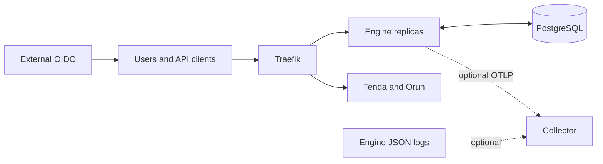

# Abada architecture overview

Abada is a self-hosted BPMN orchestration platform. Tenda, Orun, external
workers and API clients use `/api/v1`; PostgreSQL is authoritative for mutable
workflow state. Engine replicas load and lock the records required by each
command, validate and advance the canonical BPMN model, persist state/history
and outbox events, then commit atomically.

## Deployment boundary

- `compose.yaml` owns PostgreSQL and the three platform applications.
- `compose.dev.yaml` adds local Keycloak and HTTP Traefik routing.
- `compose.prod.yaml` adds TLS routing, exact versioned images, required
  secrets and externally managed OIDC.
- `compose.telemetry.yaml` adds optional metrics, traces and logs. Its absence
  is the normal telemetry-disabled mode.

Database and telemetry services are on internal networks and are not publicly
exposed. Frontend images are immutable across installations; their entrypoints
generate `/config.js` from validated runtime environment variables.

## Runtime boundary

Mutable instances, tokens, tasks, subscriptions, jobs and variables do not
live in runtime-wide maps. Only immutable parsed definition models may be
cached by definition version. PostgreSQL locks, optimistic versions and leases
coordinate multiple replicas. External side effects remain at-least-once and
must follow their idempotency contract.

See [runtime state](runtime-state.md), [event delivery](event-delivery.md),
[security](../reference/security-and-rbac.md), [BPMN support](../reference/bpmn-support.md)
and [deployment support](../reference/deployment-support.md) for normative
details.
