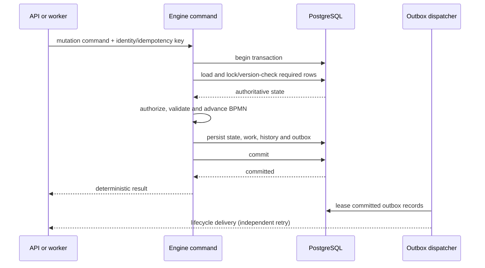

# Runtime State Architecture

This document defines the target runtime architecture for Abada 1.0 and tracks
the transition from the original in-memory engine. It is the authoritative
architecture document for mutable workflow state. The Flyway migrations are
the authority for physical table and column names.

## Target invariants

Abada 1.0 must satisfy all of these invariants:

1. **PostgreSQL is authoritative.** A command reconstructs mutable workflow
   state from committed database rows. It does not use a process-instance or
   task object left in a replica's memory as its input.
2. **Mutable state is command-local.** Tokens, joins, variables, task state,
   subscriptions and jobs are mutable only inside the command handling them.
3. **One command, one transaction.** Loading, authorization and state
   validation, BPMN advancement, persistence of resulting work and history,
   and commit form one database transaction.
4. **Conflicts are explicit.** Row locks serialize operations that must have a
   single winner; optimistic versions detect stale writes elsewhere. A retry or
   deterministic conflict response must never silently lose progress.
5. **Work is durable.** Timers and external work are database records with
   status, due/lock time, lease owner, lease expiry, attempt/retry data and
   indexed acquisition paths. Expired leases can be recovered by another
   replica. The supported core has no separate asynchronous-continuation job;
   synchronous continuations advance inside the owning command.
6. **External publication follows commit.** Lifecycle events and webhooks are
   written to a transactional outbox. No external observer is told about state
   that later rolls back.
 7. **Only immutable definitions may be cached.** Parsed definitions (BPMN XML
    or native `abada.io/v1` APL) are cached by immutable deployment/version
    identifier. Cache loss changes performance, not behavior.
8. **Project is the tenant boundary.** Definitions and instances carry an
   authoritative `project_id`; task, event and external-work acquisition is
   constrained through that instance boundary before a row is returned or
   locked. Insight facts and governance records carry the project directly.
   See [Project Envelope Architecture](project-envelope.md).

These invariants allow any request or acquired job to run on any engine
replica. Restarting or terminating a replica discards no authoritative
workflow state.

## Command lifecycle

The target command path is:

If the engine fails before commit, PostgreSQL rolls the command back and
another request or worker can retry it. If it fails after commit, the state is
already durable; an idempotency record makes a duplicate request return the
same logical result. External side effects remain at-least-once unless the
external system participates through an idempotent protocol.

## Implemented atomic command boundary

All controller-reachable mutations now enter a core command service before
touching repositories. `@AtomicRuntimeCommand` is the executable marker for
the transaction boundary; a contract test inventories the public commands and
fails when one loses that marker. Controllers translate HTTP only and no
longer own external-task or retry state transitions.

| Command family | Authoritative lock/input | State, work and history committed together |
|---|---|---|
| Deployment and start | Latest definition is read from PostgreSQL; a started instance is new | Definition/deployment history, or instance, tokens, variables, tasks, subscriptions, timers, external work and start history |
| User tasks | Task row; task completion also locks the process row | Task transition, variables, BPMN advancement, successor work and activity history |
| Process control | Process-instance row | Cancellation, failure, suspension or variables and activity history |
| Message and signal | Unconsumed subscription rows, then process-instance rows | Subscription consumption, BPMN advancement, successor work and history |
| External work | External-task row | Lease/failure/retry transition and history; completion also locks and advances the process instance |
| Timers | `SKIP LOCKED` claim transaction, then leased timer and process rows | Lease and attempt commit before execution; advancement, successor work, completion and history commit together |
| Idempotent API wrapper | Idempotency-key record plus the nested command locks | Workflow mutation and its stored deterministic response |

Timer polling is deliberately not one large transaction. A short acquisition
transaction locks a bounded batch with `FOR UPDATE SKIP LOCKED`, records each
120-second lease and commits. Each leased timer then executes through a
separate atomic command. If advancement throws, that transaction rolls back
completely; only then does a second transaction release or fail the job. This
prevents a caught exception from committing half-advanced workflow state and
allows another replica to recover an expired lease.

External-task fetch-and-lock uses the same contention principle and returns
disjoint work to concurrent replicas. V8 indexes cover available/expired timer
and external-task acquisition. Message and signal subscriptions use
pessimistic locks; signal rows are locked in stable ID order.

Secured external workers additionally submit `projectId`. PostgreSQL joins the
candidate external task to its authoritative process instance during
`SKIP LOCKED` acquisition, and the authenticated service principal must have a
matching project/topic binding. Project-scoped message and signal correlation
uses the same instance ownership predicate, preventing a same-named event in
another project from being consumed.

Idempotency keys are reserved with PostgreSQL `INSERT ... ON CONFLICT`. A
concurrent insert waits for the winning transaction and then replays its stored
response, while a rollback removes the reservation with the command. H2 uses a
single-process compatibility path and is not evidence for this guarantee.

Definition cache insertion occurs only after a successful deployment commit.
Failures while creating required timers are no longer logged and ignored: they
abort the workflow command so a waiting token cannot commit without its durable
job.

PostgreSQL rollback evidence completes a task whose successor delegate
intentionally throws after task state, variables and history have been staged.
The test verifies that all three revert to their pre-command values. Existing
two-context PostgreSQL tests demonstrate single-winner task transitions and
lossless serialized variable updates. `AtomicRuntimeCommandContractTest`
provides the inventory guard; it complements, rather than replaces, behavioral
PostgreSQL tests.

This atomicity guarantee covers Abada's database state. Embedded Java delegates
and scripts still run in the transaction. A remote or otherwise irreversible
side effect performed by a delegate cannot be rolled back by PostgreSQL and
must be idempotent; durable external tasks are the recommended boundary for
such work. Transaction-aware metrics and the transactional outbox remain
separate roadmap items.

## Implemented state authority: tasks and process instances

User tasks and process instances are the first runtime areas migrated to this
model:

1. Task reads query PostgreSQL by task ID, process instance, assignee,
   candidate user or candidate group. They return detached snapshots and do
   not populate a runtime-wide map.
2. `claim`, `completeTask` and `failTask` obtain a PostgreSQL write lock on the
   target task row and materialize one command-local task object.
3. Each command validates the committed task status before changing it. Task
   completion also reconstructs the process instance from its database row,
   advances the BPMN model and persists successor work in the transaction.
4. Task state and activity history commit atomically. Concurrent replicas wait
   for the same row lock and observe the winning status after it commits.
5. Process detail and list reads query PostgreSQL and return detached
   snapshots. Process control, variable updates, event resume and task-driven
   advancement lock the process row before reconstructing tokens, joins and
   variables.
6. Startup does not rehydrate task or process objects. Active gauges are
   restored with grouped database counts instead of loading mutable state.
7. Parsed BPMN is cached only by immutable deployment ID. New starts query
   PostgreSQL for the latest process-key version; persisted instances always
   reload their pinned deployment version.
8. Public task and process-instance lists execute bounded PostgreSQL pages
   (50 rows by default, 100 maximum) with stable ordering. Task DTO enrichment
   loads the page's process instances in one batch instead of issuing one
   process query per task.

A concurrent task command on another engine waits for the task lock, then
reads the committed status and is rejected when the transition is no longer
valid. PostgreSQL integration tests verify single winners for claim, failure
and completion across two application contexts, with one corresponding
history event.

Concurrent variable-update tests across two application contexts verify that
the process lock preserves both replicas' changes instead of losing the first
committed update. Mutating a detached process query result also has no effect
on a later read or command.

## Current migration status

| Area | Current behavior | 1.0 target |
|---|---|---|
| Parsed process definitions | One lazy replica-local cache is keyed by immutable deployment ID; latest-version selection is a PostgreSQL lookup and instances are foreign-key pinned | Retain this model and add bounded-cache telemetry if operational evidence requires it |
| User-task lifecycle | Claim, unclaim, completion and failure lock task and process rows, mutate command-local snapshots and support deterministic replay | Retain this command model |
| Startup | Preloads no workflow or definition objects; active process/task gauges use aggregate queries | Retain this model and extend durable recovery evidence |
| Process control | Instance mutations load and lock PostgreSQL rows, use command-local state and support deterministic replay | Make metrics transaction-aware |
| Query APIs | Public task and instance lists use bounded PostgreSQL pages, stable ordering and batch process hydration; detail reads return detached snapshots | Add purpose-built summary projections where full variables or candidate metadata are unnecessary |
| Message/signal correlation | Locked subscriptions are consumed with process advancement in one command transaction; duplicate and cancellation races are covered across replicas | Retain this model and add operational contention telemetry if needed |
| Timers/external work | `SKIP LOCKED` acquisition, durable leases, replica-death recovery and per-item atomic advancement are covered across replicas | Retain this model and tune batch/lease settings from production evidence |
| Metrics | Some counters are changed before transaction outcome is known | Derive durable facts or update transaction-aware metrics after commit |
| Lifecycle delivery | History and outbox records commit together; dispatchers use PostgreSQL `SKIP LOCKED` leases, retry delays and stable delivery IDs | Add destination-specific operational dashboards for the 1.0 RC |

The PostgreSQL runtime satisfies the 0.11 stable-contract and security gate for
the documented BPMN subset. Rolling-upgrade certification, benchmark evidence,
security review and operational runbooks remain 1.0 RC gates; see the roadmap.

## Concurrency policy

- Use pessimistic row locking for a singular transition with a natural owner,
  such as completing one user task or consuming one subscription.
- Use optimistic version columns on mutable aggregate records to detect stale
  updates and protect paths that cannot lock every row up front.
- Use atomic lease acquisition, preferably PostgreSQL `FOR UPDATE SKIP LOCKED`,
  for competing workers claiming independent jobs.
- Keep transactions short: never perform remote service calls while holding a
  workflow row lock.
- Require an idempotency key or protocol identity where a client can repeat a
  mutation after losing the response.

Exactly-once refers to committed workflow state transitions. Calls to external
systems are at-least-once unless their own idempotency contract prevents a
duplicate side effect.

## Cache policy

The sole engine execution cache maps an immutable process-definition deployment
ID to a fully constructed parsed BPMN model. It contains no mutable “latest by
process key” alias. A new process start queries PostgreSQL for the latest
version, while an existing process loads the deployment ID stored on its
instance row. Cache entries may be discarded and reconstructed from stored XML
without changing execution semantics.

Mutable process instances, tasks, subscriptions, jobs and variables are not
runtime-wide cache entries. Command-local maps inside a materialized process
instance hold variables and join state only for the lifetime of that command.

## Completion criteria

The migration is complete only when:

- every mutation command follows the command lifecycle above;
- query APIs use bounded database reads or purpose-built projections rather
  than mutable replica maps;
- startup preloads no workflow state and definition cache loss is transparent;
- multi-replica tests cover task commands, correlation, timers and external
  work, including replica termination around commit;
- duplicate requests return deterministic results; and
- outbox delivery, lease recovery and supported rolling upgrades pass their
  PostgreSQL acceptance suites.

Progress and test evidence are tracked in the
[Reliable OSS Core roadmap](../development/roadmap-to-1.0.md).
