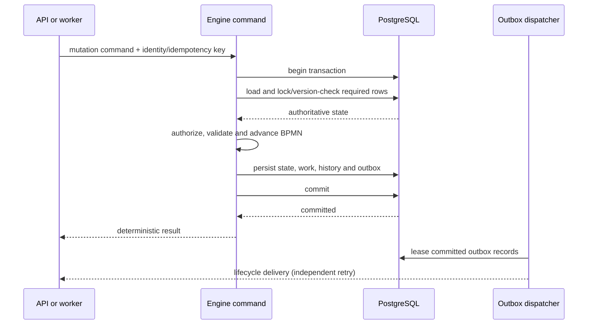

# Runtime State Architecture

This document defines the target runtime architecture for Abada 1.0 and tracks
the transition from the original in-memory engine. It is the authoritative
architecture document for mutable workflow state. The Flyway migrations are
the authority for physical table and column names.

## Target invariants

Abada 1.0 must satisfy all of these invariants:

1. **PostgreSQL is authoritative.** A command reconstructs mutable workflow
   state from committed database rows. It does not use a process-instance or
   task object left in a replica's memory as its input.
2. **Mutable state is command-local.** Tokens, joins, variables, task state,
   subscriptions and jobs are mutable only inside the command handling them.
3. **One command, one transaction.** Loading, authorization and state
   validation, BPMN advancement, persistence of resulting work and history,
   and commit form one database transaction.
4. **Conflicts are explicit.** Row locks serialize operations that must have a
   single winner; optimistic versions detect stale writes elsewhere. A retry or
   deterministic conflict response must never silently lose progress.
5. **Work is durable.** Timers and external work are database records with
   status, due/lock time, lease owner, lease expiry, attempt/retry data and
   indexed acquisition paths. Expired leases can be recovered by another
   replica. The supported core has no separate asynchronous-continuation job;
   synchronous continuations advance inside the owning command.
6. **External publication follows commit.** Lifecycle events and webhooks are
   written to a transactional outbox. No external observer is told about state
   that later rolls back.
 7. **Only immutable definitions may be cached.** Parsed definitions (BPMN XML
    or native `abada.io/v1` APL) are cached by immutable deployment/version
    identifier. Cache loss changes performance, not behavior.
8. **Project is the tenant boundary.** Definitions and instances carry an
   authoritative `project_id`; task, event and external-work acquisition is
   constrained through that instance boundary before a row is returned or
   locked. Insight facts and governance records carry the project directly.
   See [Project Envelope Architecture](project-envelope.md).

These invariants allow any request or acquired job to run on any engine
replica. Restarting or terminating a replica discards no authoritative
workflow state.

## Command lifecycle

The target command path is:

```mermaid
sequenceDiagram
    participant C as API or worker
    participant E as Engine command
    participant P as PostgreSQL
    participant O as Outbox dispatcher

    C->>E: mutation command + identity/idempotency key
    E->>P: begin transaction
    E->>P: load and lock/version-check required rows
    P-->>E: authoritative state
    E->>E: authorize, validate and advance BPMN
    E->>P: persist state, work, history and outbox
    E->>P: commit
    P-->>E: committed
    E-->>C: deterministic result
    O->>P: lease committed outbox records
    O-->>C: lifecycle delivery (independent retry)
```

If the engine fails before commit, PostgreSQL rolls the command back and
another request or worker can retry it. If it fails after commit, the state is
already durable; an idempotency record makes a duplicate request return the
same logical result. External side effects remain at-least-once unless the
external system participates through an idempotent protocol.

## Implemented atomic command boundary

All controller-reachable mutations now enter a core command service before
touching repositories. `@AtomicRuntimeCommand` is the executable marker for
the transaction boundary; a contract test inventories the public commands and
fails when one loses that marker. Controllers translate HTTP only and no
longer own external-task or retry state transitions.

| Command family | Authoritative lock/input | State, work and history committed together |
|---|---|---|
| Deployment and start | Latest definition is read from PostgreSQL; a started instance is new | Definition/deployment history, or instance, tokens, variables, tasks, subscriptions, timers, external work and start history |
| User tasks | Task row; task completion also locks the process row | Task transition, variables, BPMN advancement, successor work and activity history |
| Process control | Process-instance row | Cancellation, failure, suspension or variables and activity history |
| Message and signal | Unconsumed subscription rows, then process-instance rows | Subscription consumption, BPMN advancement, successor work and history |
| External work | External-task row | Lease/failure/retry transition and history; completion also locks and advances the process instance |
| Timers | `SKIP LOCKED` claim transaction, then leased timer and process rows | Lease and attempt commit before execution; advancement, successor work, completion and history commit together |
| Idempotent API wrapper | Idempotency-key record plus the nested command locks | Workflow mutation and its stored deterministic response |

Timer polling is deliberately not one large transaction. A short acquisition
transaction locks a bounded batch with `FOR UPDATE SKIP LOCKED`, records each
120-second lease and commits. Each leased timer then executes through a
separate atomic command. If advancement throws, that transaction rolls back
completely; only then does a second transaction release or fail the job. This
prevents a caught exception from committing half-advanced workflow state and
allows another replica to recover an expired lease.

External-task fetch-and-lock uses the same contention principle and returns
disjoint work to concurrent replicas. V8 indexes cover available/expired timer
and external-task acquisition. Message and signal subscriptions use
pessimistic locks; signal rows are locked in stable ID order.

Secured external workers additionally submit `projectId`. PostgreSQL joins the
candidate external task to its authoritative process instance during
`SKIP LOCKED` acquisition, and the authenticated service principal must have a
matching project/topic binding. Project-scoped message and signal correlation
uses the same instance ownership predicate, preventing a same-named event in
another project from being consumed.

Idempotency keys are reserved with PostgreSQL `INSERT ... ON CONFLICT`. A
concurrent insert waits for the winning transaction and then replays its stored
response, while a rollback removes the reservation with the command. H2 uses a
single-process compatibility path and is not evidence for this guarantee.

Definition cache insertion occurs only after a successful deployment commit.
Failures while creating required timers are no longer logged and ignored: they
abort the workflow command so a waiting token cannot commit without its durable
job.

PostgreSQL rollback evidence completes a task whose successor delegate
intentionally throws after task state, variables and history have been staged.
The test verifies that all three revert to their pre-command values. Existing
two-context PostgreSQL tests demonstrate single-winner task transitions and
lossless serialized variable updates. `AtomicRuntimeCommandContractTest`
provides the inventory guard; it complements, rather than replaces, behavioral
PostgreSQL tests.

This atomicity guarantee covers Abada's database state. Embedded Java delegates
and scripts still run in the transaction. A remote or otherwise irreversible
side effect performed by a delegate cannot be rolled back by PostgreSQL and
must be idempotent; durable external tasks are the recommended boundary for
such work. Transaction-aware metrics and the transactional outbox remain
separate roadmap items.

## Implemented state authority: tasks and process instances

User tasks and process instances are the first runtime areas migrated to this
model:

1. Task reads query PostgreSQL by task ID, process instance, assignee,
   candidate user or candidate group. They return detached snapshots and do
   not populate a runtime-wide map.
2. `claim`, `completeTask` and `failTask` obtain a PostgreSQL write lock on the
   target task row and materialize one command-local task object.
3. Each command validates the committed task status before changing it. Task
   completion also reconstructs the process instance from its database row,
   advances the BPMN model and persists successor work in the transaction.
4. Task state and activity history commit atomically. Concurrent replicas wait
   for the same row lock and observe the winning status after it commits.
5. Process detail and list reads query PostgreSQL and return detached
   snapshots. Process control, variable updates, event resume and task-driven
   advancement lock the process row before reconstructing tokens, joins and
   variables.
6. Startup does not rehydrate task or process objects. Active gauges are
   restored with grouped database counts instead of loading mutable state.
7. Parsed BPMN is cached only by immutable deployment ID. New starts query
   PostgreSQL for the latest process-key version; persisted instances always
   reload their pinned deployment version.
8. Public task and process-instance lists execute bounded PostgreSQL pages
   (50 rows by default, 100 maximum) with stable ordering. Task DTO enrichment
   loads the page's process instances in one batch instead of issuing one
   process query per task.

A concurrent task command on another engine waits for the task lock, then
reads the committed status and is rejected when the transition is no longer
valid. PostgreSQL integration tests verify single winners for claim, failure
and completion across two application contexts, with one corresponding
history event.

Concurrent variable-update tests across two application contexts verify that
the process lock preserves both replicas' changes instead of losing the first
committed update. Mutating a detached process query result also has no effect
on a later read or command.

## Execution tokens

Since V23 every thread of execution is a row in `process_tokens` (id, process
instance, activity, state, parent token, scope token, loop counter). Tokens are
read and written only inside the locked command of their process instance.

| State | Meaning |
|---|---|
| `WAITING` | Parked at a user task, external task or catch event |
| `ARRIVED` | Parked at a parallel or inclusive join |
| `FORKED` | Suspended at a fork until its join resumes it |
| `EVENT_WAIT` | Parked at an event gateway while its catch-event children wait |
| `INCIDENT` | Stopped by an open incident (V24): a loop limit with no `on_exhausted` route, or a message wait without `correlationKey`; an operator retry restarts it. (A `WORK_FAILED` incident leaves its token `WAITING` at the task.) |
| `ACTIVE` | Moving inside the current command; never left behind by a command |
| `COMPLETED`, `CONSUMED`, `CANCELLED` | Terminal; rows stay for lineage and are deleted with the instance |

- A fork suspends the forking token and creates one child per taken branch
  (parent and scope = the forking token). The join that closes the fork fires
  when every live child has arrived there; the children are consumed and the
  forking token continues, so its id survives the fork. A child that reaches
  an end event inside the scope stops counting toward the join.
- Any other join (a merge with no fork in scope) fires after
  `logicalIncomingCount` arrivals, or with the arrivals it has once no other
  live token of the scope can still reach it.
- An event gateway parks its token (`EVENT_WAIT`) and creates one waiting child
  per catch event. The winning child is consumed, its siblings are cancelled
  with their subscriptions and timer jobs, and the parked token continues, so
  a race counts as one stream at a later join.
- Hops are bounded per token (`MAX_HOPS`), not per command, so two branches
  reaching the same join in one command are both counted.
- Tasks, external tasks, timer jobs and subscriptions record the `token_id`
  they resume. Rows created before V23 have none and resume the oldest token
  waiting at their activity.
- Instances started before V23 are converted from the legacy JSON columns on
  their first command (`ProcessInstance.restoreLegacyTokens`): each join with
  bookkeeping becomes a forked token with one arrived child per recorded
  arrival, and the waiting activities that can still reach it become its other
  children. A mismatch with the recorded expectation is logged and converted.
- Through the 1.1.0-rc line the engine also writes `current_activity_id`,
  `active_tokens_json` and the two join columns derived from the tokens, so an
  image rollback to 1.0.0-rc.8 finds consistent state. On load, token rows
  that no longer match those columns (an older engine advanced the instance
  after a rollback) are discarded and rebuilt from the columns. The columns
  are dropped in a later migration.

## Current migration status

| Area | Current behavior | 1.0 target |
|---|---|---|
| Parsed process definitions | One lazy replica-local cache is keyed by immutable deployment ID; latest-version selection is a PostgreSQL lookup and instances are foreign-key pinned | Retain this model and add bounded-cache telemetry if operational evidence requires it |
| User-task lifecycle | Claim, unclaim, completion and failure lock task and process rows, mutate command-local snapshots and support deterministic replay | Retain this command model |
| Startup | Preloads no workflow or definition objects; active process/task gauges use aggregate queries | Retain this model and extend durable recovery evidence |
| Process control | Instance mutations load and lock PostgreSQL rows, use command-local state and support deterministic replay | Make metrics transaction-aware |
| Query APIs | Public task and instance lists use bounded PostgreSQL pages, stable ordering and batch process hydration; detail reads return detached snapshots | Add purpose-built summary projections where full variables or candidate metadata are unnecessary |
| Message/signal correlation | Locked subscriptions are consumed with process advancement in one command transaction; duplicate and cancellation races are covered across replicas | Retain this model and add operational contention telemetry if needed |
| Timers/external work | `SKIP LOCKED` acquisition, durable leases, replica-death recovery and per-item atomic advancement are covered across replicas | Retain this model and tune batch/lease settings from production evidence |
| Metrics | Some counters are changed before transaction outcome is known | Derive durable facts or update transaction-aware metrics after commit |
| AI provider credentials | Named providers live in `ai_providers` with AES-GCM encrypted keys (Studio over `ABADA_LLM_*` environment); the agent worker reads resolved keys from a worker-only endpoint and caches them briefly; no model call runs inside a workflow transaction | Retain this model |
| Tool registry | `TOOL_SERVER` project resources (validated on save) are resolved at deployment; the bindings are frozen in `process_definitions.tool_bindings` and cached per deployment id (immutable). Tool credentials live in `tool_credentials`, AES-GCM encrypted, issued only to the lease holder of a bound task. The engine never connects to a tool server | Retain this model |
| Agent step journal | `agent_steps` (V28) rows appended by the lease holder under the external-task row lock only; `external_tasks.attempt` separates resumed leases (same attempt) from new attempts. Payloads AES-GCM encrypted, digests engine-computed. Unkeyed interrupted writes become `OUTCOME_UNKNOWN` with a `TOOL_OUTCOME_UNKNOWN` incident | Retain this model |
| Agent delegation | V32: `agent_steps.child_instance_id` links a `DELEGATION` step to the child it started; delegates are pinned in `process_definitions.call_targets` under `<node>#delegate:<process>`; the child's `started_by_agent` holds the agent's identity. A `STARTED` delegation parks the external task as `AWAITING_CHILD` and creates the child in the step command; the child's `CHILD_DONE` job finishes the step under the external-task lock and reopens the work without locking the parent instance | Retain this model |
| Tool approvals | V31: `tasks.kind` (`USER` / `TOOL_APPROVAL`) and `tasks.agent_step_id`; `agent_steps.decided_at` with the decider in `resolved_by`. A `PROPOSED` step parks its external task as `AWAITING_APPROVAL` (no lease, never acquired) and opens the approval on the agent's token in the same step command (external task, then instance). A decision locks the external task, then the approval task, never the instance, and never moves the token; boundaries and cancel retire both through the by-token retirement | Retain this model |
| Agent evidence and cost | V30: per step a working copy (`request_enc`/`result_enc`, cleared when the task is completed or cancelled) and an evidence copy shaped by the project/node policy, purged after `purge_after` by a `SKIP LOCKED` sweep; engine-computed `cost_usd` from `model_prices` (effective-dated); attempt-reported tokens priced on `external_tasks` when not journaled; project policy on `projects` | Retain this model |
| Call-process lineage | `process_instances.parent_instance_id/parent_token_id/parent_activity_id/root_instance_id/call_depth` (V29); child versions pinned in `process_definitions.call_targets`. A child is created in its parent's command; its end schedules a durable `CHILD_DONE` job (`jobs.related_instance_id`, one per child) and never locks the parent. Cancels cascade parent → child in one transaction | Retain this model |
| Incidents | `incidents` rows (V24) opened inside the command that stops a token (exhausted loop, message wait without `correlationKey`) or finds task work failed for good with no `on_error` (`WORK_FAILED`); resolved by an operator retry (for agent work optionally on another allowed model, stored per task in `external_tasks.model_override`, V26) or when the instance is cancelled or failed | Add more incident types as runtime conditions need them |
| Boundaries and service levels | Task timeouts and SLA escalations are `jobs` rows of kind `BOUNDARY_TIMEOUT` / `SLA` (V26) created with the waiting token and cancelled in the command that moves it; a boundary retires the task's work atomically; tasks carry `due_at` / `escalated_at`; rate-limit deferrals are counted in `external_tasks.deferrals`. Work rows are locked before the instance row | Add a non-interrupting branch boundary if a use case needs one |
| Execution tokens | One `process_tokens` row per thread of execution (V23); joins count token ids; waiting work records its token; legacy JSON columns dual-written for rc.8 rollback | Drop the legacy JSON columns after 1.1.0 |
| Lifecycle delivery | History and outbox records commit together; dispatchers use PostgreSQL `SKIP LOCKED` leases, retry delays and stable delivery IDs | Add destination-specific operational dashboards for the 1.0 RC |

The PostgreSQL runtime satisfies the 0.11 stable-contract and security gate for
the documented BPMN subset. Rolling-upgrade certification, benchmark evidence,
security review and operational runbooks remain 1.0 RC gates; see the roadmap.

## Concurrency policy

- Use pessimistic row locking for a singular transition with a natural owner,
  such as completing one user task or consuming one subscription.
- Use optimistic version columns on mutable aggregate records to detect stale
  updates and protect paths that cannot lock every row up front.
- Use atomic lease acquisition, preferably PostgreSQL `FOR UPDATE SKIP LOCKED`,
  for competing workers claiming independent jobs.
- Keep transactions short: never perform remote service calls while holding a
  workflow row lock.
- Require an idempotency key or protocol identity where a client can repeat a
  mutation after losing the response.

Exactly-once refers to committed workflow state transitions. Calls to external
systems are at-least-once unless their own idempotency contract prevents a
duplicate side effect.

## Cache policy

The sole engine execution cache maps an immutable process-definition deployment
ID to a fully constructed parsed BPMN model. It contains no mutable “latest by
process key” alias. A new process start queries PostgreSQL for the latest
version, while an existing process loads the deployment ID stored on its
instance row. Cache entries may be discarded and reconstructed from stored XML
without changing execution semantics.

Mutable process instances, tokens, tasks, subscriptions, jobs and variables are
not runtime-wide cache entries. A materialized process instance holds its
variables and tokens only for the lifetime of the command that loaded them.

## Completion criteria

The migration is complete only when:

- every mutation command follows the command lifecycle above;
- query APIs use bounded database reads or purpose-built projections rather
  than mutable replica maps;
- startup preloads no workflow state and definition cache loss is transparent;
- multi-replica tests cover task commands, correlation, timers and external
  work, including replica termination around commit;
- duplicate requests return deterministic results; and
- outbox delivery, lease recovery and supported rolling upgrades pass their
  PostgreSQL acceptance suites.

Progress and test evidence are tracked in the
[Reliable OSS Core roadmap](../archive/roadmap-to-1.0.md).
