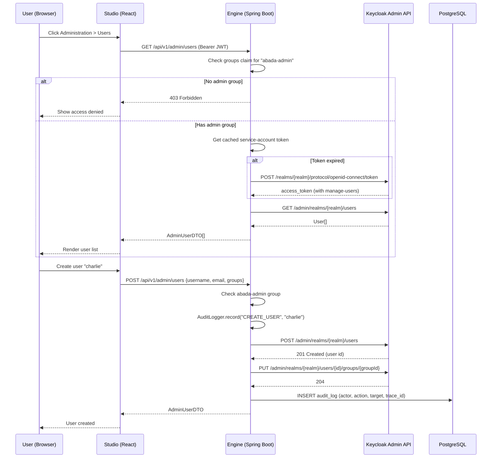
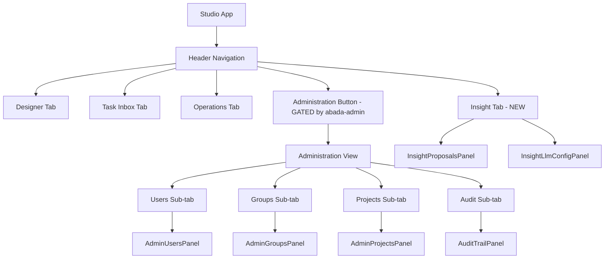

## Product Overview

Abada Studio becomes the sole working surface of the platform. The independent Orun and Tenda apps are frozen — their functionality (Task Inbox, Operations, Administration) lives as first-class tabs inside Studio. The end-of-July pitch demonstrates a complete, no-bluff loop: design → deploy → run → work → optimize → govern, all from one screen.

## Core Features

- **Platform-level Administration tab**: Replaces the current project-scoped `ProjectAdmin` with a platform-scoped view containing sub-tabs — Users, Groups, Projects overview, and Audit trail
- **External IdP Management UI**: Studio calls engine `/api/v1/admin/*` endpoints; engine proxies to Keycloak Admin REST API server-side. Users never touch Keycloak's admin console. Supports: list/search users, create users, enable/disable users, assign/revoke group memberships, list/create groups
- **Lightweight RBAC**: Engine reads `groups` claim from JWT; checks `abada-admin` group on admin endpoints. Studio reads token groups to show/hide the Administration tab. No new database tables for roles — Keycloak is the identity source of truth
- **Audit trail**: `audit_log` table (Flyway V19) recording actor, action, target, timestamp, trace_id. `AuditLogger` writes inside the same transaction as mutations. Read endpoint with pagination and filters
- **Insight Engine polish**: Dedicated Insight sub-tab in Administration (or a top-level tab) showing proposals across all projects, LLM config status, and the existing visual diff / approve-reject flow. This is the agentic killer feature for the pitch
- **Pitch-ready demo path**: Design → Deploy → Operations (live KPIs) → Task Inbox (human tasks) → Insight (AI proposals) → Administration (user management + audit) — all in Studio, no external tools

## Tech Stack

- **Engine**: Java 21, Spring Boot 3.5, Maven (`engine/mvnw`), PostgreSQL via Testcontainers, Flyway migrations
- **Studio**: React 19, Vite 8, TypeScript, Tailwind CSS 4, `@xyflow/react`, keycloak-js, oxlint, vitest
- **Keycloak Admin API proxy**: `WebClient` (Spring WebFlux) or `RestClient` (Spring 6.1) calling Keycloak Admin REST API server-side; service-account token cached with expiry refresh
- **New Flyway migration**: V19 for `audit_log` table only; no identity tables — Keycloak is the source of truth

## Implementation Approach

### Strategy

Build in 4 phases, each independently committable and demoable. The critical path for the pitch is Phases 1-2 (IdP management + Administration tab), with Phase 3 (Insight polish) as the wow-factor, and Phase 4 (audit) as the trust layer.

### Key Technical Decisions

1. **Keycloak Admin API proxy (not a sync engine)**: The engine does NOT replicate Keycloak users into PostgreSQL. It proxies live: `GET /api/v1/admin/users` → engine obtains service-account token → calls `GET {keycloak}/admin/realms/{realm}/users` → returns a clean DTO. Benefits: single source of truth (Keycloak), no drift, no credential storage in engine. Trade-off: latency (one extra hop), mitigated by token caching (30s TTL with early refresh at 25s).

2. **Token management**: A `KeycloakAdminTokenSupplier` obtains a client-credentials token for the `abada-admin-api` client (new Keycloak client whose service account is granted the `realm-management` client roles `manage-users`, `query-users`, `view-users`, `query-groups`, `view-groups`, `manage-groups`, `view-realm`). Token is cached in-memory with expiry; refreshed 30s before expiry. The `abada-admin-api` client secret is stored in engine config/env, never exposed to the browser.

3. **RBAC via JWT groups claim**: The engine already extracts `groups` from the JWT in `IdentityContextInterceptor.java:66`. A new `@RequireGroup("abada-admin")` annotation (or `@PreAuthorize("hasAuthority('abada-admin')")` with `EnableMethodSecurity`) guards admin endpoints. Studio reads `keycloak.tokenParsed.groups` to conditionally render the Administration tab. No new authorization database tables.

4. **Audit as transactional side-effect**: `AuditLogger` is called inside the same `@Transactional` boundary as the mutation it audits. If the mutation rolls back, the audit row rolls back too (AGENTS.md invariant #2). The `audit_log` table has no FK to mutable entities — it stores `target_type` and `target_id` as strings, indexed by `trace_id` and `occurred_at`.

5. **Studio view architecture**: Extend `StudioView` union to include `'insight'` as a new top-level tab. The Administration view becomes a container with internal sub-tab state (`'users' | 'groups' | 'projects' | 'audit'`). The existing `ProjectAdmin` stays accessible from within Administration > Projects > {selected project} > Members.

### Performance & Reliability

- **Keycloak token caching**: O(1) lookup, refreshed every ~30s. Avoids per-request token exchange. Bottleneck is the Keycloak API call itself (~10-50ms); acceptable for admin operations.
- **Audit writes**: Append-only insert, no joins. Indexed on `(occurred_at DESC, trace_id)`. O(1) write cost. No hot-path impact since audit only fires on mutations, not reads.
- **Studio lazy-loading**: Administration sub-views load data on tab activation, not on app mount. Avoids bundling admin data fetching into the designer flow.

### Avoiding Technical Debt

- Reuse `authenticatedFetch` pattern from `studio/src/api/authenticatedFetch.ts` for all new API clients
- Reuse `Pagination` helper from `engine/src/main/java/com/abada/engine/api/Pagination.java` for audit listing
- Reuse `IdentityContext` (already set by `IdentityContextInterceptor`) for audit actor resolution — no new auth plumbing
- Reuse the dark-theme design tokens already in Studio (`#1A1614`, `#25201D`, `#3A322E`, `#EAE3D9`, `#2A9D8F`, `#9D4EDD`) — no new design system

## Implementation Notes

- **`IdentityContextInterceptor.java:66`**: `groups` claim is already extracted via `jwt.getToken().getClaimAsStringList("groups")` and stored in `Identity`. A new `IdentityContext.requireGroup(String)` method will throw 403 if the group is absent. No changes to the interceptor itself.
- **`SecurityConfig.java`**: Needs `@EnableMethodSecurity` to activate `@PreAuthorize`. Currently absent. Adding it is safe — no existing endpoints have `@PreAuthorize` annotations, so behavior is unchanged until annotations are placed.
- **Keycloak client**: Add `abada-admin-api` client to `docker/keycloak/import/realm-dev.json` with `serviceAccountsEnabled: true`, `secret: "abada-dev-admin-api-secret"`. Grant the Admin REST API roles as `clientRoles` of the `realm-management` client on the service-account user `service-account-abada-admin-api` (`manage-users`, `query-users`, `view-users`, `query-groups`, `view-groups`, `manage-groups`, `view-realm`). Do NOT use `realmRoles` — realm roles named `manage-users`/`manage-groups` grant zero Admin REST API permission and produce a 403 (`403 Forbidden` from `/admin/realms/*`), which previously required a manual `kcadm.sh` role assignment. Keycloak's `--import-realm` only runs on an empty DB, so the file is authoritative for fresh environments; for an already-provisioned dev realm, re-run `./docker/keycloak/import/import-realm.sh docker-import` once after changing the file. Keep `realm-roles` out of the file entirely; the realm role entries named `manage-users`/`manage-groups` must not be reintroduced as a workaround. Verify after import: `kcadm.sh get-roles --rclient realm-management -r abada-dev -u service-account-abada-admin-api --cid abada-admin-api` must list the roles above. If `manage-users`/`query-groups` are absent, the import file (not kcadm) is the fix.
- **Studio Header**: Currently `Header.tsx:105` renders `['designer', 'inbox', 'operations']` as tabs and `administration` as a separate button. Plan: add `'insight'` to the tab array and keep `administration` as a separate button gated by `groups.includes('abada-admin')`.
- **Studio `App.tsx:637`**: `currentView === 'administration'` currently requires `activeProject`. Platform-level administration must NOT require a project — remove this guard and render `Administration` unconditionally (gated by RBAC instead).
- **Compose**: No new services. Add `ABADA_KEYCLOAK_ADMIN_CLIENT_ID` and `ABADA_KEYCLOAK_ADMIN_CLIENT_SECRET` env vars to `env.example` and `env.prod.example`. The engine reads them via `@ConfigurationProperties`.
- **Negative tests required** (per AGENTS.md): invalid JWT, expired JWT, missing `abada-admin` group, forged proxy header with admin endpoint access attempt.
- **Blast radius**: Phases 1-2 add new controllers and a new Studio view. No existing endpoint behavior changes. Phase 3 polishes existing Insight UI. Phase 4 adds audit logging to existing mutations — all inside existing transaction boundaries.

## Architecture Design

### System Architecture — Keycloak Admin Proxy Flow



### Studio View Architecture



## Directory Structure

```
abada-engine/
├── engine/src/main/java/com/abada/engine/
│   ├── api/
│   │   ├── AdminController.java                        # [NEW] Platform admin REST surface: /api/v1/admin/*
│   │   ├── AdminIdentityController.java                # [NEW] Keycloak user/group proxy: /api/v1/admin/users, /groups
│   │   └── AdminAuditController.java                   # [NEW] Audit read: /api/v1/admin/audit
│   ├── security/
│   │   ├── SecurityConfig.java                         # [MODIFY] Add @EnableMethodSecurity
│   │   ├── IdentityContext.java                        # [MODIFY] Add requireGroup(String) and hasGroup(String)
│   │   └── RequireAdminGroup.java                     # [NEW] Custom annotation or interceptor for abada-admin check
│   ├── identity/
│   │   ├── KeycloakAdminTokenSupplier.java             # [NEW] Caches service-account token, refreshes before expiry
│   │   ├── KeycloakAdminClient.java                    # [NEW] RestClient/WebClient proxy to Keycloak Admin REST API
│   │   ├── IdentityAdminService.java                   # [NEW] Orchestrates: list/create/update users, assign groups
│   │   └── IdentityProperties.java                     # [NEW] @ConfigurationProperties for admin client id/secret/url/realm
│   ├── audit/
│   │   ├── AuditLogger.java                            # [NEW] Transactional audit writer, called by mutations
│   │   ├── AuditService.java                           # [NEW] Read service with pagination + filters
│   │   └── AuditEntry.java                             # [NEW] DTO for audit read API
│   ├── persistence/
│   │   ├── entity/AuditLogEntity.java                  # [NEW] JPA entity for audit_log table
│   │   └── repository/AuditLogRepository.java          # [NEW] Spring Data JPA repository with paging + filtering
│   └── dto/
│       ├── AdminUserDTO.java                           # [NEW] Clean user DTO (id, username, email, enabled, groups)
│       └── AdminGroupDTO.java                          # [NEW] Clean group DTO (id, name, path, memberCount)
├── engine/src/main/resources/
│   └── db/migration/
│       └── V19__audit_log.sql                          # [NEW] audit_log table: id, actor, action, target_type, target_id, details_json, occurred_at, trace_id
├── engine/src/test/java/com/abada/engine/
│   ├── identity/
│   │   ├── KeycloakAdminTokenSupplierTest.java         # [NEW] Token caching + refresh logic
│   │   └── IdentityAdminServiceTest.java               # [NEW] User CRUD, group assignment, error handling
│   └── audit/
│       └── AuditLoggerTest.java                        # [NEW] Transactional rollback verification, pagination, filtering
├── studio/src/
│   ├── App.tsx                                         # [MODIFY] Add 'insight' to StudioView, remove project guard on administration, render InsightPanel and AdministrationView
│   ├── components/
│   │   └── Header.tsx                                  # [MODIFY] Add Insight tab, gate Administration button by groups.includes('abada-admin')
│   ├── features/
│   │   ├── admin/
│   │   │   ├── AdministrationView.tsx                  # [NEW] Container with sub-tab state: users | groups | projects | audit
│   │   │   ├── AdminUsersPanel.tsx                     # [NEW] User list, create modal, enable/disable, group assignment
│   │   │   ├── AdminGroupsPanel.tsx                   # [NEW] Group list, create, member count
│   │   │   ├── AdminProjectsPanel.tsx                 # [NEW] All-projects overview, click to manage members (reuses ProjectAdmin)
│   │   │   └── AuditTrailPanel.tsx                    # [NEW] Paginated audit table with actor/action/target/trace_id filters
│   │   ├── inbox/
│   │   │   └── TaskInbox.tsx                          # [MODIFY] Add cross-project mode (no projectId = all user tasks)
│   │   ├── operations/
│   │   │   └── ProcessOperations.tsx                  # [MODIFY] Add cross-project mode (no projectId = all instances)
│   │   └── insight/
│   │       ├── InsightPanel.tsx                       # [NEW] Top-level Insight tab: proposals across all projects, LLM config status
│   │       └── InsightProposalsList.tsx               # [NEW] Reuses InsightAPI.listProposals() without projectId
│   ├── api/
│   │   ├── admin.ts                                   # [NEW] AdminAPI client: listUsers, createUser, updateUser, listGroups, assignGroup, etc.
│   │   └── audit.ts                                   # [NEW] AuditAPI client: listEntries with pagination + filters
│   └── auth/
│       └── keycloakClient.ts                          # [MODIFY] Add getGroups() helper returning tokenParsed.groups
├── docker/keycloak/import/
│   └── realm-dev.json                                 # [MODIFY] Add abada-admin-api client + service account with realm-management clientRoles (manage-users/query-users/query-groups/manage-groups/view-realm); never realmRoles
├── env.example                                        # [MODIFY] Add ABADA_KEYCLOAK_ADMIN_CLIENT_ID, ABADA_KEYCLOAK_ADMIN_CLIENT_SECRET
├── env.prod.example                                   # [MODIFY] Same env vars
└── docs/release-notes/
    └── 1.0.0-rc.3.md                                  # [NEW] Release notes for administration surface, IdP management, audit trail
```

## Key Code Structures

### IdentityContext — extended for RBAC checks

```java
// engine/src/main/java/com/abada/engine/security/IdentityContext.java
// Currently has get() returning Identity(principalId, username, groups)
// Add convenience methods:

public static boolean hasGroup(String group) {
    Identity id = get();
    return id != null && id.groups() != null && id.groups().contains(group);
}

public static void requireGroup(String group) {
    if (!hasGroup(group)) {
        throw new ApiException(ApiErrorCode.FORBIDDEN, 
            "Required group: " + group);
    }
}
```

### AdminController — Keycloak proxy surface

```java
// engine/src/main/java/com/abada/engine/api/AdminController.java
@RestController
@RequestMapping("/v1/admin")
public class AdminController {
    private final IdentityAdminService identityAdmin;
    private final AuditService auditService;

    @GetMapping("/users")
    public List<AdminUserDTO> listUsers(@RequestParam(required=false) String query);

    @PostMapping("/users")
    public AdminUserDTO createUser(@RequestBody CreateUserRequest req);

    @PutMapping("/users/{id}")
    public AdminUserDTO updateUser(@PathVariable String id, @RequestBody UpdateUserRequest req);

    @GetMapping("/groups")
    public List<AdminGroupDTO> listGroups();

    @PutMapping("/users/{id}/groups/{groupId}")
    public void assignGroup(@PathVariable String id, @PathVariable String groupId);

    @DeleteMapping("/users/{id}/groups/{groupId}")
    public void revokeGroup(@PathVariable String id, @PathVariable String groupId);

    @GetMapping("/audit")
    public Page<AuditEntry> listAudit(
        @RequestParam(required=false) String actor,
        @RequestParam(required=false) String action,
        @RequestParam(defaultValue="0") int page,
        @RequestParam(defaultValue="20") int size);
}
```

## Design Style

The Administration workspace extends Studio's existing dark amethyst aesthetic — a premium, warm-dark interface with glassmorphic panels, subtle glows, and amethyst accent gradients. The Administration view uses a sub-tab bar (Users | Groups | Projects | Audit) rendered as pill-shaped toggles. Each sub-panel has a left-aligned header with icon + title, a search/toolbar row, and a data table with hover-reveal action buttons. The Insight tab uses the same canvas-split layout as the designer, showing the proposal diff overlay on top of the current workflow.

### Layout: Administration View

- Full-width container (no sidebar) with a horizontal sub-tab bar at top
- Each sub-panel: header (icon + title + count badge) → toolbar (search + create button) → scrollable list/table
- User create modal: centered glassmorphic dialog with form fields, group multi-select chips
- Audit panel: dense table with monospace trace_id, actor avatar, action badge, timestamp relative + absolute on hover

### Layout: Insight Tab

- Left: proposals list (compact cards with status badge, rationale excerpt, target version)
- Right: proposal detail with visual diff (reuses AIDiffModal's graph rendering inline)
- Top bar: LLM config status pill (configured/not configured, provider name, model)

### Interaction

- Tab switches: instant, no page reload, lazy-load data on first activation
- User create: modal with real-time group chip selection, password generation toggle
- Group assignment: inline dropdown on user row, optimistic update with rollback on error
- Audit: infinite scroll with filter chips that stack as removable badges
- Insight proposals: click to expand diff overlay on canvas, approve/reject buttons in a sticky bottom bar

## Agent Extensions

### SubAgent

- **code-explorer**
- Purpose: Explore engine test patterns, Keycloak Admin API integration conventions, and Studio component architecture before each implementation phase to ensure new code follows existing patterns precisely
- Expected outcome: Verified test class structures, RestClient/WebClient usage patterns in the codebase, and exact Studio component prop interfaces so new Administration and Insight views integrate seamlessly without regression