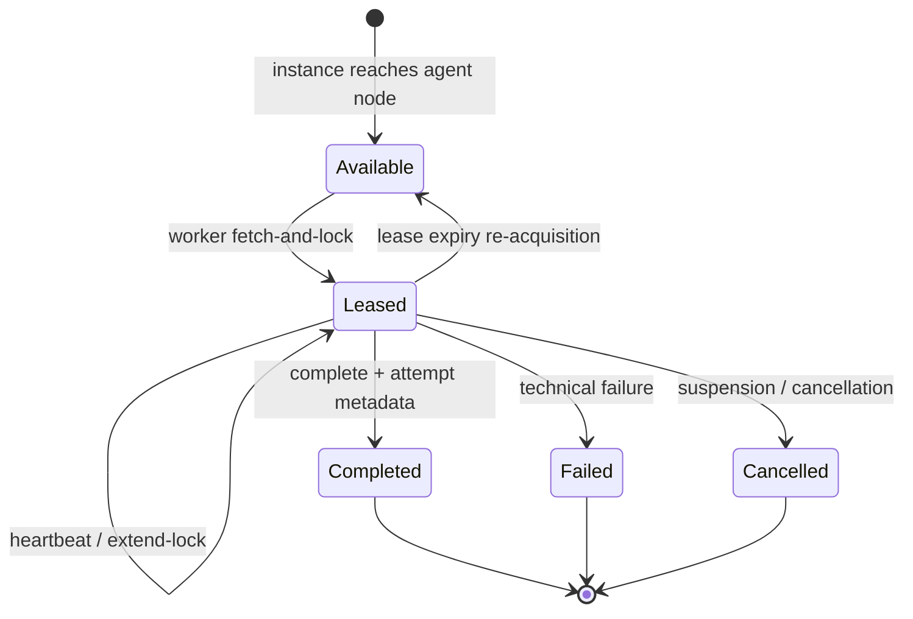

import { Aside } from '@astrojs/starlight/components';

APL `agent` nodes compile to durable external tasks on the `abada:agent`
topic, transported by the versioned external-worker protocol v1. The engine
**never invokes a model inside a workflow transaction**; the first-party
Agent Worker (a Java 21 sidecar in `agent-worker/`) and any conforming
third-party worker consume those tasks through fetch-and-lock and report back
through normal commands.

## Durable task lifecycle

- **Acquisition.** Fetch-and-lock atomically claims available tasks
  (`FOR UPDATE SKIP LOCKED`); a dead worker's lease expires and another
  replica or worker re-acquires the work without duplicate transitions.
- **Heartbeats.** Every fetch-and-lock poll writes a debounced heartbeat; a
  rejected fetch writes a durable incident row. Worker state (Online/Error/
  Offline, last heartbeat, last rejection, consecutive failures) is exposed
  per project through the worker-health API.
- **Completion and failure.** Bodies carry additive `AgentAttemptMetadata`:
  `model`, `provider`, `attempt`, `durationMs`, `tools`, `resultVariable`,
  `promptHash` (never the prompt), `errorType` (failures only) and
  `confidence` (the `_confidence` gated against the descriptor threshold).
  The engine persists them on the external-task row and in activity history.
- **Retries and idempotency.** Agent-task retries are seeded from the APL
  `max_attempts`; completion and failure use task ID + attempt ordinal +
  operation as the idempotency key, so re-sent reports deduplicate, retried
  attempts use fresh keys, and a stored failure never shadows a later
  completion of the same attempt ordinal.
- **Cancellation.** Suspension and cancellation reject late completion
  atomically; a live lease survives an engine restart without duplicate
  dispatch.

<Aside type="caution" title="At-least-once is the delivery contract">
  Workflow-state transitions are exactly once at commit. Model calls and
  downstream tool effects are at-least-once: providers and adapters must
  deduplicate with their own stable keys. Logs contain task/activity IDs and
  counters — never tokens, prompts, variables, credentials or responses.
</Aside>

## First-party vs third-party workers

The first-party worker is a **global, project-agnostic resource**:

1. It self-registers capabilities (topics plus optional model identifiers)
   once at startup via `PUT /v1/workers/me`.
2. It polls fetch-and-lock without a `projectId` and receives the owning
   `projectId` in each locked-task payload — it never needs per-project
   pre-configuration.
3. The startup sweep registers the configured `abada.workers.first-party`
   principals; per-project bindings remain only for third-party,
   project-scoped workers.

Secured engines authenticate the worker with OIDC client credentials (or a
short-lived engine token). A global fetch is rejected when the calling
principal holds no capability for a requested topic.

## Model routing and allow-lists

The sidecar routes each task by requested model name: `gemini`/`google/`
prefixes use the Gemini OpenAI-compatible endpoint; other models use an
OpenAI-compatible `/chat/completions` endpoint. Operators control cost
locally:

- `ABADA_AGENT_ALLOWED_MODELS` — the engine rejects an APL document at
  deployment or authoring validation when an agent node names a model outside
  this list (fail fast, not at first execution).
- `ABADA_AGENT_ALLOWED_TOOLS` — requested node tools must all appear here;
  the sidecar does not execute arbitrary tool code, and adapters are added
  deliberately by operators.

## Observability boundaries

Attempt metadata, worker health and history make agent execution observable
without exposing prompts, tokens or sensitive payloads. OpenTelemetry spans
remain optional diagnostics and are never authoritative for correctness.

## Evidence and reference

- Engine evidence: `AgentWorkerResilienceTest`,
  `FirstPartyWorkerCapabilityTest`, `WorkerHealthServiceTest`, and the
  global-fetch authorization tests in `SecurityAuthorizationContractTest`.
- Contract: [agent worker reference](https://github.com/bashizip/abada-platform/blob/dev/docs/reference/agent-worker.md),
  [external-worker protocol v1](https://github.com/bashizip/abada-platform/blob/dev/docs/reference/external-worker-protocol-v1.md)
- User guide: [Agent nodes and the Agent Worker](/user/agent-worker/)