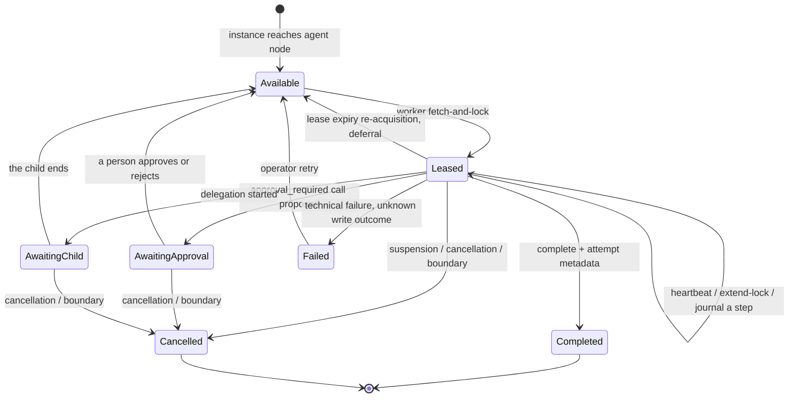
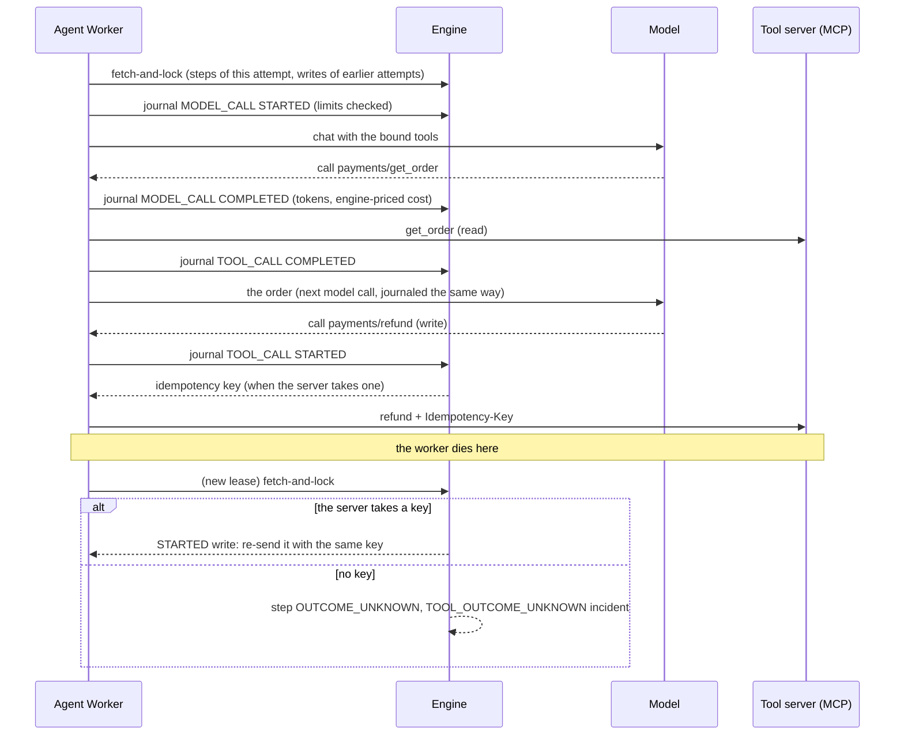

import { Aside } from '@astrojs/starlight/components';

APL `agent` nodes compile to durable external tasks on the `abada:agent`
topic, transported by the versioned external-worker protocol v1. The engine
**never invokes a model inside a workflow transaction**; the first-party
Agent Worker (a Java 21 sidecar in `agent-worker/`) and any conforming
third-party worker consume those tasks through fetch-and-lock and report back
through normal commands.

## Durable task lifecycle

```mermaid
stateDiagram-v2
    [*] --> Available: instance reaches agent node
    Available --> Leased: worker fetch-and-lock
    Leased --> Leased: heartbeat / extend-lock / journal a step
    Leased --> AwaitingApproval: approval_required call proposed
    AwaitingApproval --> Available: a person approves or rejects
    Leased --> AwaitingChild: delegation started
    AwaitingChild --> Available: the child ends
    Leased --> Completed: complete + attempt metadata
    Leased --> Failed: technical failure, unknown write outcome
    Failed --> Available: operator retry
    Leased --> Available: lease expiry re-acquisition, deferral
    Leased --> Cancelled: suspension / cancellation / boundary
    AwaitingApproval --> Cancelled: cancellation / boundary
    AwaitingChild --> Cancelled: cancellation / boundary
    Completed --> [*]
    Cancelled --> [*]
```

- **Acquisition.** Fetch-and-lock atomically claims available tasks
  (`FOR UPDATE SKIP LOCKED`); a dead worker's lease expires and another
  replica or worker re-acquires the work without duplicate transitions.
- **Heartbeats.** Every fetch-and-lock poll writes a debounced heartbeat; a
  rejected fetch writes a durable incident row. Worker state (Online/Error/
  Offline, last heartbeat, last rejection, consecutive failures) is exposed
  per project through the worker-health API.
- **Completion and failure.** Bodies carry additive `AgentAttemptMetadata`:
  `model`, `provider`, `attempt`, `durationMs`, `tools`, `resultVariable`,
  `promptHash` (never the prompt), `errorType` (failures only) and
  `confidence` (the `_confidence` gated against the descriptor threshold).
  The engine persists them on the external-task row and in activity history.
- **Retries and idempotency.** Agent-task retries are seeded from the APL
  `max_attempts`; completion and failure use task ID + attempt ordinal +
  operation as the idempotency key, so re-sent reports deduplicate, retried
  attempts use fresh keys, and a stored failure never shadows a later
  completion of the same attempt ordinal.
- **Cancellation.** Suspension and cancellation reject late completion
  atomically; a live lease survives an engine restart without duplicate
  dispatch.
- **Waiting without a lease.** `AWAITING_APPROVAL` and `AWAITING_CHILD` work is
  never handed out and holds no worker: a person's decision, or the child's
  end, makes it acquirable again on the same attempt.

<Aside type="caution" title="At-least-once, and never blind">
  Workflow-state transitions are exactly once at commit. Model calls and tool
  side effects are at-least-once: PostgreSQL cannot roll them back. The step
  journal narrows that: a keyed write is re-sent only with its original key, a
  write without a key is never re-sent after an interruption, and an identical
  write in a later attempt is answered from the journal. Logs contain
  task/activity IDs and counters — never tokens, prompts, variables,
  credentials or responses.
</Aside>

## The tool loop and the step journal

An agent that binds tools runs a loop: the model asks for tools, the worker
calls them, the model answers. Every call is **journaled with the engine
before it runs**, in a command that locks only the external-task row and never
advances the process.

```mermaid
sequenceDiagram
    participant W as Agent Worker
    participant E as Engine
    participant M as Model
    participant T as Tool server (MCP)

    W->>E: fetch-and-lock (steps of this attempt, writes of earlier attempts)
    W->>E: journal MODEL_CALL STARTED (limits checked)
    W->>M: chat with the bound tools
    M-->>W: call payments/get_order
    W->>E: journal MODEL_CALL COMPLETED (tokens, engine-priced cost)
    W->>T: get_order (read)
    W->>E: journal TOOL_CALL COMPLETED
    W->>M: the order (next model call, journaled the same way)
    M-->>W: call payments/refund (write)
    W->>E: journal TOOL_CALL STARTED
    E-->>W: idempotency key (when the server takes one)
    W->>T: refund + Idempotency-Key
    Note over W,T: the worker dies here
    W->>E: (new lease) fetch-and-lock
    alt the server takes a key
        E-->>W: STARTED write: re-send it with the same key
    else no key
        E-->>E: step OUTCOME_UNKNOWN, TOOL_OUTCOME_UNKNOWN incident
    end
```

- **Sequence and replay.** The engine accepts only the next sequence of the
  current attempt; an identical replay is idempotent, a divergent one is
  refused. A resumed lease rebuilds the conversation from the journal, so no
  model turn is paid for twice.
- **Writes.** A write is journaled `STARTED` before it runs. When its server
  accepts a key, the engine derives it from the task, attempt and sequence, so
  it is the same on every lease. Without a key, an interrupted write stops for
  a person, who confirms whether it happened; the agent then resumes with that
  fact as the call's result.
- **Later attempts.** A write with the same tool and arguments that an earlier
  attempt completed is answered from the journal (`reused`), whatever call id
  the model gives it — it is neither sent nor approved again.
- **Limits and cost.** `max_turns`, `max_tokens_total` and `budget_usd` are
  checked when a model call is journaled; cost is computed by the engine from
  the model's price at the time of the call.
- **Bindings.** Only tools frozen in the definition's bindings may be
  journaled; anything else is refused.

## Approvals and delegation

- **Approvals.** An `approval_required` call is journaled `PROPOSED`: in the
  same command the work parks (`AWAITING_APPROVAL`) and a `TOOL_APPROVAL` human
  task opens for the approver groups, with the arguments the evidence policy
  keeps and their digest. Deciding it locks the external task, then the task —
  never the instance — and the worker may then run the call only with the
  approved digest. A worker credential can never decide.
- **Delegation.** A `delegate:<process>` call starts a governed child: the
  engine checks the declared target, the inputs against the child's declared
  variables and the depth, then parks the work (`AWAITING_CHILD`) and creates
  the child with the agent's identity as its lineage. The child's end runs the
  same idempotent `CHILD_DONE` job as `call-process`; its declared outputs, or
  its final status, become the tool's result.

## First-party vs third-party workers

The first-party worker is a **global, project-agnostic resource**:

1. It self-registers capabilities (topics plus optional model identifiers)
   once at startup via `PUT /v1/workers/me`.
2. It polls fetch-and-lock without a `projectId` and receives the owning
   `projectId` in each locked-task payload — it never needs per-project
   pre-configuration.
3. The startup sweep registers the configured `abada.workers.first-party`
   principals; per-project bindings remain only for third-party,
   project-scoped workers.

Secured engines authenticate the worker with OIDC client credentials (or a
short-lived engine token). A global fetch is rejected when the calling
principal holds no capability for a requested topic.

## Model routing and allow-lists

The sidecar routes each task by requested model name: `gemini`/`google/`
prefixes use the Gemini OpenAI-compatible endpoint; other models use an
OpenAI-compatible `/chat/completions` endpoint. Operators control cost
locally:

- `ABADA_AGENT_ALLOWED_MODELS` — the engine rejects an APL document at
  deployment or authoring validation when an agent node names a model outside
  this list (fail fast, not at first execution).
- `ABADA_AGENT_ALLOWED_TOOLS` — the tool servers this worker may reach. A
  node's `<server>/<tool>` reference must name a listed server (or be listed
  exactly), so a deployment cannot widen what the operator allowed. Which
  tools exist and their read / write / approval-required policy come from the
  project's tool server resources, frozen with each definition version.

## Observability boundaries

Attempt metadata, worker health and history make agent execution observable
without exposing prompts, tokens or sensitive payloads. OpenTelemetry spans
remain optional diagnostics and are never authoritative for correctness.

## Evidence and reference

- Engine evidence: `AgentWorkerResilienceTest`,
  `FirstPartyWorkerCapabilityTest`, `WorkerHealthServiceTest`, the
  global-fetch authorization tests in `SecurityAuthorizationContractTest`,
  `PostgresAgentStepJournalTest` (journal, keys, unknown outcomes, reuse),
  `PostgresToolApprovalTest` and `ToolApprovalApiTest` (approvals),
  `PostgresAgentDelegationTest` (delegation), `PostgresAgentLimitsTest` and
  `PostgresEvidenceAndCostTest` (limits, evidence and cost).
- Worker evidence: `AgentLoopTest` and `AgentToolLoopEndToEndTest` against a
  stub model and a stub MCP server.
- Contract: [agent worker reference](https://github.com/bashizip/abada-platform/blob/dev/docs/reference/agent-worker.md),
  [external-worker protocol v1](https://github.com/bashizip/abada-platform/blob/dev/docs/reference/external-worker-protocol-v1.md)
- User guide: [Agent nodes and the Agent Worker](/user/agent-worker/)