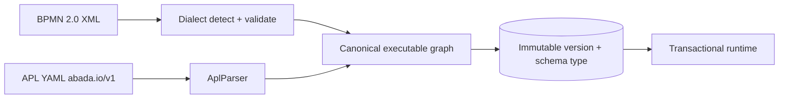

import { Aside } from '@astrojs/starlight/components';

APL documents are not translated into BPMN before execution. `AplParser`
compiles `abada.io/v1` YAML **directly** into the same canonical executable
graph that BPMN XML produces, so both schemas share the runtime, persistence,
versioning and outbox machinery.

## Schema dispatch

The engine sniffs the deployment source:

- a document whose first meaningful line is `version: abada.io/v1` compiles
  through the native APL parser;
- anything starting with `<` validates and compiles as canonical BPMN 2.0 XML.

Persisted definitions are recompiled through the same dispatch on restart.
The stored schema is recorded per definition version in
`process_definitions.schema_type` (`BPMN_XML` or `APL_NATIVE`) and surfaced in
deployment/list DTOs as `schemaType` with `definitionFormatVersion`
(`canonical-1` / `apl-native-1`).

## One canonical model

The APL node vocabulary maps 1:1 onto the runtime primitives that BPMN
imports produce:

| APL node | Runtime element |
| --- | --- |
| `webhook` | Start event |
| `end` | End event |
| `approval-gate` | User task (candidate groups from `assignees`) |
| `engine-task` | External service task on `service` |
| `agent` | External service task on the fixed `abada:agent` topic |
| `script` | In-transaction script task (the APL form of an embedded Java delegate) |
| `decision-table` | Business rule task with native `abada:decisionTable` semantics |
| `condition` | Exclusive gateway |
| `inclusive` | Inclusive gateway |
| `parallel` | Parallel gateway |
| `message-catch` / `timer` / `signal` | Durable catch-event primitives |
| `event-gateway` | Event-based gateway with atomic sibling cancellation |

The APL twin of the engine's kitchen-sink process is proven 1:1 against the
BPMN original by `AplKitchenSinkTest` (PostgreSQL) and Studio's
APL↔BPMN round-trip check — the two surfaces really do compile to one model.

## Strict validation

APL closes and tightens holes relative to XML:

- Documents are **strictly acyclic**; any loop over `next` or branch targets
  is rejected at deployment.
- Duplicate ids, a second `webhook`, a missing `metadata.name`, undeclared
  routing targets, unrecognized node types and invalid bounds fail deployment
  with index-friendly stable error codes and roll back — nothing partial
  persists.
- `event-gateway` requires ≥2 competing children; the first to fire advances
  the instance and every sibling subscription/timer/token is cancelled in the
  same transaction.

## Immutable versions

Deploying a process key creates a new immutable version that stores the exact
source (YAML or XML), its checksum and schema type. New instances select the
latest committed definition; running instances retain their stored deployment
ID. Studio deploys the exact saved revision of a project document — parsed
cache entries use the immutable deployment ID, so redeployment can never
change an active instance's semantics.

Project documents carry a stable `metadata.key` unique inside their project
and autosave with optimistic revisions (`If-Match`); a stale save is rejected
instead of overwriting another editor. Project archive is reversible and
blocks document edits, deployment and new starts while running instances drain
normally.

<Aside type="note">
  The authoritative grammar, every node's field contract and the rejection
  matrix live in the repository's [APL specification](https://github.com/bashizip/abada-engine/blob/dev/docs/reference/apl-specification.md),
  the [APL node reference](https://github.com/bashizip/abada-engine/blob/dev/docs/reference/apl-node-reference.md)
  and the [BPMN support contract](https://github.com/bashizip/abada-engine/blob/dev/docs/reference/bpmn-support.md#native-apl-documents-abadaio-v1).
  See the authoring guide for the user-facing workflow: [Author processes in
  native APL](/user/authoring/).
</Aside>