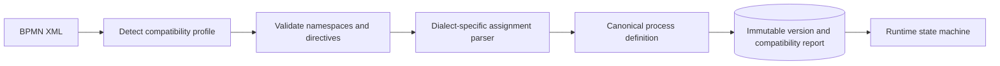

import { Aside } from '@astrojs/starlight/components';

The runtime never executes vendor XML directly. Deployment detects the BPMN
dialect, validates every execution-relevant directive and translates supported
semantics into a vendor-neutral canonical process model.

## Compatibility profiles

- `standard-bpmn-2.0` accepts portable BPMN constructs and explicit standard
  resource assignments.
- `abada-native-1` accepts Abada's versioned extension namespace.
- `camunda-7` preserves existing supported Camunda definitions through a
  compatibility parser and deterministic migration tooling.

Each profile maps supported XML into shared `ProcessExpression` and
`UserTaskAssignment` models. Conflicting or unknown execution directives
produce stable validation codes. Deployment is atomic: invalid input persists
neither a definition version nor a partial compatibility report.

## Supported execution subset

The 1.0 contract focuses on none start/end events, user tasks, embedded and
external service tasks, script tasks, exclusive/inclusive/parallel gateways,
and message/signal/duration-timer catch events. Event-based gateways are
limited to one outgoing catch event.

Unsupported constructs—such as subprocesses, boundary events,
multi-instance activities, compensation, complex gateways, cyclic timers, DMN
and CMMN—are rejected during deployment rather than treated as ambiguous
pass-through nodes.

<Aside type="caution" title="Compatibility is explicit, not permissive">
  Supporting Camunda 7 input does not make vendor extensions part of the
  runtime model. New execution semantics require a canonical representation,
  validation rules, persistence behavior and executable equivalence evidence.
</Aside>

## Version immutability

Redeploying a process key creates a new immutable version. New instances select
the latest committed definition, while running instances retain their stored
deployment ID. Parsed cache entries use that immutable ID, so redeployment
cannot change an active instance's semantics.
