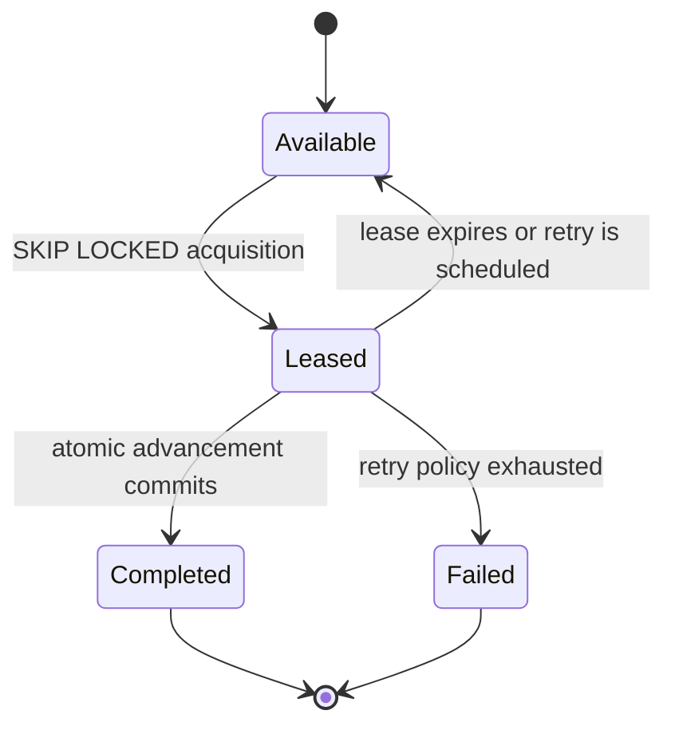
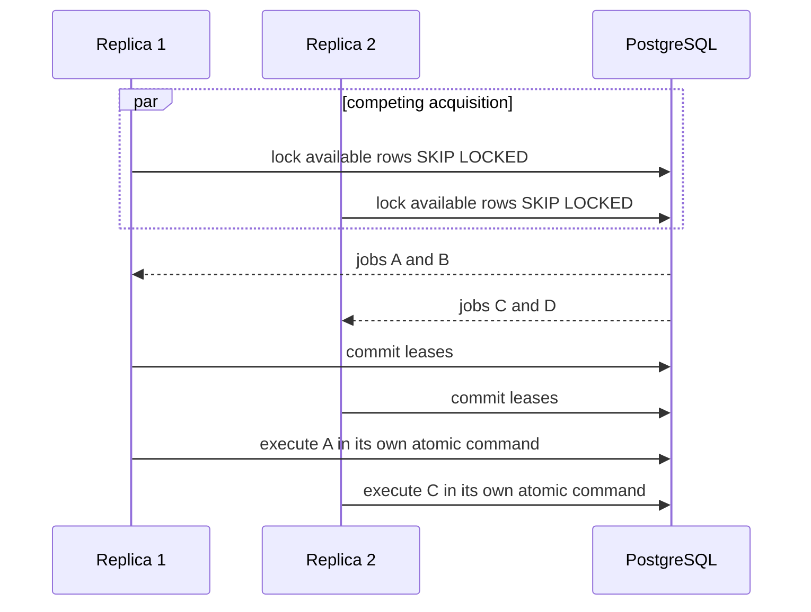

import { Aside } from '@astrojs/starlight/components';

All replicas run the same engine image and coordinate through PostgreSQL. No
leader or broker is required for correctness.

## Durable work lifecycle

Timers, external tasks and outbox deliveries include a status, availability or
due time, lease owner, lease expiry and retry metadata. Acquisition uses
bounded `FOR UPDATE SKIP LOCKED` queries so competing replicas claim disjoint
rows without blocking the whole queue.

## Acquisition is intentionally short

The engine commits a short acquisition transaction, then executes each leased
item in its own workflow command. A failed advancement therefore rolls back
that item without holding locks on the rest of the batch.

Agent tasks ride the same machinery: fetch-and-lock claims durable
`abada:agent` work with `SKIP LOCKED` semantics, worker heartbeats refresh
owned leases, and expiry re-acquires dead-worker work without duplicate
transitions. The Insight analyzer adds one more lease consumer — the
durable singleton lease that guarantees a single analyzer at a time (see
[The Insight Engine](/architecture/insight/)).

## Recovery rules

- A replica that dies before acquisition commit owns nothing.
- A replica that dies after lease commit leaves a durable lease; another
  replica can recover it after expiry.
- A replica that dies after workflow commit cannot cause a second workflow
  transition when the request or work completion is replayed deterministically.
- External effects remain at-least-once even when the internal state transition
  is single-winner.

## Correlation and user tasks

Message and signal subscriptions are durably stored and locked during
correlation. User-task transitions lock the task row and, when advancing the
process, the process-instance row. Concurrent contenders observe the winner's
committed state and receive a deterministic rejection rather than advancing a
second time.

<Aside type="note" title="Certified topology">
  Multi-replica claims apply to PostgreSQL deployments covered by the
  Testcontainers concurrency, failover, lease-recovery and duplicate-request
  suites. They do not make H2 a clustered production database.
</Aside>
