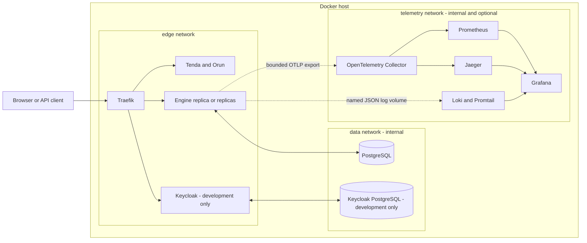

import { Aside } from '@astrojs/starlight/components';

The release distribution combines one shared platform definition with exactly
one environment profile. Telemetry is an optional third layer; it is not a
dependency of workflow execution.

## Layer ownership

| Layer | Owns | Must not own |
| --- | --- | --- |
| `compose.yaml` | PostgreSQL, Engine, Tenda, Orun, internal data and edge networks, persistent workflow/log volumes | Identity provider, TLS policy, telemetry backends |
| `compose.dev.yaml` | Local HTTP routing, bundled Keycloak, safe evaluation credentials | Production identity or certificates |
| `compose.prod.yaml` | Exact application version, TLS/ACME routing, required external OIDC and CORS values, production restart/resources | Bundled production Keycloak or default secrets |
| `compose.telemetry.yaml` | Collector, metrics, traces, logs and Grafana | Database authority, engine readiness or workflow transactions |

The release bundle contains these files and every mounted configuration asset.
It intentionally contains no Docker build context, so deployments pull the
same immutable frontend and engine images everywhere.

## Frontend startup contract

Tenda and Orun do not embed installation-specific URLs during `vite build`.
Their container entrypoint validates API URL, OIDC URL, realm and client ID,
escapes them into `/config.js`, and starts Nginx only after validation passes.
The HTML loads `/config.js` before the application bundle, and Nginx marks that
file as non-cacheable. This lets one image serve multiple installations while
still failing fast on incomplete configuration.

## Workflow and telemetry health

The engine Compose health check uses `/api/actuator/health/readiness`. Its
readiness group contains application and PostgreSQL state and excludes
telemetry. `/api/actuator/health/telemetryExport` reports whether export is
disabled or configured, but never probes or gates on a collector.

With telemetry disabled, the engine supplies a no-op `Tracer` to command
services and creates no span or metric exporter. With telemetry enabled, span
queues, batches, retry time and request timeouts are bounded. Export happens
outside workflow-state transactions; an outage may lose diagnostic signals
but cannot roll back a committed task or make readiness fail.

<Aside type="caution" title="Security boundary">
  PostgreSQL and telemetry backends have no public ports. Production exposes
  only Traefik on 80/443. Grafana is loopback-only in the bundled overlay and
  needs an operator-managed access path for remote production use.
</Aside>

## Persistent and replaceable state

- `postgres_data` is authoritative workflow state and must be backed up.
- `engine_logs` carries structured rolling logs to Promtail when the overlay is
  present; logging continues without Promtail.
- `letsencrypt_data` preserves production ACME state.
- Prometheus, Loki and Grafana volumes are operational telemetry state. Their
  loss does not change workflow correctness.
- Engine and frontend containers are replaceable. Replica coordination and
  restart recovery come from PostgreSQL, not container-local memory.
