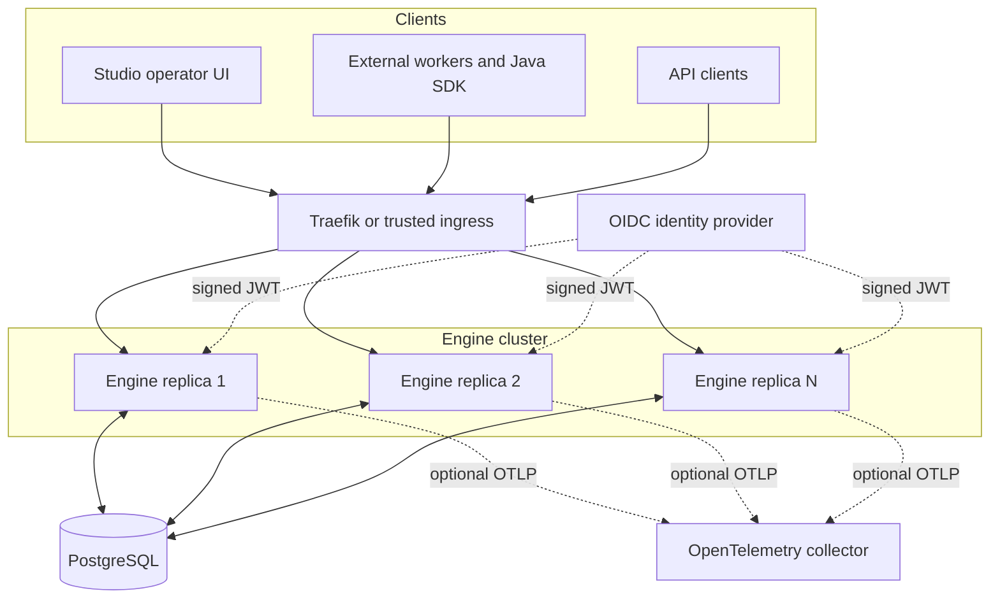

import { Aside, Card, CardGrid } from '@astrojs/starlight/components';

Abada is a self-hosted BPMN orchestration platform. Clients and workers use the
versioned API, any engine replica may handle a command, and PostgreSQL owns the
workflow truth.

## Architectural boundaries

<CardGrid>
  <Card title="Public boundary" icon="puzzle">
    `/api/v1` and worker protocol v1 expose stable DTOs, typed errors,
    pagination, idempotency and trace propagation.
  </Card>
  <Card title="Execution boundary" icon="setting">
    Core command services reconstruct state and execute the supported BPMN
    semantics inside explicit transactions.
  </Card>
  <Card title="Persistence boundary" icon="database">
    JPA repositories and Flyway migrations map durable definitions, instances,
    tasks, subscriptions, jobs, variables, history and outbox records.
  </Card>
  <Card title="Presentation boundary" icon="laptop">
    Studio consumes public DTOs. It does not define authorization or
    reconstruct authoritative workflow history.
  </Card>
</CardGrid>

## State ownership

| State | Authority | Replica memory policy |
| --- | --- | --- |
| Definitions and versions | PostgreSQL deployment rows | Parsed immutable model may be cached by deployment ID |
| Instances, tokens and joins | PostgreSQL | Command-local only |
| Variables and user tasks | PostgreSQL | Detached read snapshots or command-local models |
| Subscriptions, timers and work | PostgreSQL | Acquired through locks and leases |
| Audit history and lifecycle events | PostgreSQL | Lifecycle delivery originates from the outbox |

<Aside type="note" title="H2 is not the production reference">
  H2 exists for local convenience. PostgreSQL Testcontainers provide the
  evidence for migrations, locking, concurrency, restart recovery and
  multi-replica behavior.
</Aside>

## Continue exploring

- [Runtime and transaction boundaries](/architecture/runtime/)
- [Platform deployment and telemetry boundaries](/architecture/deployment/)
- [Cluster acquisition and recovery](/architecture/cluster/)
- [Authentication and authorization](/architecture/security/)
- [BPMN parsing and canonical execution](/architecture/bpmn/)
