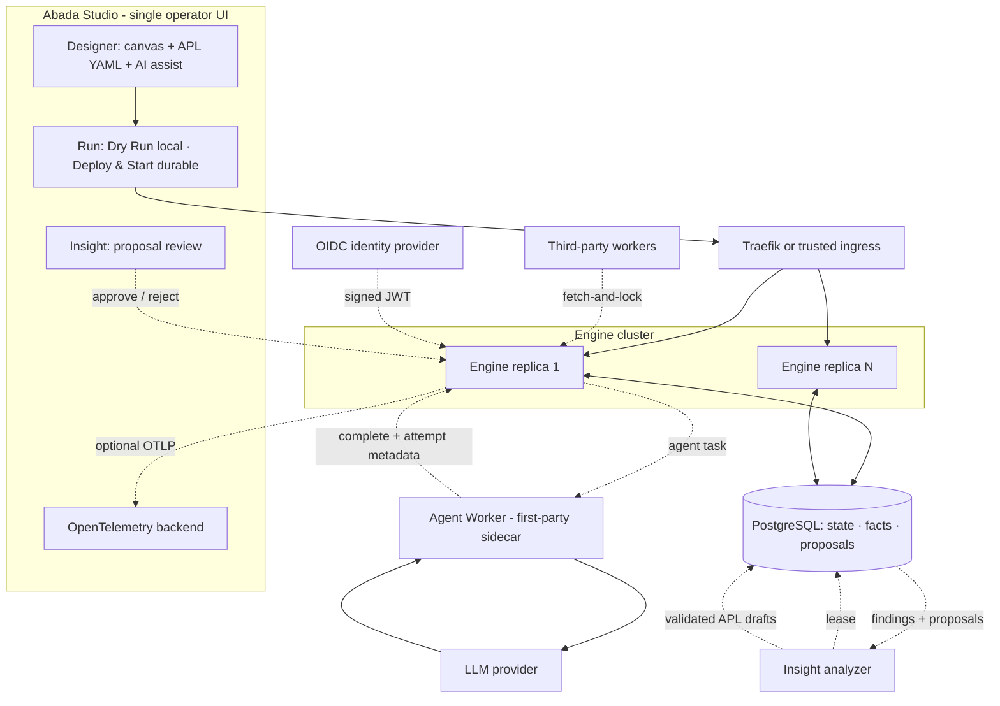

import { Aside, Card, CardGrid } from '@astrojs/starlight/components';

Abada orchestrates **agentic workflows on a transactional ACID rail**. Studio
is the AI-native authoring and operations surface, APL is the native
definition language, the Engine is a PostgreSQL-authoritative transactional
core, agent nodes execute as durable external work, and the Insight Engine
closes a governed self-optimizing loop. Clients and workers use the versioned
API; any engine replica may handle a command; PostgreSQL owns the workflow
truth.

The doctrine expressed across these components is **the table is the law,
agents are the advice**: deterministic decision tables evaluate inside the
transaction, probabilistic agent work stays on the durable worker protocol,
and humans govern every executable change.

## Architectural boundaries

<CardGrid>
  <Card title="Authoring boundary" icon="laptop">
    Studio serializes one APL document from its canvas and YAML editor; BPMN
    XML is transpiled at import. Dry Run is local and mocked; Deploy &amp;
    Start is the only authoring action that persists state.
  </Card>
  <Card title="Public boundary" icon="puzzle">
    `/api/v1` and worker protocol v1 expose stable DTOs, typed errors,
    pagination, idempotency and trace propagation — including the additive
    `abada.agent/v1` profile.
  </Card>
  <Card title="Execution boundary" icon="setting">
    Core command services reconstruct state and execute the canonical model
    inside explicit transactions; agent and external work always arrives back
    through a command.
  </Card>
  <Card title="Persistence boundary" icon="database">
    JPA repositories and Flyway migrations map durable definitions, instances,
    tasks, subscriptions, jobs, variables, history, Insight facts and outbox
    records.
  </Card>
</CardGrid>

## State ownership

| State | Authority | Replica memory policy |
| --- | --- | --- |
| Definitions and versions | PostgreSQL deployment rows | Parsed immutable model may be cached by deployment ID |
| Instances, tokens and joins | PostgreSQL | Command-local only |
| Variables and user tasks | PostgreSQL | Detached read snapshots or command-local models |
| Subscriptions, timers and work | PostgreSQL | Acquired through locks and leases |
| Agent and external tasks | PostgreSQL external-task rows (attempt metadata included) | Acquired through fetch-and-lock leases |
| Insight facts, findings and proposals | PostgreSQL (facts commit with their command) | Analyzer works from durable windows |
| Audit history and lifecycle events | PostgreSQL | Lifecycle delivery originates from the outbox |

<Aside type="note" title="H2 is not the production reference">
  H2 exists for local convenience. PostgreSQL Testcontainers provide the
  evidence for migrations, locking, concurrency, restart recovery and
  multi-replica behavior.
</Aside>

## Continue exploring

- [The transactional execution core](/architecture/runtime/)
- [Native APL and the canonical model](/architecture/apl/)
- [Agent Worker execution](/architecture/agent-worker/)
- [The Insight Engine](/architecture/insight/)
- [Platform deployment and telemetry boundaries](/architecture/deployment/)
- [Cluster acquisition and recovery](/architecture/cluster/)
- [Authentication and authorization](/architecture/security/)