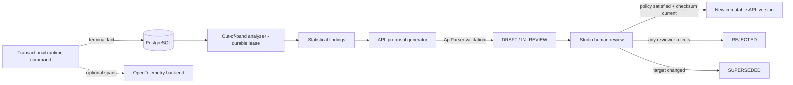

import { Aside } from '@astrojs/starlight/components';

The Insight Engine turns execution evidence into workflow improvements
without Kafka, ClickHouse or a mandatory analytical stack (ADR-003). It is
**disabled by default**, never changes a running process instance, and has no
auto-apply mode: executable changes reach production only through explicit,
policy-compliant human approval.

## The loop

1. **Facts.** Each terminal node visit writes one idempotent row in the same
   transaction as the runtime command that made the decision — identifiers,
   status, timing, topic/decision metadata, matched rule indexes and fallback
   usage. No variables, prompts or PII.
2. **Analyze.** An out-of-band analyzer acquires a durable singleton lease and
   consumes bounded, non-overlapping windows. It persists findings first, then
   optionally drafts a change; a crash resumes an `ANALYZED` window after the
   lease expires.
3. **Generate.** An optional OpenAI-compatible model call happens **outside**
   database transactions. The candidate is discarded unless `AplParser`
   accepts it and its process key matches the target; a rule-based fallback
   preserves executable semantics without a model.
4. **Propose.** At most one open proposal exists per deployment, snapshotted
   with its target deployment, version and checksum.
5. **Govern.** Studio review (approve/reject) under the snapshotted policy.
   When satisfied and the target is still latest, the proposed APL deploys
   through the normal engine command as a new immutable version
   (`ADOPTED`). A stale target becomes `SUPERSEDED`. Rejection requires a
   non-empty comment and is terminal.

## Durable data model

| Table | Purpose |
| --- | --- |
| `insight_execution_facts` | One idempotent row per node visit (`visit_id`) |
| `insight_observation_windows` | Durable analyzer cursor and `ANALYZED`/`COMPLETED`/`FAILED` recovery state |
| `insight_findings` | Threshold violations for one deployment and node |
| `insight_proposals` | Target/proposed APL, checksum, policy snapshot, lifecycle and adopted version |
| `insight_approval_policies` | Versioned policy per definition key |
| `insight_proposal_reviews` | Immutable actor decision and comment |
| `insight_worker_lease` | Cluster-safe singleton analysis lease |

Facts and workflow state commit or roll back together. Latency baselines use
facts strictly before the current window — facts in the window cannot train
their own baseline.

## Signals

- external-task failure rate after `min-attempts`;
- external-task p95 latency relative to the pre-window baseline;
- decision-table fallback ratio after `min-fallback-samples`.

## Governance

Policies are keyed by definition and snapshot onto new proposals. The default
is one approval from `abada-insight-reviewer`; a policy lists distinct
reviewer groups and requires one approval per group (`PARALLEL` any order,
`SEQUENTIAL` declared order). One actor reviews a proposal once. Reviews,
status transitions and deployment results are stored durably and emitted
through the normal history/outbox recording; optimistic timestamps and
versions prevent silent overwrites. Insights proposals are generated only for
native APL definitions — BPMN deployments remain supported for compatibility
but are not proposal targets.

## Role of OpenTelemetry

OpenTelemetry stays an optional operational export for traces and diagnostics.
It is not the v1 Insight cursor, does not authorize a proposal, and is not
required for the certified standard topology.

<Aside type="note">
  API, authorization and configuration details: [Insight Loop
  reference](https://github.com/bashizip/abada-platform/blob/dev/docs/reference/insight-loop.md)
  and [ADR-003](https://github.com/bashizip/abada-platform/blob/dev/docs/adr/ADR-003-insight-loop-engine-otel-apl.md).
  Review workflow in Studio: [Insight: governed AI
  optimization](/user/studio-insight/).
</Aside>