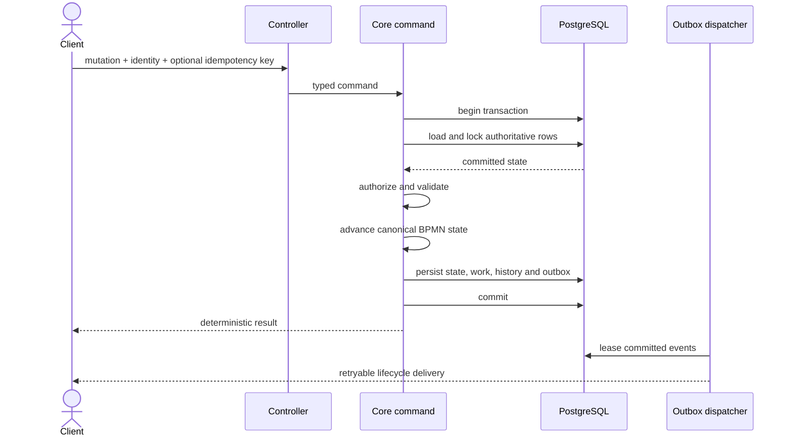

import { Aside, Steps } from '@astrojs/starlight/components';

Every mutation follows one rule: committed PostgreSQL rows are the input and
output of the workflow transition. A replica does not continue from a mutable
process object retained from an earlier request.

## Atomic command lifecycle

<Steps>
1. **Load.** Fetch the definition version and mutable aggregate records needed
   by the command.
2. **Lock.** Use row locks for single-winner transitions and optimistic versions
   for stale-write detection.
3. **Authorize and validate.** Check the authenticated permission, task
   assignment, current status, lease ownership and command inputs.
4. **Advance.** Execute the vendor-neutral process model and create successor
   tokens or durable work.
5. **Persist.** Store variables, tasks, subscriptions, jobs, history,
   idempotency result and outbox events in the same transaction.
6. **Commit.** Only a successful commit makes the transition visible.
</Steps>

## Failure semantics

- Failure before commit rolls back workflow state, new work, history and
  outbox records together.
- Failure after commit leaves durable progress. An idempotency record lets a
  duplicate API mutation replay its logical response.
- Embedded Java delegates and scripts run inside the transaction, but an
  irreversible external side effect cannot be rolled back by PostgreSQL.
- External tasks are the preferred boundary for remote effects; workers must
  make at-least-once effects idempotent.

<Aside type="caution" title="Never call a remote service while holding workflow locks">
  A slow or failed remote call lengthens the transaction and increases cluster
  contention. Model retryable remote work as a durable external task instead.
</Aside>

## Cache policy

The sole execution cache stores immutable parsed definitions keyed by
deployment ID. A new process start queries PostgreSQL for the latest version;
an existing instance reloads its pinned version. Evicting the cache changes
latency, not semantics.

Mutable instances, tokens, joins, tasks, subscriptions, timers, jobs and
variables never live in runtime-wide maps. Command-local maps are allowed only
while materializing and advancing one locked aggregate.

## Executable boundary

Controller-reachable mutations enter services marked with
`@AtomicRuntimeCommand`. `AtomicRuntimeCommandContractTest` inventories that
boundary, while PostgreSQL rollback and two-context tests prove the behavior
under failures and concurrent commands.
