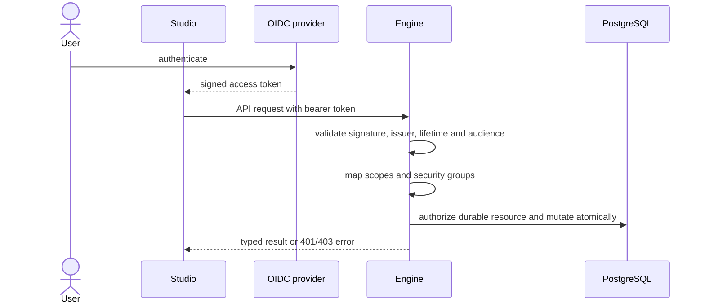

import { Aside } from '@astrojs/starlight/components';

Production defaults to direct OIDC JWT validation. The engine verifies the
issuer, signature, lifetime and configured API audience instead of trusting
identity headers supplied by an arbitrary client.

## Permission domains

| Domain | OAuth scopes | Security role | Examples |
| --- | --- | --- | --- |
| Deployment | `process:deploy` | `abada-deployer` | Deploy BPMN definitions |
| Process control | `process:control` | `abada-process-controller` | Start, fail and correlate |
| Tasks | `task:read`, `task:write` | `abada-task-user` | Read and act on visible tasks |
| Operations | `operations:read`, `operations:write` | `abada-operator` | Inspect state, history, jobs and retries |
| Workers | `worker:execute` | `abada-worker` | Use worker protocol v1 |
| Administration | all domains | `abada-admin` | Full engine access |

Business groups used for BPMN assignment do not grant engine permissions.
Task actions require both the platform permission and durable
assignee/candidate authorization.

## Trusted proxy mode

Proxy mode accepts `X-Auth-Request-*` identity headers only when explicitly
configured. It is safe only if network policy makes the engine unreachable
except through the authenticating proxy. Those headers are ignored in OIDC
mode, and disabled security is limited to local development and automated
tests.

<Aside type="danger" title="Do not expose proxy mode directly">
  If clients can reach the engine without passing through the trusted proxy,
  they can forge identity headers. Treat network isolation as part of the
  authentication boundary.
</Aside>

## Data protection and audit

- CORS allows configured origins and the documented API and trace headers.
- Request logs exclude authorization headers and complete sensitive payloads.
- Typed authentication and authorization failures use the API v1 error shape.
- Committed security-relevant mutations append actor, action, timestamp,
  process/activity identifiers and trace ID to durable history.
- Negative tests cover invalid and expired JWTs, forged proxy headers, role
  boundaries, CORS, sensitive logging and unauthorized cross-user task access.
