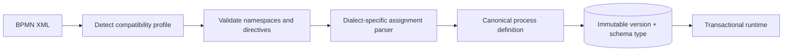

import { Aside } from '@astrojs/starlight/components';

Native APL is Abada's authoring language, but BPMN remains a first-class
**import and backward-compatibility surface**. Studio transpiles BPMN into APL
at the import boundary, and the engine accepts BPMN 2.0 XML directly: a
deployment source starting with `<` is validated and compiled through the
canonical BPMN path, while `version: abada.io/v1` goes through the native APL
parser. Both compile to the same executable graph and share the runtime.

## Compatibility profiles

- `standard-bpmn-2.0` accepts portable BPMN constructs and explicit standard
  resource assignments.
- `abada-native-1` accepts Abada's versioned extension namespace
  (`https://abada.io/schema/bpmn`).
- `camunda-7` preserves existing supported Camunda definitions through a
  compatibility parser and deterministic migration tooling.

Each profile maps supported XML into shared canonical models. Conflicting or
unknown execution directives produce stable validation codes. Deployment is
atomic: invalid input persists neither a definition version nor a partial
compatibility report. New execution semantics require a canonical
representation, validation rules, persistence behavior and executable
equivalence evidence — supporting Camunda input never makes vendor extensions
part of the runtime model.

## Supported execution subset

The 1.0 contract covers none start/end events, user tasks, embedded and
external service tasks, script tasks, business rule tasks carrying a native
`abada:decisionTable`, exclusive/inclusive/parallel/event-based gateways, and
message/signal/duration-timer catch events. An event-based gateway requires at
least two competing catch children: the first child to fire advances the
instance and every sibling wait state (subscription, timer job and token) is
cancelled atomically in the same transaction.

Unsupported constructs — such as subprocesses, boundary events,
multi-instance activities, compensation, complex gateways, cyclic timers,
external DMN 1.3 decision files and CMMN — are **rejected during deployment**
rather than treated as ambiguous pass-through nodes. A business rule task is
supported only with an inline `abada:decisionTable` extension; a user task's
`camunda:formKey` maps to the canonical `formKey` (a project FORM resource)
and reports a warning when it does not resolve.

The full element-by-element matrix with executable evidence lives in the
[BPMN support contract](https://github.com/bashizip/abada-platform/blob/dev/docs/reference/bpmn-support.md).

## Importing into Studio

1. In Studio, choose **Import BPMN** (Upload icon) and select a `.bpmn` file.
   Studio transpiles it into a native-APL document — the file carries the
   `[BPMN Imported]` badge until you author further in APL.
2. Review the transpiled APL and the format pill; round-trip fidelity for the
   supported subset is verified by Studio's kitchen-sink check.
3. Save and **Deploy &amp; Start** as usual. The engine persists the exact
   deployed source with its schema type; nothing is silently rewritten.

Alternatively, deploy BPMN XML directly to the engine through the API — the
source XML is preserved and the compatibility profile/report recorded.

## Migrating from Camunda 7

Existing Camunda definitions keep working under the `camunda-7` profile. When
you are ready to move forward, run the deterministic migration tooling to
convert preserved semantics into the stable Abada namespace, then author new
changes natively in APL. BPMN remains deployable forever for compatibility;
Insight optimization proposals, however, target only native APL definitions.

## Version immutability

Redeploying a process key creates a new immutable version. New instances select
the latest committed definition, while running instances retain their stored
deployment ID. Parsed cache entries use that immutable ID, so redeployment
cannot change an active instance's semantics.

<Aside type="note">
  Normative sources: the [dialect compatibility
  ADR](https://github.com/bashizip/abada-platform/blob/dev/docs/adr/ADR-001-bpmn-dialects-and-vendor-compatibility.md),
  the [BPMN support contract](https://github.com/bashizip/abada-platform/blob/dev/docs/reference/bpmn-support.md)
  and the migration/profile documents linked from the [authoritative contracts
  index](/reference/contracts/). APL-native authoring: [Author processes in
  native APL](/user/authoring/).
</Aside>