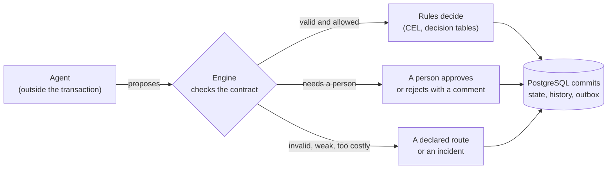

import { Aside, Badge, CardGrid, LinkCard } from '@astrojs/starlight/components';

Abada runs business processes in which AI agents, deterministic rules and
people work together. This page introduces every capability in a few lines,
with a short APL excerpt, what the engine **guarantees** and where that
guarantee **stops**. Each section links to the page that explains it fully.

Capabilities marked <Badge text="1.1.0-rc.2 · on dev" variant="caution" /> are
implemented and tested on the development branch and ship with the next
release candidate.

## The one idea: agents advise, the engine decides



A model never changes process state by itself. Its answer enters the process
only through an engine command that validates it, inside one PostgreSQL
transaction with the history and the events that describe it.

## Processes

### Processes are APL documents

A process is a YAML document in **APL** (`abada.io/v1`). Studio draws it as a
diagram and edits both views as one document; the engine compiles it directly.

```yaml
version: abada.io/v1
metadata: { key: refund_agent, name: Refund agent }
flow:
  entry: request-received
  nodes:
    - { id: request-received, type: webhook, next: handle }
    - { id: handle, type: agent, model: gemini-3.6-flash, prompt: "…", next: done }
    - { id: done, type: end }
```

- **Guarantee.** Deployment validates the whole document and rejects anything
  ambiguous, at its path, before anything runs.
- **Limit.** APL is the authoring format; BPMN 2.0 is an import boundary with a
  [tested subset](/compatibility/bpmn/).

[Author processes in APL](/user/authoring/) ·
[Native APL and the canonical model](/architecture/apl/)

### Versions are immutable

Each deployment is a new version. A running instance keeps the version it
started with, including the tool servers and child processes it was bound to.

- **Guarantee.** Redeploying never changes the behavior of running instances.
- **Limit.** Fixing a running instance means retrying or cancelling it, not
  editing its definition.

## Agents advise

### Agents are durable work

An `agent` step becomes durable external work on the `abada:agent` topic. A
worker (the first-party Agent Worker or your own) leases it, calls the model
and reports back through an engine command.

- **Guarantee.** No model is called inside a workflow transaction. A dead
  worker's lease expires and another worker continues; a late report after a
  cancellation is rejected.
- **Limit.** With no worker running, agent steps wait — they do not fail.

[Agent nodes and the Agent Worker](/user/agent-worker/) ·
[Agent Worker execution](/architecture/agent-worker/)

### The output contract

```yaml
- id: classify
  type: agent
  result_variable: classification
  output_schema:
    type: object
    required: [category, severity]
    properties: { severity: { enum: [low, medium, high] } }
  confidence_threshold: 80
  on_invalid_output: review
  on_low_confidence: review
```

- **Guarantee.** The engine — not the worker, the model or the UI — checks the
  answer against the schema and the confidence threshold before it is stored.
  A rejected answer takes its declared route or counts as a failed attempt.
- **Limit.** A valid answer can still be wrong; the contract bounds its shape
  and confidence, and a review step is how you bound its content.

### Fallback models

`fallback_models` lists up to three models tried while the one before is
rate-limited or unavailable. Invalid or weak answers never switch the model.
[Fallback models](/user/process-patterns/#fallback-models)

## Rules decide

### Deterministic rules

```yaml
- id: route
  type: condition
  rules:
    - if: "${classification.severity == 'high'}"
      then: escalate
    - else: draft
      then: draft
```

Conditions and decision tables are sandboxed **CEL**, evaluated inside the
transaction.

- **Guarantee.** The same inputs give the same decision; an expression that
  cannot be evaluated fails loudly instead of guessing; CEL cannot reach the
  JVM.
- **Limit.** Rules see process variables only, never external systems.

## Humans approve

### Review decisions with a comment

A `human-input` step can declare outcomes; rejecting requires a comment the
next agent reads.
[Review decisions](/user/process-patterns/#review-decisions)

### Service levels

`sla_hours` marks a late task escalated; `on_timeout` routes the process
elsewhere after a deadline.
[Service levels](/user/process-patterns/#service-levels) ·
[Timeouts](/user/process-patterns/#timeouts)

## Process shapes

### Bounded loops and routes

Every cycle needs a `loop` bound, and every way out of a step — an error, a
timeout, a weak answer — is a named route on the canvas.
[Loops, routes and review decisions](/user/process-patterns/)

### Routing agents

An agent may choose the next step, but only among the routes its node declares,
and a route's `when` lets the engine veto the choice.

```yaml
routes:
  refund:   { next: investigate, description: The customer asks for money back, when: "request.amount <= 500.0" }
  escalate: { next: manual, description: Anything unclear, angry or legal }
```

- **Guarantee.** An undeclared route, or one whose `when` is false, is treated
  as an invalid answer; the route taken is recorded with the confidence.
- **Limit.** The model chooses by the descriptions you write; vague
  descriptions give vague routing.

[Let the agent choose the next step](/user/process-patterns/#let-the-agent-choose-the-next-step)

## Agents that act

<Badge text="1.1.0-rc.2 · on dev" variant="caution" />

### Tools and tool servers

Agents use tools declared by a project **tool server** (an MCP server reached
over streamable HTTP). Each tool has a policy: `read`, `write` or
`approval_required`.

```yaml
# Tool server (project resource)
name: payments
transport: streamable-http
url: https://payments-mcp.internal/mcp
tools:
  get_order: { policy: read }
  refund: { policy: approval_required, idempotency: none, approvers: [finance] }
```

```yaml
# Agent node
tools:
  - payments/get_order
  - payments/refund
```

- **Guarantee.** An agent can call only the tools bound to its node, frozen
  with the definition version. A node can tighten a policy, never loosen it.
  The worker additionally refuses servers its operator did not allow.
- **Limit.** The engine never connects to a tool server: the worker does, with
  the project's tool credential.

[Tools and tool servers](/user/agent-worker/#tools-and-limits) ·
[Tutorial: an agent that acts](/user/tutorial-agent-that-acts/)

### A person approves a write

An `approval_required` call is journaled as **proposed**: the agent's work
parks without a worker and an approval task opens for the approver groups,
showing the exact arguments.


- **Guarantee.** The call runs only after a candidate approves it, and only
  with the approved arguments. A worker credential can never decide. A
  rejection's comment goes back to the agent.
- **Limit.** The approver sees the arguments the evidence policy keeps;
  sensitive values may be redacted.

[Approving an agent's tool call](/user/process-patterns/#approving-an-agents-tool-call)

### A crash never repeats a write blindly

Every model and tool call is journaled before it runs. A restarted worker
continues from the journal instead of starting over.

- **Guarantee.** A write whose server accepts an idempotency key is re-sent
  with the **same** key. A write without one that was interrupted is never
  re-sent: the step becomes `OUTCOME_UNKNOWN` and an incident asks a person
  whether it happened. A later attempt that asks for the same write gets the
  recorded result instead of sending it again.
- **Limit.** Without an idempotency key, someone must check the target system;
  external effects stay at-least-once unless the server deduplicates.


[Crash safety in the tutorial](/user/tutorial-agent-that-acts/#10-the-writes-outcome-is-unknown)

### Limits and cost

```yaml
max_turns: 6          # model calls per attempt
max_tokens_total: 50000
budget_usd: 0.05      # computed by the engine from model prices
```

- **Guarantee.** The engine checks the limits before each model call is
  journaled and computes cost from your [model prices](/user/agent-worker/#tools-and-limits);
  a budget fails closed for an unpriced model. Reaching a limit ends the step
  with `AGENT_BUDGET_EXHAUSTED`, routable through `on_error`.
- **Limit.** Cost is an engine estimate from token counts and your prices, not
  the provider's invoice.

## Composition

<Badge text="1.1.0-rc.2 · on dev" variant="caution" />

### Call another process

```yaml
- id: payout
  type: call-process
  process: refund_payout
  inputs: { order_id: "${request.order_id}", amount: "${request.amount}" }
  outputs: { payout_id: payout_id }
```

The child runs as its own instance, with its own locks, history and
reviewers; only the mapped outputs come back.

### Let an agent delegate

```yaml
delegates:
  - process: fraud_check
    description: Assess the fraud risk of a refund
    outputs: [verdict]
```

The agent decides whether to start the child; the engine checks the inputs
against the child's declared variables, the nesting depth and, when required,
a person's approval.

- **Guarantee.** Child versions are pinned at deployment; lineage links every
  child to the instance and the agent step that started it; cancelling the
  parent cancels its children.
- **Limit.** Delegation is depth-limited (`abada.call-process.max-depth`,
  default 4) and only to processes of the same project.

[Let an agent delegate to another process](/user/process-patterns/#let-an-agent-delegate-to-another-process) ·
[Called processes](/user/operations/#called-processes)

## Evidence

### The audit trail

Every command records its actor, time and identifiers in the instance history,
in the same transaction as the change. Agent decisions record the model,
attempt, confidence and route — never prompts, secrets or comment text.

### Step evidence and payloads

Each journaled step keeps digests, tokens, cost and timings. Payloads (prompts,
replies, tool arguments and results) are kept as the project's **evidence
policy** allows — `none`, `redacted` (default) or `full`, for a retention
period — encrypted at rest.

- **Guarantee.** Only members with the `abada-evidence-reader` role can read
  payloads, and every read is recorded.
- **Limit.** Digests prove what was sent; after retention, payloads are gone.

[Operate running processes](/user/operations/#one-instance)

## Operations

### Live instances and the step inspector

<Badge text="1.1.0-rc.2 · on dev" variant="caution" />

The instance page follows the project's event stream and refreshes as soon as
something happens. Its step inspector lists every model call, tool call and
delegation with its policy, state, approver, tokens and cost.


### Incidents and retries

A path that cannot continue stops with an incident; the rest of the instance
keeps running. An operator retries it — on another model if needed — or, for
an unknown write outcome, says what happened.
[Incidents](/user/operations/#incidents)

## Improvement

### Insight proposes, people decide

The Insight Engine turns terminal facts into proposed APL changes. A proposal
becomes a new version only after policy-compliant human review.
[Insight: governed AI optimization](/user/studio-insight/)

## What Abada does not promise

<Aside type="caution" title="Boundaries">
- **External effects are at-least-once.** PostgreSQL cannot roll back a model
  call or a tool's side effect. Abada never re-sends an interrupted write
  without an idempotency key, and asks a person instead — but a tool server
  must deduplicate with the key it receives to make retries harmless.
- **Nothing auto-applies.** Insight proposals and agent-proposed changes wait
  for a person.
- **The certified topology** is one or more engine instances on PostgreSQL
  with Docker Compose; see the
  [deployment support matrix](https://github.com/bashizip/abada-platform/blob/dev/docs/reference/deployment-support.md).
</Aside>

## Next

<CardGrid>
  <LinkCard title="Use cases" href="/user/use-cases/" description="Five runnable processes and what each one shows." />
  <LinkCard title="Tutorial: an agent that acts" href="/user/tutorial-agent-that-acts/" description="Tools, an approved write, a crash and the cost, with a screenshot at every step." />
  <LinkCard title="Tutorial: a reviewed AI reply" href="/user/first-workflow/" description="Agents, a review loop with comments, a timeout and fallback models." />
  <LinkCard title="Architecture" href="/architecture/" description="How the transactional core keeps AI work safe." />
</CardGrid>
