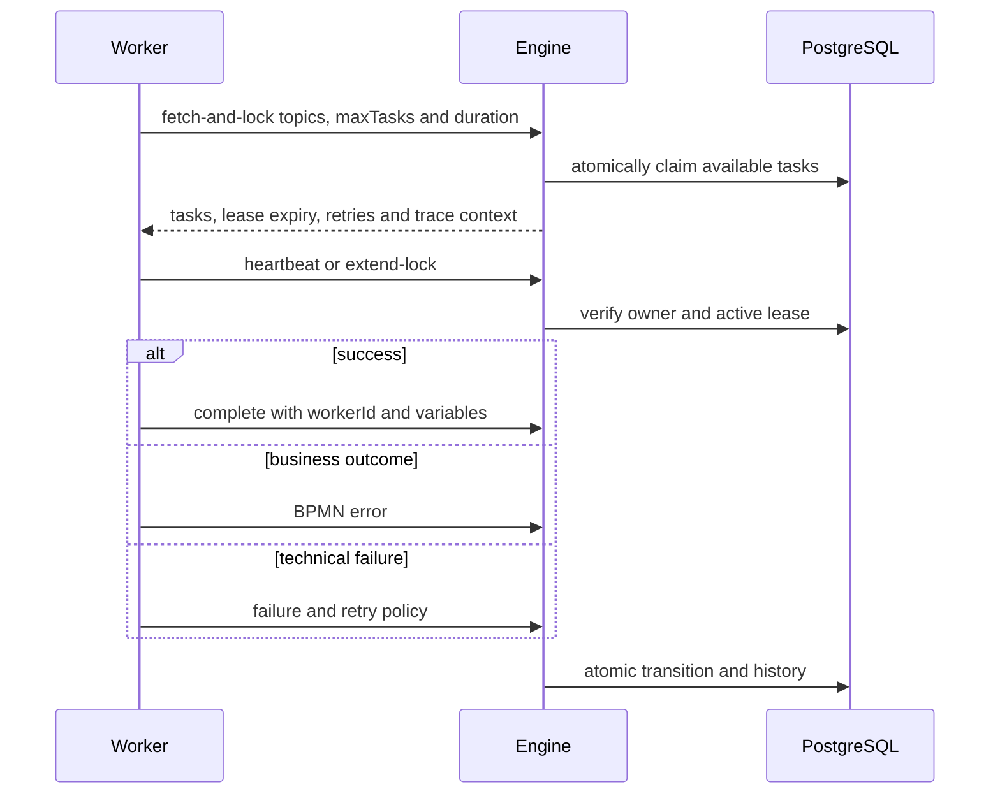

import { Aside } from '@astrojs/starlight/components';

Abada 0.11 freezes the public REST surface under `/api/v1` and external-worker
protocol v1. Evolve them additively and prove compatibility from generated
OpenAPI.

## REST API v1

- Keep persistence entities out of public schemas; map them to stable DTOs.
- Existing paths, methods, field names, types and status meanings are stable.
- New optional fields, endpoints, response headers and enum values are allowed.
- List bodies remain JSON arrays. Pagination metadata uses `X-Page`,
  `X-Page-Size`, `X-Total-Count` and `X-Total-Pages`.
- Mutation endpoints accept `Idempotency-Key` where deterministic replay is
  defined.
- JSON errors use the stable `ErrorResponse` envelope and machine-readable
  `ApiErrorCode` values.

The generated OpenAPI document is checked against
`engine/src/test/resources/contracts/api-v1-contract.json` by
`OpenApiContractTest`.

## Worker protocol v1

Completion, heartbeat, extension, failure and BPMN error validate worker
ownership and lease expiry. Trace context propagates with acquired work. The
Java SDK under `sdk/java` is the executable reference client.

<Aside type="caution" title="External effects are at-least-once">
  A worker may finish its remote side effect and lose the completion response.
  Use a stable business or idempotency key at the external system; the engine
  cannot roll that effect back.
</Aside>

## Contract change checklist

1. Update the DTO and controller without leaking an entity.
2. Preserve old input unless a versioned migration explicitly changes it.
3. Add typed success, invalid-input and authorization tests.
4. Update the OpenAPI compatibility manifest.
5. Update Tenda, Orun or the Java SDK if they consume the contract.
6. Update the API or worker protocol reference in the same change.

## Platform administration endpoints (`/api/v1/admin/**`)

The engine proxies the Keycloak Admin API under `/api/v1/admin/**`. These are
**additive** to API v1 and do not change the worker protocol. They are
governed by the same compatibility policy but with an extra rule:

- The proxy is keyed off `abada.identity.admin.*` configuration. When those
  are absent, `GET /api/v1/admin/status` reports `configured: false` and every
  other admin endpoint returns `503` with an empty body. Engine startup is
  unaffected.

Endpoints, payload shapes and idempotency notes live in
[`/docs/reference/api-v1.md`](../../../../../docs/reference/api-v1.md#platform-administration).

### Authorization

The `SecurityConfig` restricts `/api/v1/admin/**` to users whose JWT carries
the `abada-admin` authority (mapped from the `abada-admin` group via the JWT
`groups` claim, or from the `X-Auth-Request-Groups` header in trusted-proxy
mode). Negative tests for missing or wrong group are part of
`SecurityAuthorizationContractTest`.

### Why a separate confidential client

The Keycloak Admin API is service-account-only. The engine authenticates with
a dedicated confidential client (`abada-admin-api`) whose service account
holds the `realm-management` client roles
`manage-users`, `manage-groups`, `query-users`, `view-users`, `query-groups`,
`view-groups`, `manage-realm` and `view-realm`. These must be granted as
`clientRoles` of the `realm-management` client — realm roles with those names
do not authorize the Admin REST API and result in 403 responses. The same engine
shares an audience validator across user JWTs and service-account JWTs, so
the service account's audience claim must equal `OIDC_AUDIENCE` (or
`abada-admin-api` if the audience mapper is installed — see
[`/docs/reference/security-and-rbac.md`](../../../../../docs/reference/security-and-rbac.md#platform-administration-client-abada-admin-api)).

