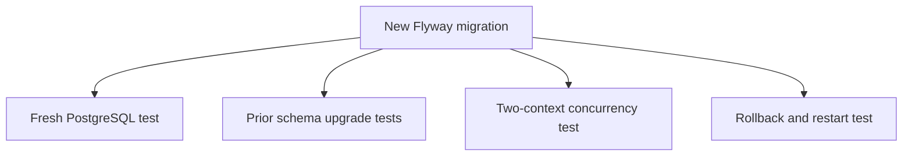

import { Aside, Steps } from '@astrojs/starlight/components';

Flyway owns the production schema under
`engine/src/main/resources/db/migration/`. Hibernate validates the result; it
does not generate production tables.

## Migration workflow

<Steps>
1. Add the next numbered migration. Never edit a migration included in a
   released version.
2. Make additive changes where possible and preserve existing rows.
3. Add indexes for new acquisition, lock or query paths.
4. Update JPA entities and repositories to match the migrated schema.
5. Prove a fresh PostgreSQL database reaches the new version.
6. Prove upgrades from every supported prior schema version.
7. Document backup, ordering, rollback and downgrade limitations.
</Steps>

## Choose concurrency deliberately

| Mechanism | Use it for | Example |
| --- | --- | --- |
| Pessimistic row lock | One resource must have a single transition winner | Task completion or subscription consumption |
| Optimistic version | Detect a stale aggregate write | Process-instance updates outside a fully locked path |
| `FOR UPDATE SKIP LOCKED` | Replicas claim independent available work | Timers, external tasks and outbox rows |
| Unique constraint/upsert | Reserve a durable identity | Idempotency keys |

Keep lock ordering stable and transactions short. A query that works under H2
is not evidence that it behaves correctly under PostgreSQL contention.

<Aside type="danger" title="Destructive migrations need an operational contract">
  Do not delete or rewrite production data without explicit backup, restore,
  rollback and upgrade guidance. A downgrade normally requires restoring the
  pre-upgrade backup.
</Aside>

## Minimum verification

Persistence changes require PostgreSQL Testcontainers, fresh migration,
supported upgrade paths, rollback behavior and restart recovery. Acquisition
or locking changes also require at least two concurrent engine contexts and a
single-winner/lossless-progress assertion.
