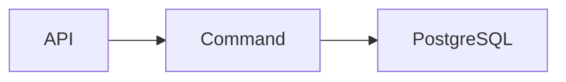

import { Aside, Steps } from '@astrojs/starlight/components';

Pages live under `documentation/src/content/docs/` and use Starlight's
file-based routes. Prefer `.mdx` when importing Starlight components; ordinary
Markdown remains suitable for simple prose.

## Authoring workflow

<Steps>
1. Identify the authoritative contract or ADR for the behavior.
2. Update that source and its executable tests when behavior changes.
3. Update the curated page that explains the behavior.
4. Add or revise a Mermaid diagram only when relationships or sequence become
   clearer than prose.
5. Run the documentation audit, type check and production build.
</Steps>

## MDX components

Import components from `@astrojs/starlight/components` at the start of the page:

```mdx
import { Aside, CardGrid, LinkCard } from '@astrojs/starlight/components';

<Aside type="caution" title="Contract boundary">
  Explain a risk without hiding it in ordinary prose.
</Aside>
```

Use components for navigation, steps, tabs and materially important notices.
Keep ordinary explanation in Markdown so pages remain easy to review.

## Mermaid diagrams

Use a fenced `mermaid` block. `astro-mermaid` renders it during the site build
and follows Starlight's light/dark theme.

````md

````

Diagram rules:

- describe one relationship or sequence per diagram;
- use stable architectural names rather than transient implementation detail;
- accompany diagrams with text for accessibility and search;
- avoid encoding guarantees that are not backed by a contract and test;
- run the production build so invalid Mermaid syntax fails before review.

## Links and source-of-truth

Use site-relative links such as `/architecture/runtime/` for curated pages.
Link detailed contract sources through the [authoritative contracts
index](/reference/contracts/). Do not copy entire source documents into this
site; summarize their implications so one normative copy remains.

<Aside type="caution" title="Documentation changes with behavior">
  A state-ownership, transaction, recovery, API, security or deployment change
  is incomplete until its contract, executable evidence and curated guide agree.
</Aside>

## Validation

```bash
cd documentation
npm audit --audit-level=low
npm run check
npm run build
```

Starlight validates internal links during the production build. CI runs the
same commands on every pull request.
