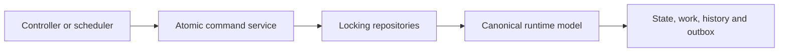

import { Aside, Steps } from '@astrojs/starlight/components';

Engine changes should enter through an existing abstraction whenever it
matches the behavior: dialect parser, canonical model, core command, repository
or stable DTO. Avoid repository-wide refactoring for a local semantic change.

## Mutation implementation pattern

<Steps>
1. Keep controllers responsible for HTTP translation, typed DTOs and response
   status—not repository state transitions.
2. Mark the core mutation boundary with `@AtomicRuntimeCommand` and load every
   mutable input inside it.
3. Lock the natural owner row before validating status or ownership.
4. Advance only the canonical process model; never interpret vendor XML during
   execution.
5. Persist successor tokens/work, variables, history and outbox events before
   the transaction commits.
6. Return a deterministic response suitable for idempotent replay.
</Steps>

## Adding BPMN behavior

A supported construct requires all of the following:

- secure parsing and explicit dialect/profile handling;
- a vendor-neutral canonical representation;
- deployment validation with stable machine-readable error codes;
- unambiguous runtime semantics and persistence;
- successful, invalid-input, rollback and restart tests;
- an executable BPMN fixture;
- updates to the BPMN support and runtime-semantics contracts.

<Aside type="caution" title="Reject ambiguity at deployment">
  Never accept an execution-relevant directive that the canonical model cannot
  represent. Reject it with a stable validation code instead of ignoring it or
  treating the node as pass-through.
</Aside>

## Embedded execution

Java delegates and scripts execute synchronously inside the workflow
transaction. They are suitable for deterministic local logic. Use an external
task for remote calls, long-running work or effects that need independent retry
and heartbeat behavior.

## Definition caches

Cache only immutable parsed definitions by deployment ID. Do not add a mutable
“latest definition” alias or cache instances/tasks to reduce reads. Optimize
queries with bounded projections, indexes and batch loading without changing
the database-authority rule.
