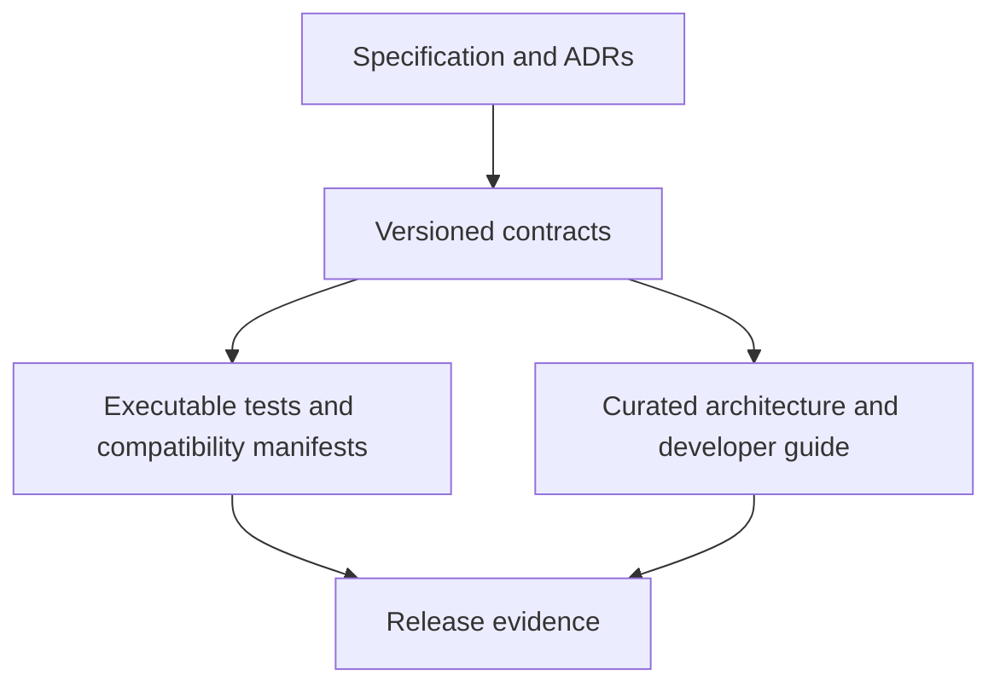

import { Aside, CardGrid, LinkCard } from '@astrojs/starlight/components';

This site is a reader-oriented map of Abada's technical architecture. It does
not replace the detailed Markdown contracts in the repository.

<Aside type="caution" title="When documents disagree">
  Do not broaden a product claim. Treat the runtime semantics, BPMN support,
  deployment support, API v1, worker protocol and security documents as the
  contract. Fix the implementation or narrow the guide and update its tests in
  the same change.
</Aside>

## Documentation layers

- **Specifications and ADRs** record normative requirements and decisions.
- **Contracts** define supported behavior and compatibility promises.
- **This site** connects the contracts into understandable workflows.
- **Executable tests** prove claims at parser, API, persistence and cluster
  boundaries.
- **Release notes and the roadmap** record the evidence for each gate.

## Direct entry points

<CardGrid>
  <LinkCard title="Architecture overview" href="/architecture/" />
  <LinkCard title="Developer guide" href="/developer/" />
  <LinkCard title="Authoritative contracts" href="/reference/contracts/" />
  <LinkCard title="Documentation authoring" href="/developer/documentation/" />
</CardGrid>

## User documentation boundary

The user guide covers the certified Compose distribution, identity,
telemetry, backup, upgrades and the first task workflow. Kubernetes, hosted
SaaS, multi-tenancy and an embedded Java distribution remain outside the 1.0
release-candidate contract.
