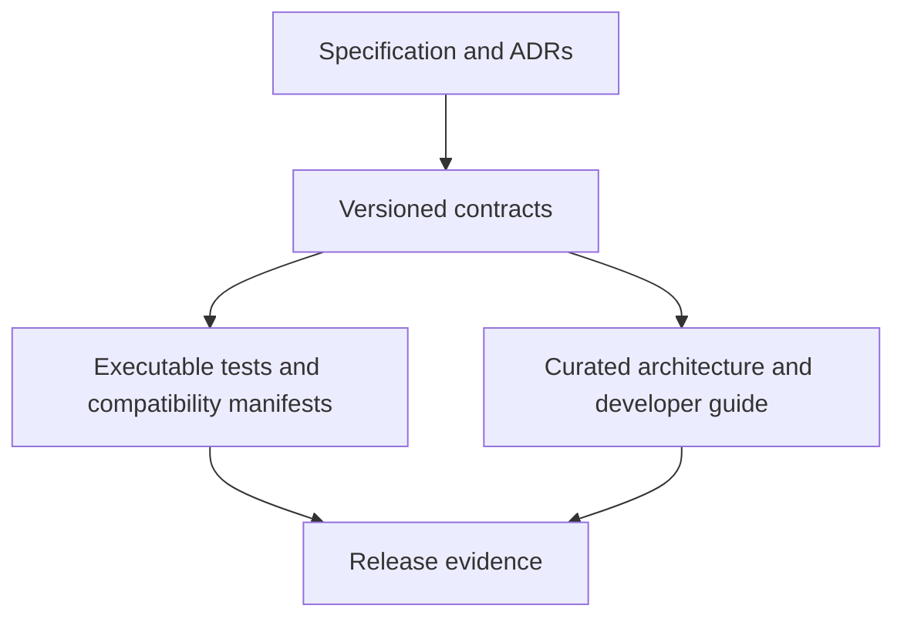

import { Aside, CardGrid, LinkCard } from '@astrojs/starlight/components';

This site is a reader-oriented map of Abada's technical architecture. It does
not replace the detailed Markdown contracts in the repository.

<Aside type="caution" title="When documents disagree">
  Do not broaden a product claim. Treat the runtime semantics, APL and BPMN
  support, worker and agent contracts, deployment support, Insight governance
  and security documents as the contract. Fix the implementation or narrow the
  guide and update its tests in the same change.
</Aside>

## Documentation layers

- **Specifications and ADRs** record normative requirements and decisions.
- **Contracts** define supported behavior and compatibility promises.
- **This site** connects the contracts into understandable workflows.
- **Executable tests** prove claims at parser, API, persistence and cluster
  boundaries.
- **Release notes and the roadmap** record the evidence for each gate.

## Direct entry points

<CardGrid>
  <LinkCard title="Your first agentic workflow" href="/user/first-workflow/" />
  <LinkCard title="Author processes in native APL" href="/user/authoring/" />
  <LinkCard title="Architecture overview" href="/architecture/" />
  <LinkCard title="Agent Worker execution" href="/architecture/agent-worker/" />
  <LinkCard title="The Insight Engine" href="/architecture/insight/" />
  <LinkCard title="Authoritative contracts" href="/reference/contracts/" />
</CardGrid>

## User documentation boundary

The user guide covers the certified Compose distribution — including the Agent
Worker service and the optional Insight Engine — identity, telemetry, backup,
upgrades, native-APL authoring and the first agentic workflow. Kubernetes,
hosted SaaS, multi-tenancy and an embedded Java distribution remain outside
the current release-candidate contract.

## Status callouts

Capabilities from the 1.1 agentic track that are implemented in the working
tree but not yet backed by production certification evidence are marked
accordingly (for example "1.1 agentic track — on dev"). A claim that applies
to the prepared `1.0.0-rc.6` evaluation release is left unmarked or labeled
`1.0.0-rc.6`.