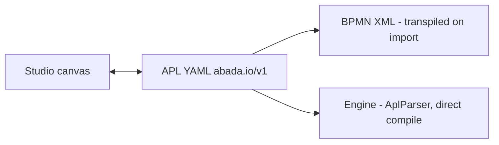

import { Aside, CardGrid, LinkCard } from '@astrojs/starlight/components';

**APL** (Abada Process Language) is the canonical, human-readable way to
define a workflow in Abada. A process is a YAML document (`abada.io/v1`) that
Studio serializes from its canvas and that the engine compiles *directly* into
the executable graph — no XML intermediate. BPMN remains supported as an
import and backward-compatibility format that Studio transpiles at the
boundary.



## Why YAML

- **Configuration as code.** A workflow is plain text a reviewer can diff and
  version-control, without a vendor XML vocabulary.
- **Comments are first-class.** Studio and AI-assisted tooling annotate
  workflows with rationale and policy references that never leak into
  execution.
- **AI-friendly.** Indentation-based structure and comments make APL a stable
  target for small, reviewable machine-generated diffs.

## Document structure

A document has exactly three top-level keys:

```yaml
version: abada.io/v1
metadata:
  name: Lead Triage          # sanitized to the process key: lead_triage
  owner: alice               # optional
flow:
  entry: onStart             # id of the single webhook start node
  nodes: [ ... ]
```

`metadata.name` becomes the immutable process key (non-alphanumeric characters
become `_`, lowercased). A project can hold multiple process keys; each key
versions immutably on every deploy.

## Node vocabulary

| Node | What it does | Runtime element |
| --- | --- | --- |
| `webhook` | Single start node | Start event |
| `agent` | LLM call as durable external work (`abada:agent`) | External service task |
| `engine-task` | Any durable worker topic (system service, integration) | External service task |
| `script` | In-transaction server-side script | Script task |
| `decision-table` | Deterministic rules evaluated **in the workflow transaction** | Business rule task |
| `approval-gate` | Human validation step (optionally with a `formKey` form) | User task |
| `condition` | Exclusive branch on `rules` | Exclusive gateway |
| `inclusive` | Fork/join on all matching `rules` | Inclusive gateway |
| `parallel` | Fork into ≥2 branches and join | Parallel gateway |
| `event-gateway` | ≥2 competing catch children; first to fire wins | Event-based gateway |
| `message-catch` | Durable subscription by message name + `correlationKey` | Message catch event |
| `timer` | Durable ISO-8601 duration wait | Timer catch event |
| `signal` | Durable broadcast subscription | Signal catch event |
| `end` | Terminal node | End event |

Every node shares `id`, optional `description` (the human-visible name — for
an `approval-gate` it is the task name), optional `next`, and an optional `ui`
layout hint. `condition` and `parallel` route through their branching keys
(`rules` / `branches`), never `next`; `event-gateway` routes exclusively
through its inline `events`. A `condition` branch matches with an
`if: "${...}"` expression and routes with `then: <nodeId>`; `else: <nodeId>`
marks the default flow.

## The doctrine: the table is the law, agents are the advice

- **`agent`** nodes are probabilistic advice: durable external tasks that a
  worker executes *outside* the workflow transaction.
- **`decision-table`** nodes are deterministic law: hit policies
  `FIRST | UNIQUE | COLLECT`, an explicit `otherwise` fallback, evaluation
  inside the transaction, and a `DECISION_TABLE_APPLIED` audit record. No
  match and no fallback fails loudly — never a guess.
- **`approval-gate`** puts a human between probabilistic and deterministic
  steps. Assignees are candidates; a `formKey` resolves to a project FORM
  resource whose fields bind by id to process variables.

## A compact example

```yaml
version: abada.io/v1
metadata:
  key: lead_triage
  name: Lead Triage
  owner: sales-team
flow:
  entry: onStart
  nodes:
    - id: onStart
      type: webhook
      description: Lead received
      next: classify
    - id: classify
      type: agent
      profile: abada.agent/v1
      model: gemini-3.6-flash
      prompt: |
        Classify the lead from ${lead.companySize}.
        Return exactly one value: HIGH, MEDIUM, or LOW.
      inputs:
        lead: ${lead}
      result_variable: lead_priority
      next: route
    - id: route
      type: condition
      description: Route by classified priority
      rules:
        - if: "${lead_priority == 'HIGH'}"
          then: review
        - else: done
          then: done
    - id: review
      type: approval-gate
      description: Senior sales review
      assignees: [lead-triage-human-reviewer]
      next: done
    - id: done
      type: end
```

Strict deployment validation rejects cycles, duplicate ids, undeclared
targets, a second `webhook`, invalid bounds and unrecognized node types with
index-friendly, stable error codes — atomically, persisting nothing.

## Authoring surfaces in Studio

- **Canvas and YAML are one document.** The designer and the APL editor
  bidirectional-sync through a single document model.
- **Format badges.** Files show `[APL Native]` or `[BPMN Imported]`; the
  `abada.io/v1` language spec appears in Process Details.
- **Rule matrix inspector.** `decision-table` nodes edit in a matrix widget
  (inputs, ordered `when`/`then` rows, hit policy, `otherwise` toggle) that
  stays in sync with the canonical YAML.
- **Natural-language generation.** Describe the process; Studio scaffolds APL
  through the configured provider, with a deterministic local fallback.
- **Project file tree.** Projects are IDE-like workspaces seeded with
  `processes/`, `forms/` and `resources/` folders. Documents autosave with
  optimistic revisions; a stale save is rejected instead of overwriting
  another editor.

## Dry Run vs Deploy & Start

| | Dry Run | Deploy & Start |
| --- | --- | --- |
| Saves the document | No | Yes |
| Calls a model or tools | No — mock it | Yes, through a worker |
| Creates an instance | No | Yes, project-scoped |
| Error semantics | Local only | Durable, immutable version |

## Deeper reading

<CardGrid>
  <LinkCard title="Your first agentic workflow" href="/user/first-workflow/" />
  <LinkCard title="APL technical specification" href="https://github.com/bashizip/abada-platform/blob/dev/docs/reference/apl-specification.md" />
  <LinkCard title="APL node reference" href="https://github.com/bashizip/abada-platform/blob/dev/docs/reference/apl-node-reference.md" />
  <LinkCard title="Native APL and the canonical model" href="/architecture/apl/" />
</CardGrid>

<Aside type="note">
  The full property contract for every node, its validation bounds and its
  BPMN equivalent live in the repository's APL specification and node
  reference. This page is the orientation; those documents are the contract.
</Aside>