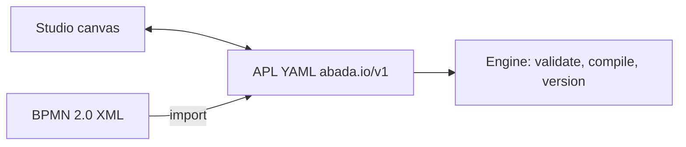

import { Aside, CardGrid, LinkCard } from '@astrojs/starlight/components';

**APL** (Abada Process Language) is how you write a process in Abada: a YAML
document (`abada.io/v1`) that Studio draws as a diagram and the engine
compiles **directly** into the executable graph. BPMN 2.0 files can be
imported too; they run on the same engine (see [BPMN import and
compatibility](/compatibility/bpmn/)).


```mermaid
flowchart LR
    Canvas[Studio canvas] <--> YAML[APL YAML abada.io/v1]
    BPMN[BPMN 2.0 XML] -->|import| YAML
    YAML --> Engine[Engine: validate, compile, version]
```

New to Abada? Start with the [tutorial](/user/first-workflow/): it builds a
complete process in Studio, with screenshots.

## Why YAML

- **Readable and reviewable.** A process is plain text you can diff, review
  and keep in version control.
- **Close to the diagram.** One node in the YAML is one step on the canvas.
- **A stable target for AI.** Small, structured documents make
  machine-proposed changes easy to validate and review.

<Aside type="note" title="Comments">
  The engine ignores YAML comments. Studio saves the document it generates
  from the canvas, so comments in a pasted or edited document are not kept;
  keep annotated sources in version control.
</Aside>

## Document structure

A document has three top-level keys:

```yaml
version: abada.io/v1
metadata:
  key: lead_triage           # optional — derived from name when omitted
  name: Lead Triage
  owner: sales-team          # optional
  variables:                 # optional — what expressions may read
    - name: lead
      type: object
      required: true
flow:
  entry: onStart             # id of the single webhook start node
  nodes: [ ... ]
```

- `metadata.key` is the process key. Every deployment of a key creates a new
  **immutable version**; running instances keep the version they started on.
- `metadata.variables` declares the start payload and the variables steps
  write. The engine then warns about an expression that reads a name nobody
  declares or writes — usually a typo.

## Nodes

| Node | What it does |
| --- | --- |
| `webhook` | The single start node |
| `agent` | A model call, run by an agent worker outside the database transaction; the engine checks its result |
| `engine-task` | Work done by any external worker on a topic (an integration, a system call) |
| `script` | A small server-side script, run inside the transaction |
| `decision-table` | Deterministic rules, evaluated inside the transaction and audited |
| `human-input` | A task for people in the listed groups, optionally with a form and review outcomes |
| `condition` | Exclusive branch on `rules` |
| `inclusive` | Takes every matching branch, then joins |
| `parallel` | Runs branches in parallel, then joins |
| `event-gateway` | Waits for the first of several events |
| `message-catch` | Waits for a correlated message |
| `timer` | Waits for an ISO-8601 duration |
| `signal` | Waits for a broadcast signal |
| `end` | Ends the path |

Every node has an `id`, an optional `description` (shown as the step name; for
a `human-input` it is the task name) and usually a `next`. A `condition` routes
with `rules` (`if: "${...}"` + `then`, and an `else` default), `parallel` with
`branches`, an `event-gateway` with its `events`. `approval-gate` is a
deprecated alias of `human-input`.

Waiting steps can also route around problems — loops, errors, timeouts, weak
AI answers, review decisions, service levels and fallback models. Each has
its own section in [Loops, routes and review
decisions](/user/process-patterns/).

## Who decides what

- **Agents advise.** An `agent` step proposes a value; the engine checks it
  against `output_schema` and `confidence_threshold` before it enters the
  process.
- **Rules decide.** `decision-table` and `condition` are deterministic CEL,
  evaluated inside the transaction. A table with no match and no `otherwise`
  fails loudly instead of guessing.
- **People approve.** A `human-input` step puts a person between the advice
  and the action; with `outcomes`, the person's choice routes the process.

## A small example

```yaml
version: abada.io/v1
metadata:
  key: lead_triage
  name: Lead Triage
flow:
  entry: onStart
  nodes:
    - id: onStart
      type: webhook
      next: classify
    - id: classify
      type: agent
      model: gemini-3.6-flash
      prompt: Classify the lead. Return HIGH, MEDIUM or LOW.
      inputs:
        lead: ${lead}
      result_variable: lead_priority
      output_schema:
        type: object
        required: [priority]
        properties:
          priority: { enum: [HIGH, MEDIUM, LOW] }
      next: route
    - id: route
      type: condition
      rules:
        - if: "${lead_priority.priority == 'HIGH'}"
          then: review
        - else: done
    - id: review
      type: human-input
      description: Senior sales review
      assignees: [sales-directors]
      next: done
    - id: done
      type: end
```

## Authoring in Studio

- **Canvas and YAML are one document.** Edit either one; the other follows.
  Switch with **Diagram / APL YAML**.
- **New Process** creates an empty document, imports a BPMN file, or takes
  pasted APL. Documents live in the project's `processes/` folder and save
  automatically; a stale save is refused instead of overwriting someone
  else's edit.
- **Describe it.** The bar at the bottom of the canvas drafts or refines a
  process from plain language through the configured AI provider, or a local
  scaffold when none is reachable. You review the result before it applies.
- **Decision tables** have a matrix editor (inputs, rows, hit policy,
  `otherwise`).
- **Agent steps** pick their tools from the project's tool servers, with each
  tool's policy: a step may tighten a policy (for example require approval)
  but never loosen it, and an approval-required tool asks who approves it.
  Loop limits (turns, tokens, budget), routes, delegates and the inputs and
  outputs of a call-process step are edited in the inspector, with the
  engine's rules checked as you type.
- **Undo and redo** cover every edit of the open process (<kbd>⌘Z</kbd> /
  <kbd>Ctrl+Z</kbd>, <kbd>⇧⌘Z</kbd> / <kbd>Ctrl+Y</kbd>), 100 steps per process.

## Validation

The engine is the only APL validator, and Studio asks it directly:

- **While you type**, the draft is sent to `POST /api/v1/apl/validate` — the
  same checks a deployment runs, with nothing stored. Each problem is listed
  with its step and badged on the canvas (`⚠ n`).
- **Errors** (`ABADA-APL-VALIDATION-001`) block **Apply to diagram** and
  **Deploy & Start**: a broken route, a cycle without a repeat limit, a model
  outside the engine's allow-list, an expression that is not valid CEL.
- **Warnings** never block. `ABADA-APL-SCHEMA-001` flags an unknown field —
  usually a typo such as `confidence_treshold` — or a wrong type;
  `ABADA-APL-VARIABLE-001` flags an undeclared variable.
- A refused deployment stores nothing.

<Aside type="caution" title="Warnings become errors at 1.1.0">
  In the 1.1.0 release candidates, schema violations are warnings so existing
  processes keep deploying. From 1.1.0 they reject the deployment; fix them
  now.
</Aside>

The model list and the field limits in the inspector come from the same engine
(`GET /api/v1/apl/schema`), so Studio never offers a model the deployment
would refuse.

## Dry Run vs Deploy & Start

| | Dry Run | Deploy & Start |
| --- | --- | --- |
| Where it runs | In your browser | On the engine |
| Saves or deploys | No | Yes — a new immutable version |
| Calls models or workers | No — you type mocked answers | Yes, through workers |
| Human steps | Simulated, every route offered | Real tasks in the Task Inbox |

Deploying a revision that never passed a Dry Run asks for an explicit
confirmation.

## Deeper reading

<CardGrid>
  <LinkCard title="Tutorial: a reviewed AI reply" href="/user/first-workflow/" />
  <LinkCard title="Loops, routes and review decisions" href="/user/process-patterns/" />
  <LinkCard title="APL specification" href="https://github.com/bashizip/abada-platform/blob/dev/docs/reference/apl-specification.md" />
  <LinkCard title="APL node reference" href="https://github.com/bashizip/abada-platform/blob/dev/docs/reference/apl-node-reference.md" />
</CardGrid>
