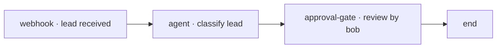

import { Aside, Steps } from '@astrojs/starlight/components';

This guide walks one small end-to-end loop on the development profile: an
**agent node** classifies an incoming payload, a **human approval gate**
reviews it, and an **end** node closes the instance. You will author in native
APL, dry-run locally, then let the engine and the Agent Worker execute the
real, durable version.

Prerequisites: the [quickstart](/user/quickstart/) development profile is
running and you can sign in to Studio at `http://studio.localhost` as `alice`.

## 1. Create a project and a process

1. In Studio, create a new project (**New project**). You become its Owner,
   Maintainer, Operator and Viewer.
2. Inside the project, open the **Project Explorer** and create a new process
   document. Studio seeds an empty canvas.
3. The new file carries the `[APL Native]` format badge — Studio authors
   `abada.io/v1` YAML, not BPMN. (Importing an existing BPMN file is possible;
   see [BPMN import and compatibility](/compatibility/bpmn/).)

<Aside type="tip" title="Natural-language scaffold">
  In the designer you can describe the process in natural language (for
  example: "classify the lead with an agent, then a human reviews HIGH
  results") and Studio scaffolds an APL document through the configured
  provider — or a deterministic local scaffold when no provider is reachable.
</Aside>

## 2. Build the flow

Add and connect these nodes on the canvas:



- **`webhook`** — the single start node.
- **`agent`** — probabilistic work. Give it a `model`, a `prompt`, bind
  `inputs` to payload variables, declare `result_variable` and an
  `output_schema`, and set a `confidence_threshold`. It compiles to a durable
  external task on the `abada:agent` topic.
- **`approval-gate`** — human validation. Set `assignees` to the
  `lead-triage-human-reviewer` project group (or `bob` directly in dev).
- **`end`** — the terminal node.

Canvas and YAML stay in sync: the same document is visible in the YAML editor
as `version: abada.io/v1` with `metadata`, `flow.entry` and `flow.nodes`.
Hand-edited YAML reparses into the canvas. If you prefer keyboard over canvas,
paste the YAML from an [example](/user/authoring/#a-compact-example) and watch
the diagram build itself.

## 3. Dry Run — local and mocked

Open **Dry Run**. It executes *locally*: nothing is saved, deployed or sent to
a model. Tokens animate node by node and pause where the scenario is
non-deterministic:

- at the **agent** node, mock the model output and its `_confidence`;
- at the **approval-gate**, simulate Bob's completion.

Dry Run never creates engine state. Its value is checking that the flow and
its variable bindings behave as designed before anything durable happens.

<Aside type="caution" title="Dry Run is not execution">
  Deploying a revision that was never dry-run requires an explicit warning
  acknowledgement in **Deploy &amp; Start**. Only that dialog persists state.
</Aside>

## 4. Deploy & Start — the durable action

1. Open **Deploy &amp; Start** from the header.
2. Provide the start payload (for example `{"lead": {...}}`).
3. Confirm. Studio saves the project document, deploys the exact revision as
   an **immutable definition version**, and starts a project-scoped instance.

The instance opens as a read-only canvas projection that shows only
engine-reported state — Studio never fakes live progress.

## 5. Watch the agent run

The instance pauses in `ACTIVE` at the **agent** node with a durable external
task. The first-party Agent Worker (started automatically by the dev
launcher) fetches and locks it, calls the configured model outside any
workflow transaction, and completes it.

In the instance view and the Operations tab you can now inspect:

- the **agent attempt metadata** — model actually used, provider, attempt
  number, latency, tools, `promptHash` and the achieved `confidence` against
  the declared threshold;
- the **worker health** panel — the `abada-agent-worker` entry shows
  Online/Error/Offline with last heartbeat, last rejection and consecutive
  failures.

<Aside type="note" title="No worker? The run waits — on purpose">
  Agent work must not advance engine state outside a command. With no worker
  (or no configured LLM key) the instance stays `ACTIVE` at the agent node.
  See [Agent nodes and the Agent Worker](/user/agent-worker/).
</Aside>

## 6. Complete the human review

Bob signs in to Studio (dev credentials `bob` / `bob`), opens the project and
finds the task in the **Task Inbox**. Bob claims it and completes it — with a
form when the approval gate declares a `formKey`, or with the default decision
UI otherwise. Completing the task advances the instance to `end`.

## 7. Verify in Operations

Open the **Operations** tab and locate the instance. Its activity history must
show the start event, the agent external task (locked/completed with attempt
metadata), the user task and the end event, and the instance must be
`COMPLETED`.

Restart recovery check:

```bash
docker compose --env-file .env.dev \
  -f compose.yaml -f compose.dev.yaml restart abada-engine
./release/abada-platform status dev
```

Previously deployed definitions, running instances and agent tasks remain
visible because PostgreSQL, not engine memory, owns workflow state.

## Also try: the AI Lead Triage starter

On first login the development profile creates and deploys the **AI Lead
Triage** starter in the `Abada Starter` project. Start it from **Deploy
&amp; Start** with HIGH, MEDIUM or LOW inputs, then run four LOW samples to
let the Insight Engine produce its first governed proposal. That flow is the
platform's own demonstration of the loop you just built by hand. See
[Insight: governed AI optimization](/user/studio-insight/).