import { Aside, LinkCard } from '@astrojs/starlight/components';

In this tutorial you build a process that answers customer complaints. An
agent classifies the complaint, a second agent drafts the reply, and a support
lead approves the draft or rejects it **with a comment**. A rejected draft goes
back to the agent, which rewrites it using that comment, at most three times.

Along the way you use everything a real process needs:

| You will see | Where |
| --- | --- |
| Paste APL and get a diagram | [Step 3](#3-paste-the-process) |
| A repeat limit on a loop (`↻ 3`) and named routes | [Step 4](#4-read-the-diagram) |
| Review outcomes with a required comment | [Step 5](#5-look-at-the-steps) |
| A route drawn on the canvas (a two-day timeout) | [Step 6](#6-draw-a-route-a-two-day-timeout) |
| A local, mocked Dry Run | [Step 8](#8-dry-run-it) |
| Real agents, a human decision and a revised draft | [Steps 9–12](#9-deploy-and-start) |
| The audit trail and a fallback model | [Steps 13–14](#13-follow-it-in-operations) |

It takes about 20 minutes.

**Before you start**

- The [development platform](/user/quickstart/) is running and you can sign
  in to Studio at `http://studio.localhost`.
- An AI provider is set in **Studio → Settings → AI Providers** (for example
  a Gemini key). Without one, agent steps wait — nothing breaks.
- Two development accounts: **alice** (`alice` / `alice`) builds and runs the
  process, **bob** (`bob` / `bob`) reviews the drafts.

<Aside type="note" title="About these screenshots">
  They were taken on the development profile with a deterministic test model,
  so the drafts you get from a real model will read differently. Everything
  else — steps, routes, variables, history — is what you will see.
</Aside>

## 1. Create a project

Sign in as **alice**. Click the project name in the header, open **New
project**, and name it `Customer care`. You become its Owner, Maintainer,
Operator and Viewer.

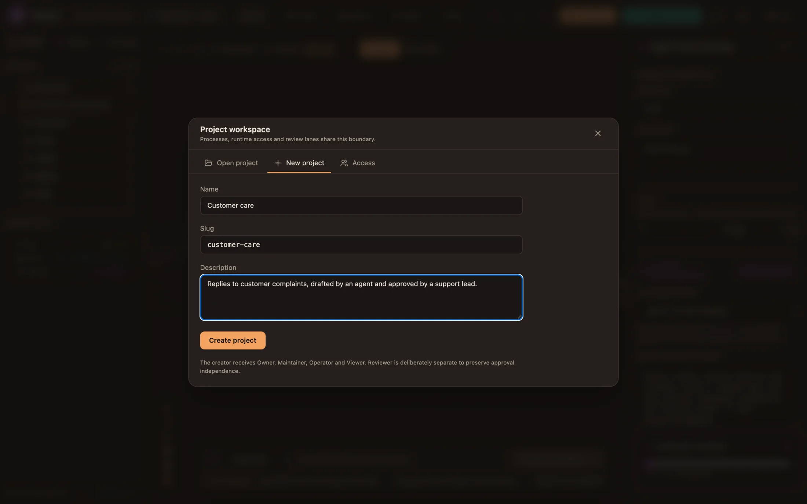

## 2. Let bob review

The review step will be offered to the `support-leads` group. Bob is not in
that group in the identity provider, so you give it to him **inside this
project** only:

1. Ask bob to sign in to Studio once, so the platform knows him.
2. As alice, open **Admin → Projects → Add Member**, pick `bob`, tick
   **Viewer**, and type `support-leads` under **Task Groups (Human Tasks)**.


A project task group works exactly like an identity group for human tasks,
but only in this project. Without the **Admin** tab (it needs the
`abada-admin` group), an owner can do the same through the API:

```bash
# Find bob's principal id, then make him a Viewer with the task group.
curl "$ABADA_URL/api/v1/projects/$PROJECT_ID/principals?query=bob" -H "Authorization: Bearer $TOKEN"
curl -X PUT "$ABADA_URL/api/v1/projects/$PROJECT_ID/members/$BOB_PRINCIPAL_ID" \
  -H "Authorization: Bearer $TOKEN" -H "Content-Type: application/json" \
  -d '{"roles": ["VIEWER"], "reviewLanes": [], "taskGroups": ["support-leads"]}'
```

## 3. Paste the process

In the **Project** panel, click **+** next to *Project* (New Process), choose
**Paste APL**, paste the document below and name the file `complaint_reply`.

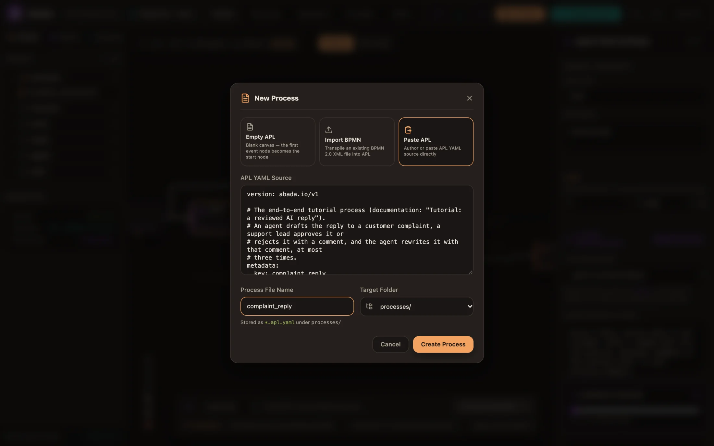

```yaml title="complaint-reply.apl.yaml"
version: abada.io/v1
metadata:
  key: complaint_reply
  name: Complaint reply
  owner: customer-care
  variables:
    - name: complaint
      type: object
      required: true

flow:
  entry: complaint-received
  nodes:
    - id: complaint-received
      type: webhook
      description: Complaint received
      next: classify

    # Advice, checked by the engine: the answer must match the schema and be confident enough.
    - id: classify
      type: agent
      description: Classify the complaint
      model: gemini-3.6-flash
      prompt: |
        Classify this customer complaint. Give its category, its severity
        (low, medium or high) and a one-sentence summary.
      inputs:
        complaint: ${complaint}
      result_variable: classification
      output_schema:
        type: object
        required: [category, severity, summary]
        properties:
          category: { type: string }
          severity: { enum: [low, medium, high] }
          summary: { type: string }
      confidence_threshold: 70
      on_low_confidence: triage
      next: draft

    # Rewritten after each rejection with the reviewer's comment, three times at most.
    - id: draft
      type: agent
      description: Draft the reply
      model: gemini-3.6-flash
      fallback_models: [gpt-5-mini]
      prompt: |
        Write a short, polite reply to the customer. Offer a remedy that fits
        the severity. Reviewer feedback on the previous draft, if any: ${review_comment}
      inputs:
        complaint: ${complaint}
        classification: ${classification}
        review_comment: ${review_comment}
      result_variable: reply
      output_schema:
        type: object
        required: [subject, body]
        properties:
          subject: { type: string }
          body: { type: string }
      loop:
        max_iterations: 3
        on_exhausted: triage
      on_timeout: { after: PT30M, then: triage }
      next: review

    # A person decides; a rejection must say why.
    - id: review
      type: human-input
      description: Review the reply
      assignees: [support-leads]
      sla_hours: 4
      escalate_to: [managers]
      outcomes:
        approve: { next: sent }
        reject: { next: draft, comment: required }

    - id: triage
      type: human-input
      description: Handle the complaint by hand
      assignees: [managers]
      next: sent

    - id: sent
      type: end
      description: Reply approved
```

The same file is in the repository:
[`examples/apl/complaint-reply.apl.yaml`](https://github.com/bashizip/abada-platform/blob/dev/examples/apl/complaint-reply.apl.yaml).

What each part asks the engine to guarantee:

- **`classify`** is advice. Its answer must match `output_schema` and carry a
  confidence of at least 70; otherwise the engine sends the case to `triage`
  instead of trusting it.
- **`draft`** reads `review_comment`, which is empty on the first pass and
  holds the reviewer's comment after a rejection. Its `loop` lets the process
  come back here **three times at most**, then hands the case to `triage`.
  `on_timeout` stops a draft that takes more than 30 minutes, and
  `fallback_models` keeps it going if `gemini-3.6-flash` is rate-limited.
- **`review`** has two **outcomes**. *Reject* goes back to `draft` and cannot
  be sent without a comment. After four hours (`sla_hours`) the task stays
  open but `managers` can pick it up too.

## 4. Read the diagram

Studio draws the document. The `↻ 3` badge marks the repeat limit, and each
route carries its name: *approve* and *reject* leave the review, *low
confidence*, *timeout* and *limit reached* lead to `triage`.

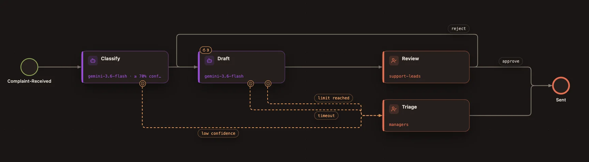

## 5. Look at the steps

Click **Review**. The inspector shows the assignees, the service level, the
escalation group and the outcomes, each with its target and a **comment
required** switch.


Click **Draft**. The **Loop** section holds the repeat limit (3, then
Triage); further down, **Routes** holds the timeout and the fallback models.

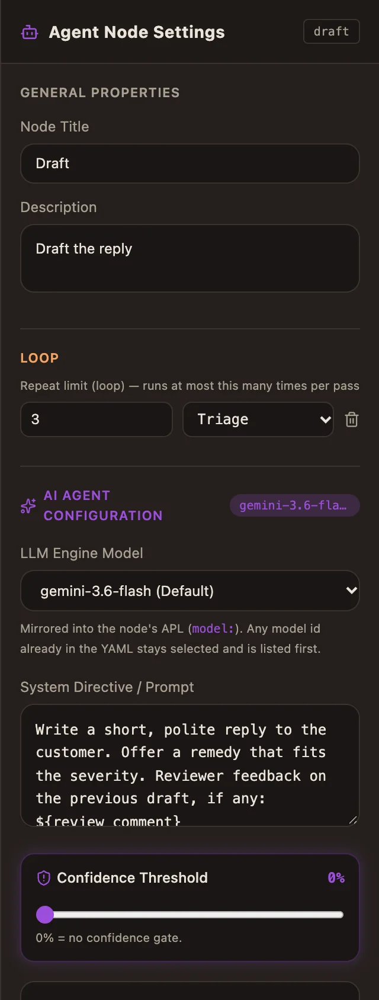

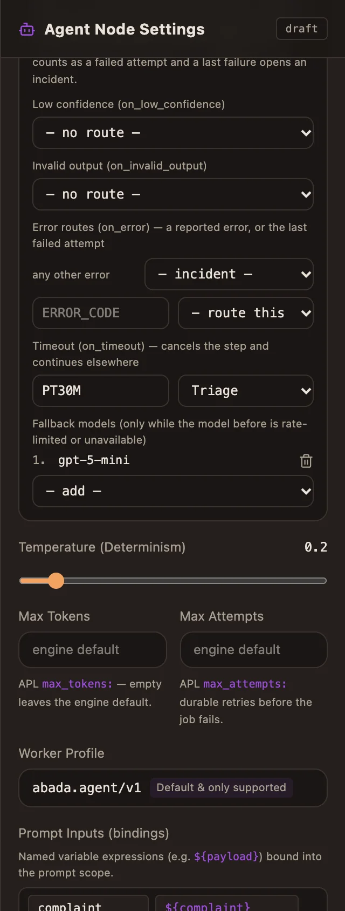

Everything you change here is written to the APL, and every change is one
undo step (<kbd>⌘Z</kbd> / <kbd>Ctrl+Z</kbd>).

## 6. Draw a route: a two-day timeout

Nobody should forget a draft for a week. Drag from the right edge of
**Review** to **Triage**. Studio asks what the connection means and offers
only the routes a review step supports:


Choose **On timeout…**, type `P2D` (two days, ISO-8601) and click **Add
timeout**. Studio checks the duration the way the engine does (between one
second and 365 days).

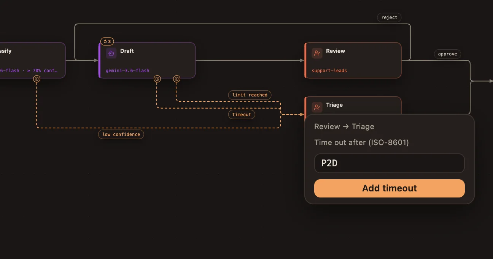

The new route appears at once:

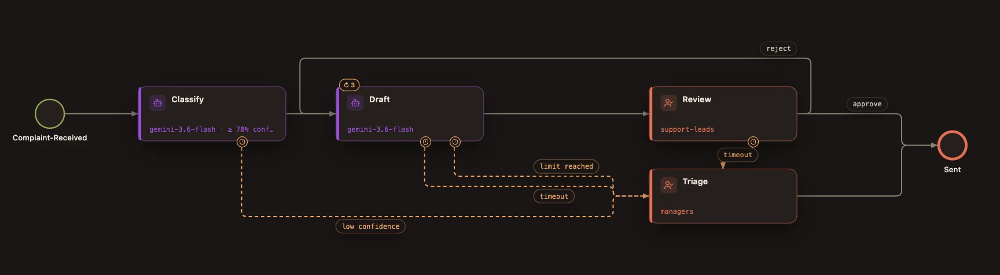

## 7. Check the APL

Switch to **APL YAML**. The drawn route is now an `on_timeout` block on the
review step, and the status bar says **Valid APL**: the engine checked the
draft while you edited.

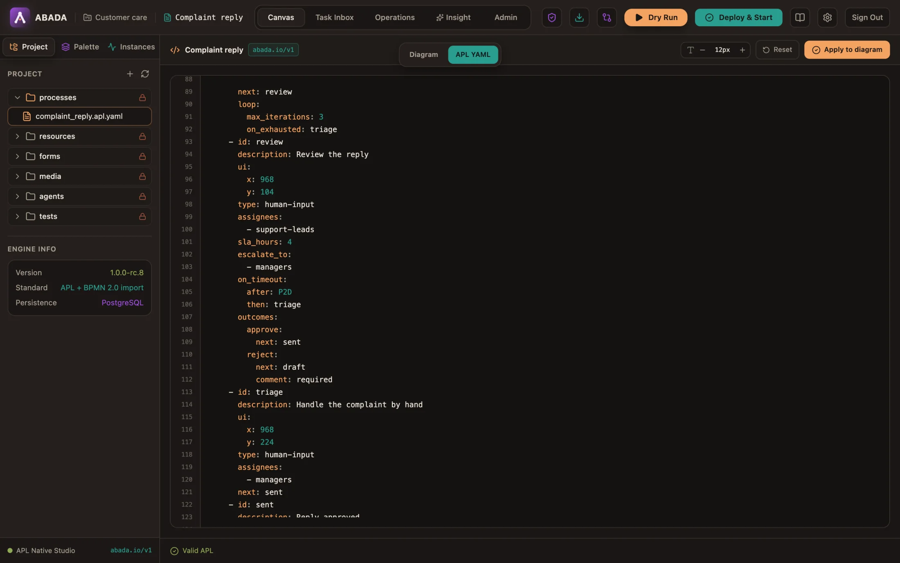

<Aside type="tip" title="What happens if a loop has no limit">
  Studio warns you before the engine does. Remove the repeat limit from
  **Draft** and the step turns red with `↻ !` and `⚠ 1`; the inspector shows
  the engine's message and an **Add loop bound** button. A deployment would be
  refused. Undo puts the limit back.

  
</Aside>

## 8. Dry Run it

Click **Dry Run**, paste this payload and start:

```json
{
  "complaint": {
    "customer": "Claire Dupont",
    "order": "A-1042",
    "message": "My order arrived nine days late. I paid 7.90 EUR for shipping and want it back."
  }
}
```

Dry Run runs **in your browser**: nothing is saved, deployed or sent to a
model. It stops at each agent so you can type a mocked answer, and at the
review it offers every route of the step — *Approve*, *Reject* and the new
*Timeout*. Try *Reject* to watch the token go back to **Draft**.

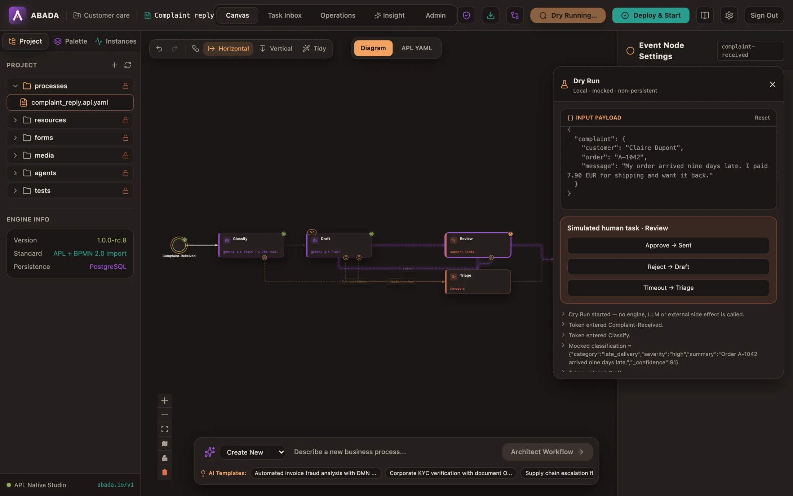

Finish with *Approve → Sent*. Studio remembers that this exact revision passed
a Dry Run.

## 9. Deploy and start

Click **Deploy & Start**, paste the same payload, and confirm. Studio saves the
document, deploys it as an **immutable version** (`v1`) and starts an instance.

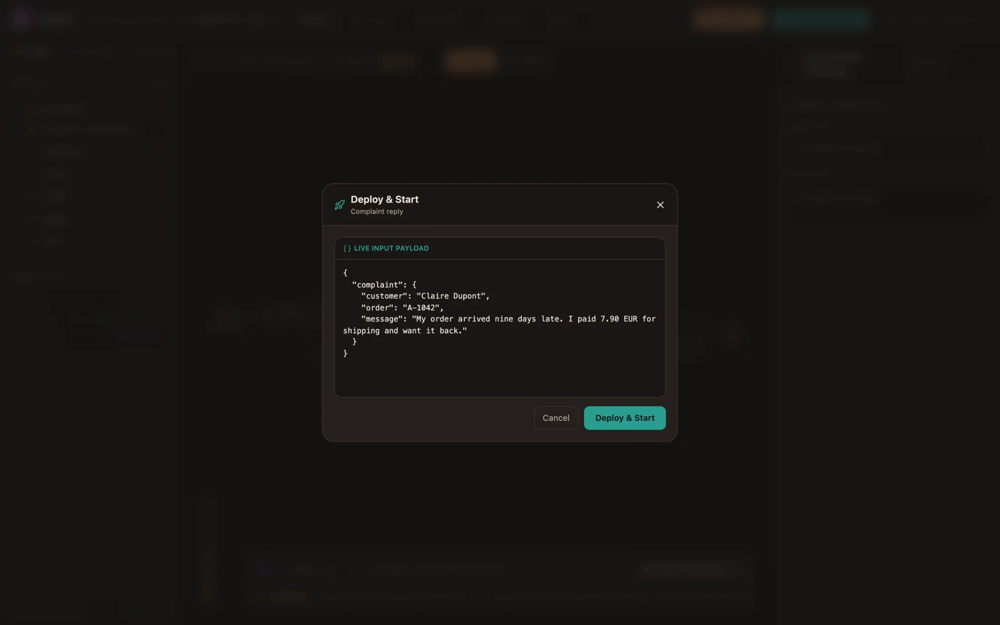

## 10. Watch the agents

The live instance opens on the canvas. Both agents run through the Agent
Worker, outside any database transaction, and the instance stops at
**Review**. Click **Draft** to see its attempt: the model that answered, the
confidence, the token counts, and **Output contract OK** — the engine checked
the answer against the schema before storing it.

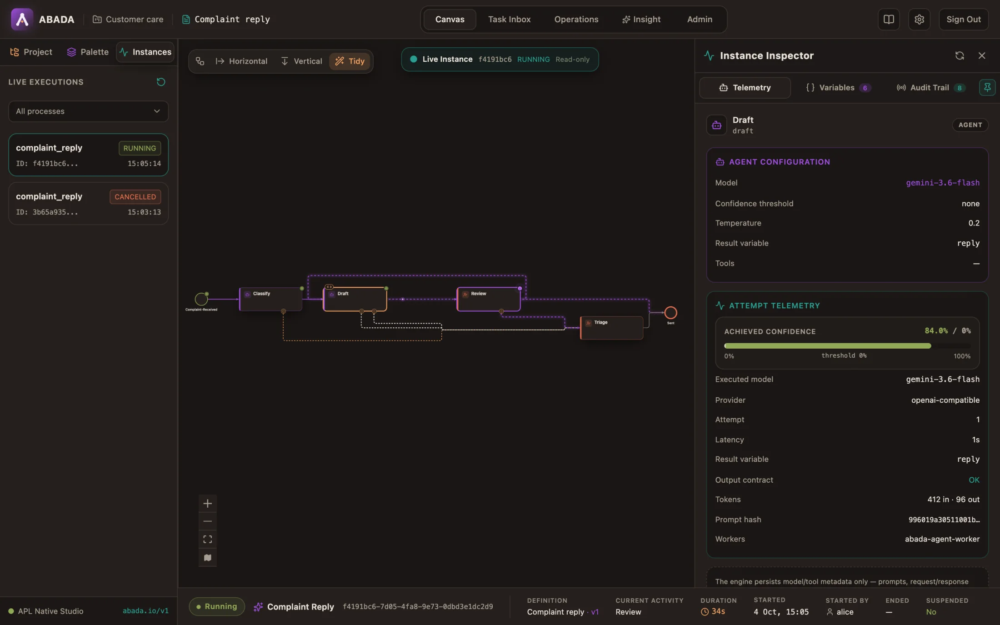

The **Variables** tab shows what the agents produced:

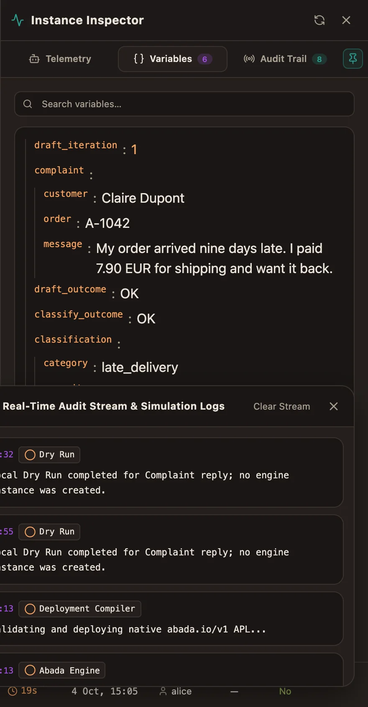

## 11. Bob rejects the draft

Sign in as **bob** and open **Task Inbox**. *Review the reply* is waiting for
the `support-leads` group. Open it and click **Claim**.

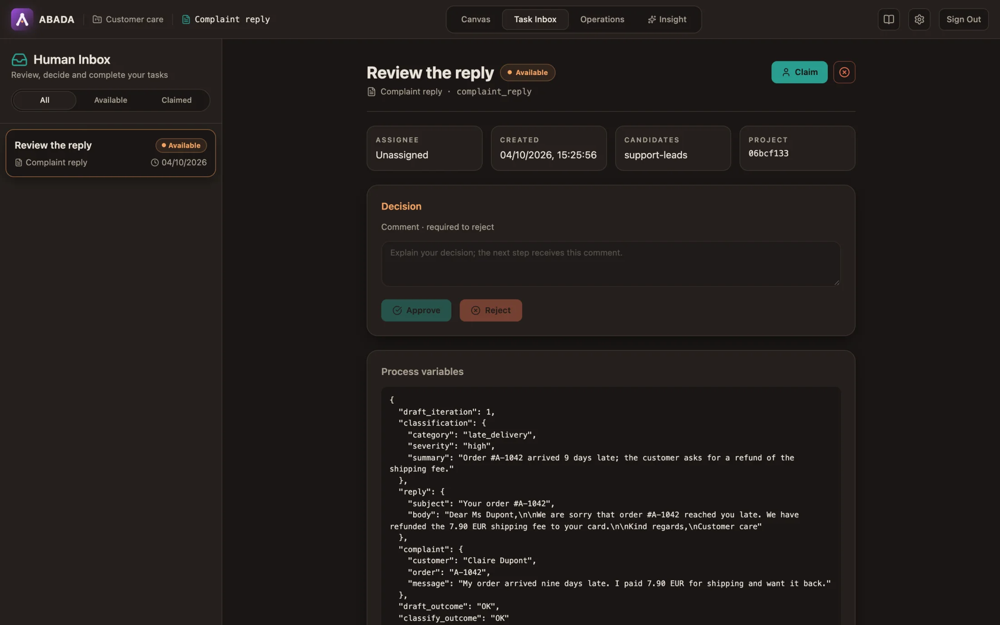

The **Decision** panel shows one button per outcome. Bob finds the draft too
thin, writes why, and clicks **Reject**. Without the comment, Studio — and the
engine — would refuse the rejection.

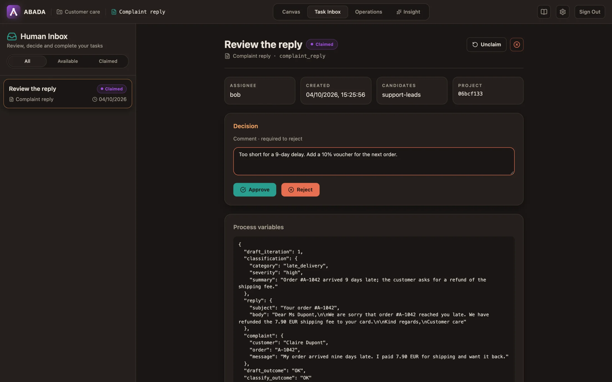

## 12. The agent revises; bob approves

The engine stores the decision in `review_outcome`, the comment in
`review_comment`, and sends the process back to **Draft**. The agent writes a
second draft with the comment in its inputs, and a new review task appears.

In the new task, `draft_iteration` is `2`, `review_comment` holds bob's words,
and the reply now offers the voucher:

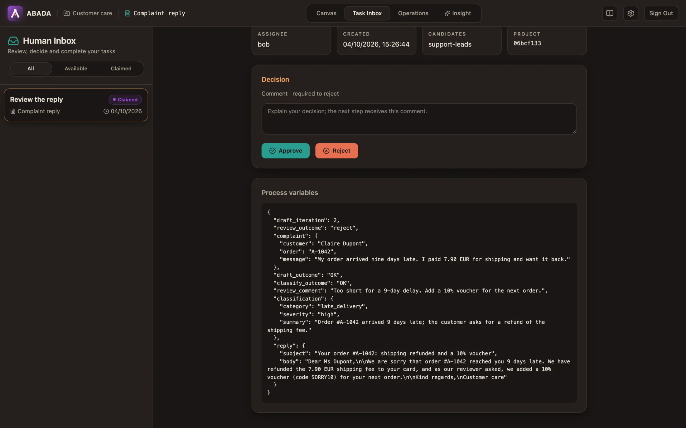

Bob claims it and clicks **Approve**. The instance completes.

## 13. Follow it in Operations

Sign in as alice again and open **Operations**: the instance is
*Completed*, and the Agent Worker is online.


Open the instance. The canvas highlights the path it took — including the way
back from Review to Draft — and the **Audit Trail** lists every step: who
claimed and decided each task, which worker ran each agent, and the route each
decision took (*outcome reject → draft*).


The history records that bob wrote a comment and how long it was, never the
text itself; the text lives in the instance variables.

## 14. When the model is rate-limited

If `gemini-3.6-flash` answers *429 Too Many Requests*, the worker tries the
next model of `fallback_models` instead of failing. The attempt shows which
model actually answered and which one it replaced:


If every model is unavailable, the attempt waits and retries without using up
`max_attempts`; `on_timeout` (30 minutes here) bounds the wait. See
[Operate running processes](/user/operations/) for incidents and retries.

## What you built

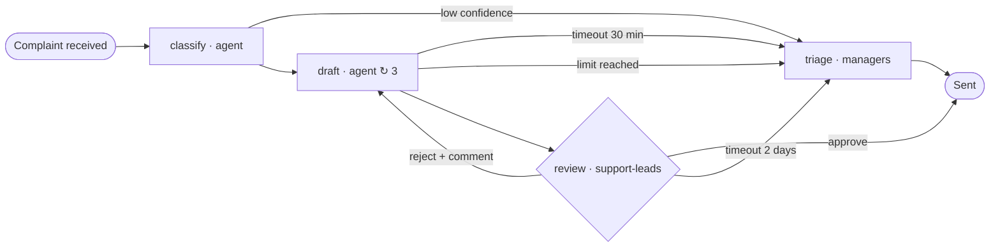
```mermaid
flowchart LR
    S([Complaint received]) --> C[classify · agent]
    C -->|low confidence| T[triage · managers]
    C --> D[draft · agent ↻ 3]
    D -->|timeout 30 min| T
    D -->|limit reached| T
    D --> R{review · support-leads}
    R -->|approve| E([Sent])
    R -->|reject + comment| D
    R -->|timeout 2 days| T
    T --> E
```

The agents advise; the engine checks every answer and every decision; people
approve; and PostgreSQL keeps the whole story.

## Next steps

<LinkCard title="Loops, routes and review decisions" href="/user/process-patterns/" description="Every route a step can take, and how to edit them in Studio." />
<LinkCard title="Operate running processes" href="/user/operations/" description="Instances, incidents, retries on another model, service levels." />
<LinkCard title="Author processes in APL" href="/user/authoring/" description="The language, its nodes and how Studio validates it." />
