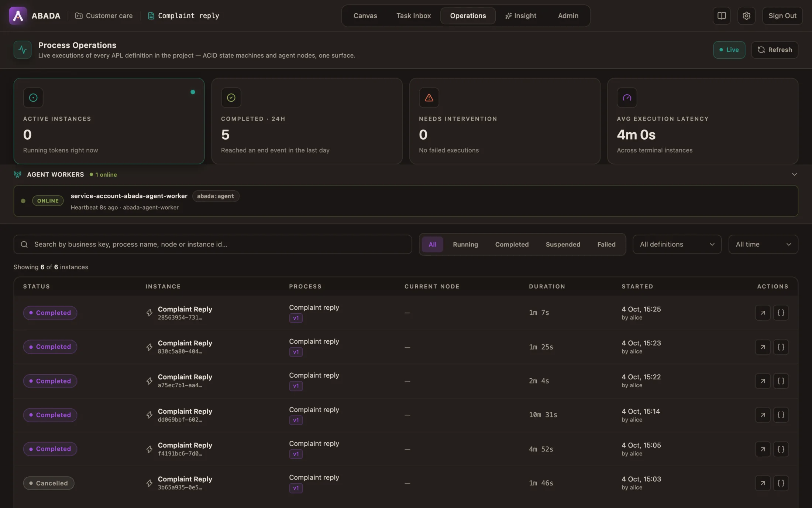
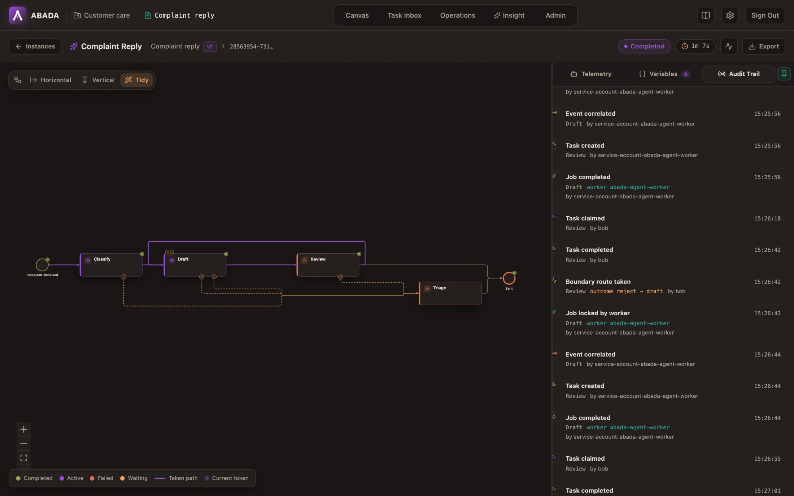

import { Aside } from '@astrojs/starlight/components';

Everything a running process does is stored in PostgreSQL first and shown in
Studio second. This page is the operator's guide: where to look, what each
state means, and how to unblock an instance.

## The Operations view

**Operations** lists every instance of the open project. The counters show
what is running, what finished in the last day and what **needs
intervention** (failed instances plus open [incidents](#incidents)); the
worker strip shows each agent worker and its last heartbeat, and the
**Incidents** strip lists the open incidents.



Filter by status (*Running*, *Completed*, *Suspended*, *Failed*), definition or
time range, or search by instance id, process or node.

| Worker state | Meaning |
| --- | --- |
| Online | The worker polled recently |
| Error | Its last fetch was rejected (identity, permission or configuration) |
| Offline | No recent heartbeat |

## One instance

Open an instance to see the path it took on the canvas and three tabs:

- **Telemetry** — for the selected step: its configuration and, for an agent,
  each attempt: model and provider, attempt number, latency, confidence
  against the threshold, the output contract result, token counts, prompt
  hash and worker. When a fallback model answered, **Fallback for** names the
  model it replaced.
- **Variables** — the current process variables.
- **Audit Trail** — every event in order, with its actor: process started,
  jobs locked and completed by workers, tasks claimed and completed, and the
  route a step took (`outcome reject → draft`, `timeout → triage`). Click an
  event for its details.



The engine stores attempt metadata only — never prompts, model responses or
provider keys.

## Instance actions

| Action | In Studio | Effect |
| --- | --- | --- |
| Suspend / Resume | Instance header | A suspended instance accepts no completion; late worker reports are rejected and retried after resume |
| Cancel | Instance header | Ends the instance and retires all its open work (tasks, jobs, timers) in one transaction |
| Retry a failed job | Failed step in the inspector | Gives the job one more attempt and resolves its `WORK_FAILED` incident |
| Retry an incident | **Incidents** strip (Operations or the instance) | Restarts the stopped step; see [Incidents](#incidents) |

The same actions exist under `/api/v1/projects/{projectId}/instances/{instanceId}`
(`DELETE` to cancel, `PUT …/suspension`) and
`/api/v1/projects/{projectId}/jobs/{jobId}/retries`.

## Incidents

An incident stops one path of an instance until someone acts. The rest of the
instance — other branches, timers — keeps going.

| Incident | Cause | Fix |
| --- | --- | --- |
| `WORK_FAILED` | A step's last attempt failed and the step has no `on_error` | Fix the cause (provider key, quota, worker), then retry |
| `LOOP_EXHAUSTED` | A loop reached `max_iterations` and has no `on_exhausted` | Retry (the step starts a fresh pass) or cancel |
| `MISSING_CORRELATION_KEY` | A message wait has no `correlationKey` value | Set the variable, then retry |
| `TOOL_OUTCOME_UNKNOWN` | An agent write was interrupted and its tool server takes no idempotency key, so it may or may not have happened | Check the target system, then confirm: **It happened** or **It did not happen**. The agent resumes with that fact; the write is never re-sent blindly |

### In Studio

The **Incidents** strip in Operations lists the open incidents of the project,
newest first: kind, step, instance, when it opened and the engine's message.
An instance's page shows the same strip with only its own incidents, and only
while it has one.

**Retry** restarts the step: failed work is reopened with a fresh attempt
budget, an exhausted loop starts a fresh pass, a message wait is armed again.
The incident leaves the list once the engine has resolved it; if the engine
refuses the retry, its reason is shown on the incident.

Retry is an Operator or Owner action on the project. Other members see the
incidents without the actions; the engine enforces the same rule on the API.

### Through the API

List and retry them through the project API:

```bash
# Open incidents of a project
curl "$ABADA_URL/api/v1/projects/$PROJECT_ID/incidents" -H "Authorization: Bearer $TOKEN"

# Retry one
curl -X POST "$ABADA_URL/api/v1/projects/$PROJECT_ID/incidents/$INCIDENT_ID/retry" \
  -H "Authorization: Bearer $TOKEN"
```

A `TOOL_OUTCOME_UNKNOWN` incident needs the confirmed outcome in the body:

```bash
curl -X POST "$ABADA_URL/api/v1/projects/$PROJECT_ID/incidents/$INCIDENT_ID/retry" \
  -H "Authorization: Bearer $TOKEN" -H "Content-Type: application/json" \
  -d '{"toolOutcome":"NOT_PERFORMED"}'
```

### Retry an agent step on another model

When a provider is down or out of quota, an operator can retry a failed agent
step on another allowed model, for that task only; the deployed definition is
unchanged. The reason is required and recorded with the old and new model and
the operator in the history (`INCIDENT_RETRIED`).

In Studio, a `WORK_FAILED` incident on an agent step offers **Retry on another
model**: pick a model from the engine's allow-list (the step's current model
is left out), give the reason, and confirm. The option is not offered for
other incidents or steps, which the engine would reject.

Through the API:

```bash
curl -X POST "$ABADA_URL/api/v1/projects/$PROJECT_ID/incidents/$INCIDENT_ID/retry" \
  -H "Authorization: Bearer $TOKEN" -H "Content-Type: application/json" \
  -d '{"model": "gemini-3.7-flash", "reason": "provider quota exhausted"}'
```

Only project Operators and Owners may retry.

## Waiting is not failing

Some states look stuck but are working as designed:

| You see | What it means |
| --- | --- |
| An agent step stays active, no attempt yet | No worker is online, or no AI provider serves the model. Nothing is lost; the step runs when a worker can take it |
| `EXTERNAL_TASK_DEFERRED` in the history | Every model of the step is rate-limited or unavailable. The attempt waits and retries without using up `max_attempts`; `on_timeout` bounds the wait |
| A human task marked as escalated | It passed its `sla_hours`; the `escalate_to` groups can claim it too. It is still open |
| Two attempts on one agent step | A worker died or lost its lease; another worker took the task. The engine advanced the process once |

<Aside type="note" title="Restarts are safe">
  Instances, tasks, jobs, timers and loop counters live in PostgreSQL. Restart
  or replace an engine at any time: every instance continues where it stopped.
</Aside>

## Related

- [Loops, routes and review decisions](/user/process-patterns/) — where each
  route comes from.
- [Agent nodes and the Agent Worker](/user/agent-worker/) — providers, models
  and worker configuration.
- [Troubleshooting](/user/troubleshooting/) — platform-level problems.
