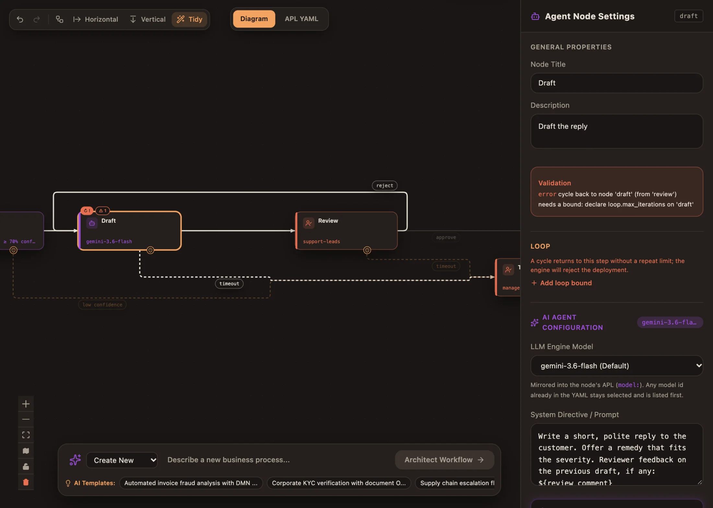
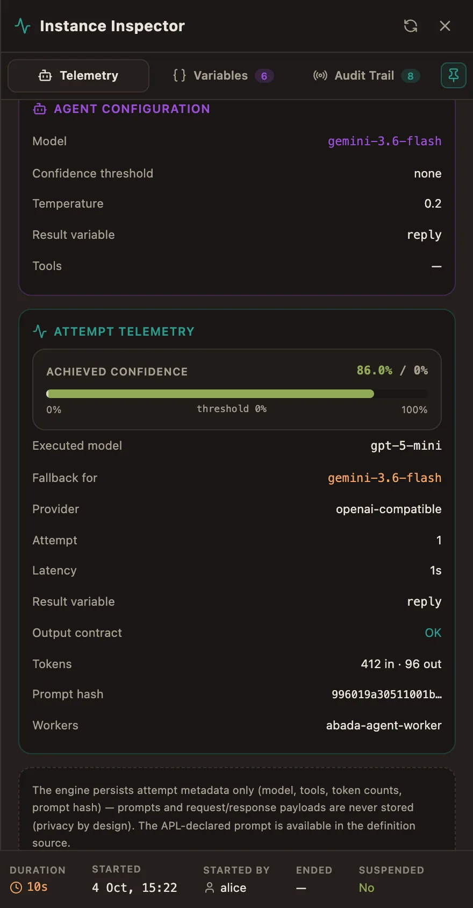
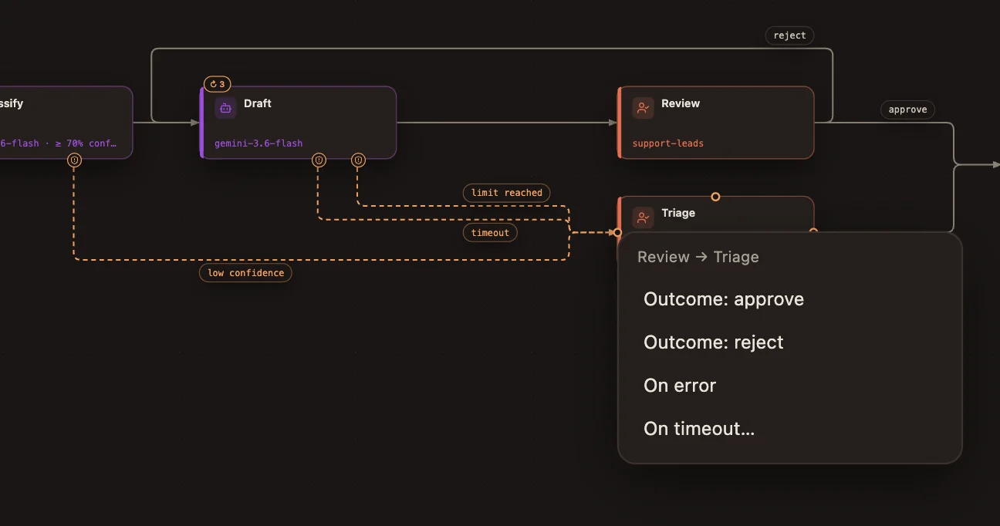
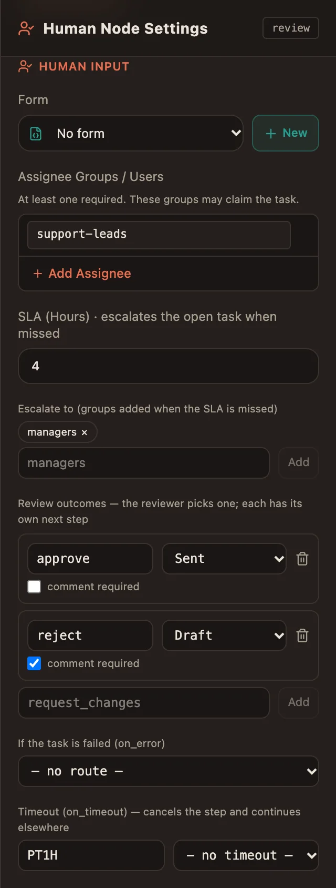

import { Aside } from '@astrojs/starlight/components';

Real processes go back, wait, fail and ask people to decide. This page shows
each of these shapes in APL, what the engine guarantees, and how to edit it in
Studio. The [tutorial](/user/first-workflow/) uses all of them in one process.

| You want to… | Use |
| --- | --- |
| Redo a step after a rejection, but not forever | [`loop`](#repeat-a-step-with-a-limit) |
| Let a reviewer choose what happens next, with a reason | [`outcomes`](#review-decisions) |
| Send weak or malformed AI answers to a person | [`on_low_confidence`, `on_invalid_output`](#weak-or-malformed-ai-answers) |
| Handle a failed step | [`on_error`](#errors) |
| Stop a step that takes too long | [`on_timeout`](#timeouts) |
| Escalate a human task that is late, without cancelling it | [`sla_hours`, `escalate_to`](#service-levels) |
| Survive a rate-limited or unavailable model | [`fallback_models`](#fallback-models) |

## Repeat a step with a limit

A process may go back to an earlier step as long as that step says how many
times it may run:

```yaml
- id: draft
  type: agent
  loop: { max_iterations: 3, on_exhausted: triage }
  next: review
```

- The engine counts the passes in `draft_iteration` (1, 2, 3…), which a prompt
  or a condition can read.
- After the third pass, the next arrival continues at `on_exhausted`. Without
  `on_exhausted`, the instance stops at `draft` with a `LOOP_EXHAUSTED`
  incident that an operator resolves (see [Operate running
  processes](/user/operations/#incidents)).
- A cycle whose target declares no `loop` is **refused at deployment**. A cycle
  cannot return to the start node, a parallel or an inclusive gateway.
- Each parallel branch counts its own passes.

In Studio, a loop step shows `↻ 3`. A cycle without a usable limit turns the
step red (`↻ !`) with the engine's message and an **Add loop bound** button in
the inspector:



## Review decisions

A human step can ask for a decision instead of a plain "done". Each outcome
says where the process goes and whether the reviewer must explain it:

```yaml
- id: review
  type: human-input
  assignees: [support-leads]
  outcomes:
    approve: { next: sent }
    reject: { next: draft, comment: required }
```

- Two to six outcomes, named in lowercase (`approve`, `request_changes`; up to 32 characters). A step with
  outcomes has no `next`.
- The reviewer sees one button per outcome and a comment box in the Task
  Inbox. The engine refuses an unknown outcome or a missing required comment —
  the UI is a convenience, not the guard.
- The decision is stored in `review_outcome` and the comment in
  `review_comment`, so the next step can use them. Here the agent reads
  `${review_comment}` and rewrites its draft.
- History records the outcome and the comment length, never the comment text.
- Clients decide with `POST /api/v1/projects/{projectId}/tasks/{taskId}/decision`
  and a body `{"outcome": "reject", "comment": "…"}`; a plain *complete* is
  refused on a step that declares outcomes.

In BPMN, the same decision is a user task with `abada:outcomes` (see [BPMN
import and compatibility](/compatibility/bpmn/)).

## Weak or malformed AI answers

The engine checks every agent result before it touches the process:

```yaml
- id: classify
  type: agent
  output_schema:
    type: object
    required: [category, severity]
  confidence_threshold: 70
  on_low_confidence: triage    # _confidence missing or below 70
  on_invalid_output: triage    # result does not match output_schema
```

Without these routes, a rejected result counts as a failed attempt and is
retried; the last failure follows `on_error` or opens an incident.

## Errors

`on_error` is taken when a worker reports an error, or when the last attempt
of a step fails. A list routes specific error codes first:

```yaml
- id: sync-crm
  type: engine-task
  service: crm-sync
  on_error:
    - { code: CUSTOMER_UNKNOWN, then: create-customer }
    - { then: manual-fix }     # any other error
```

Without `on_error`, a step that fails for good stops the instance with a
`WORK_FAILED` incident. Agent, engine-task and human steps all accept
`on_error`.

## Timeouts

`on_timeout` stops a step after an ISO-8601 duration (`PT30M`, `PT2H`, `P2D`;
from one second to 365 days), cancels its work and continues at `then`:

```yaml
on_timeout: { after: P2D, then: triage }
```

The clock covers retries and rate-limit waits. Agent, engine-task and human
steps accept it.

## Service levels

`sla_hours` is a promise, not a deadline. When it passes, the task **stays
open**, the `escalate_to` groups can claim it too, and a `TASK_SLA_BREACHED`
event is sent:

```yaml
- id: review
  type: human-input
  assignees: [support-leads]
  sla_hours: 4
  escalate_to: [managers]
```

Combine it with `on_timeout` when the task must also end at some point.

## Fallback models

```yaml
- id: draft
  type: agent
  model: gemini-3.6-flash
  fallback_models: [gpt-5-mini]
```

The worker tries the next model only when the one before is **unavailable** —
rate limit (HTTP 429), quota, timeout, 5xx or unreachable — never because of
its answer. Every model must be on the engine's allow-list. When none can run,
the attempt waits (the provider's `Retry-After`, then a growing delay capped at
15 minutes) and retries **without using up `max_attempts`**.

The attempt telemetry shows the model that answered and the one it replaced:



## Edit routes in Studio

Everything above can be built on the canvas; the APL stays the source of truth.

- **Draw a connection** from a task: a menu asks what it means and offers only
  the routes that step supports — *Next step*, *On error* (optionally for one
  code), *On timeout…* (with its duration), *Low confidence* and *Invalid
  output* for agents, each review *Outcome*, and *Loop limit reached* on a
  loop step. A new *Next step* replaces the old one.

  

- **Delete a route**: click the edge and press <kbd>Delete</kbd>. The route it
  stands for is removed from the APL. Deleting a step removes every route that
  pointed at it.
- **The inspector** edits the same routes: error routes by code, the timeout,
  fallback models, escalation groups, outcomes (name, target, comment
  required) and the repeat limit.

  

- **Badges**: `↻ 3` on a loop step, red `↻ !` on an unbounded cycle, `⚠ n` for
  engine validation issues about the step (listed in the inspector).
- Each edit is one undo step (<kbd>⌘Z</kbd> / <kbd>Ctrl+Z</kbd>).

<Aside type="note" title="The contract">
  Every field, its limits and its BPMN equivalent are in the repository's
  [APL specification](https://github.com/bashizip/abada-platform/blob/dev/docs/reference/apl-specification.md),
  [node reference](https://github.com/bashizip/abada-platform/blob/dev/docs/reference/apl-node-reference.md)
  and [runtime semantics](https://github.com/bashizip/abada-platform/blob/dev/docs/reference/runtime-semantics.md).
</Aside>
