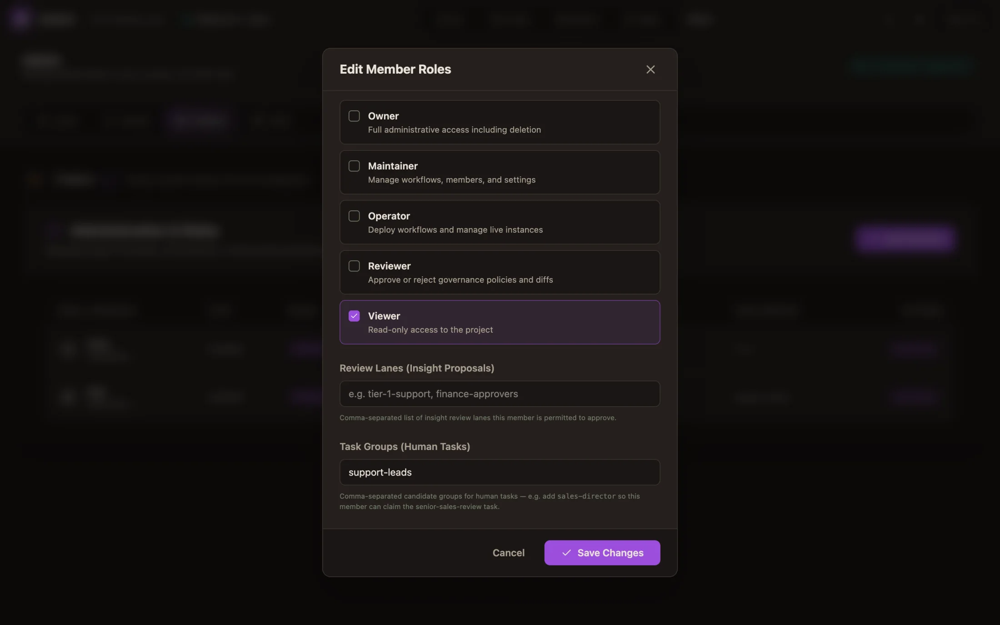
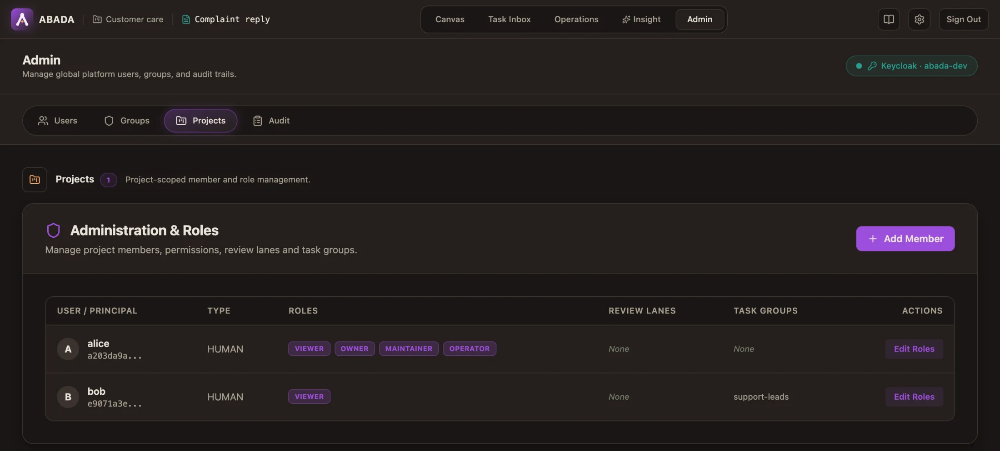

import { Aside, Steps } from '@astrojs/starlight/components';

Access in Abada has two layers:

- **Platform groups** in the identity provider (Keycloak) say what a person
  may do at all: deploy, start processes, work on tasks, operate.
- **Project membership** says where: each project lists its members, their
  project roles, and the task groups they hold in that project.

The Studio **Admin** tab manages both. It talks to the engine
(`/api/v1/admin/**`), which talks to Keycloak, so you do not need the Keycloak
console.

<Aside type="tip" title="Who sees the Admin tab">
  Members of the `abada-admin` group. The tab also needs the engine's
  Keycloak admin client (`ABADA_KEYCLOAK_*`); the development and server
  profiles configure it.
</Aside>

## Platform groups

| Group | Lets a person… |
| --- | --- |
| `abada-task-user` | See and work on human tasks |
| `abada-process-controller` | Start processes, correlate messages and signals |
| `abada-deployer` | Deploy process versions |
| `abada-operator` | Read and act on instances, variables, history, incidents and retries |
| `abada-project-creator` | Create projects |
| `abada-insight-reviewer` | Review Insight proposals |
| `abada-evidence-reader` | Read agent evidence payloads (prompts, tool arguments and results, as the project's evidence policy kept them) in projects they belong to. Every read is recorded |
| `abada-admin` | Everything, including the Admin tab, **except** reading agent evidence payloads, which needs `abada-evidence-reader` |

`abada-worker` is for **service accounts** of external workers (such as the
Agent Worker), not for people. Business groups such as `managers` grant no
engine permission by themselves; they matter as task candidates.

## Add a user

<Steps>

1. Open **Admin → Users → New User**.

2. Enter a username, and optionally an email, a name and an initial password.

3. Add the platform groups the person needs — usually `abada-task-user`, plus
   `abada-process-controller` and `abada-deployer` for people who build and
   run processes.

4. Ask the person to sign in to Studio once. Until then the engine does not
   know them and they cannot be added to a project.

</Steps>

## Give someone access to a project

Open the project in Studio, then **Admin → Projects → Add Member**, pick the
person and set:

- **Roles** — Owner, Maintainer, Operator, Reviewer, Viewer. Project creators
  get every role except Reviewer, so that nobody approves their own Insight
  proposals.
- **Review lanes** — the Insight review lanes the member may approve, such as
  `TECHNICAL` or `COMPLIANCE`.
- **Task groups** — candidate groups the member holds **in this project
  only**. A task assigned to `support-leads` can be claimed by members with
  that task group, even if the identity provider has no such group.

Changes apply on the member's next request; group changes in Keycloak apply
when their token refreshes (within about five minutes).

Project owners can do the same through
`PUT /api/v1/projects/{projectId}/members/{principalId}` with `roles`,
`reviewLanes` and `taskGroups`.

## Limitations

- No bulk import (CSV or SCIM) in the UI; script `POST /api/v1/admin/users`.
- The **Audit** sub-tab is a placeholder. Admin changes are recorded on the
  server with the caller, action, target and trace ID.

## Reference

- API: `docs/reference/api-v1.md` (Platform administration, Projects)
- Operations: `docs/operations/studio-administration.md` — Keycloak admin
  client setup, environment variables, failure modes
- Security model: `docs/reference/security-and-rbac.md`
