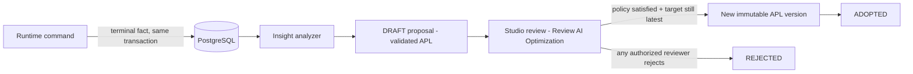

import { Aside, Steps } from '@astrojs/starlight/components';

The Studio **Insight** tab is the human review step of the self-optimizing
loop. The Insight Engine observes terminal execution facts in PostgreSQL,
derives findings, and produces **validated native-APL proposals** that reach
production only through explicit, policy-compliant human approval — there is
**no auto-apply mode**.

<Aside type="note" title="1.1 agentic track — on dev">
  The Insight loop is implemented in the working tree (ADR-003). It is
  disabled by default in engine configuration and never changes a running
  process instance. Production-scale evidence and infrastructure
  certification remain open on the 1.1 RC roadmap.
</Aside>

## How a proposal is born

1. Each terminal node visit writes one **idempotent fact** in the same
   transaction as the runtime command — identifiers, status, timing and
   decision metadata only; never variables or PII.
2. The analyzer acquires a durable singleton lease and consumes bounded,
   non-overlapping observation windows. Latency baselines always come from
   facts strictly before the current window.
3. Signals include external-task failure rate after `min-attempts`,
   external-task p95 latency against the pre-window baseline, and
   decision-table fallback ratio.
4. A generator drafts a change — an optional OpenAI-compatible model call
   made **outside** database transactions — and the candidate is discarded
   unless `AplParser` accepts it and its process key matches the target. A
   rule-based fallback preserves executable semantics when no model is
   configured.
5. At most one open (`DRAFT`/`IN_REVIEW`) proposal exists per deployment. The
   target deployment, version and checksum are snapshotted onto the proposal.

## Review a proposal

Open **Review AI Optimization** from the instance or audit surfaces. Loading,
empty and error outcomes stay in this surface; they never redirect elsewhere.

<Steps>

1. Pick a proposal card (status chips follow the lifecycle: `DRAFT`,
   `IN_REVIEW`, `ADOPTED`, `REJECTED`, or `SUPERSEDED` for stale targets).
   The proposal shows the project, the targeted workflow and the rationale.

2. Read the **AI diff**: a read-only graph diff (added nodes in green,
   modified paths in amber, removed paths in red, with `# OPTIMIZATION`
   annotations per node) plus a base/proposed APL YAML diff. The live canvas
   stays untouched while a proposal is open.

3. Check the `expectedUpdatedAt` optimistic-locking handle. If a newer
   proposal lands while you read, review actions disable until you refresh.

4. **Approve** or **Reject**. Rejection requires a non-empty comment; the
   decision is durable and terminal for that proposal.

</Steps>

When the approval policy is satisfied and the target deployment/checksum is
still the latest, approving **deploys the proposed APL as a new immutable
version** through the normal engine command. A target that changed meanwhile
becomes `SUPERSEDED` — approval never mutates an existing version. There is no
manual "apply" step; approval is the commit boundary.

## Governance policies

Policies are keyed per definition and snapshotted onto new proposals. The
default is one approval from `abada-insight-reviewer`. A policy names distinct
reviewer groups and requires one approval per group:

- `PARALLEL` — groups may approve in any order;
- `SEQUENTIAL` — groups approve in the declared order.

One actor can review a proposal once. Review lanes such as `TECHNICAL` and
`COMPLIANCE` are separate from project roles: a reviewer must hold the
project `REVIEWER` role **and** the lane named by the policy. Project creators
are deliberately not granted `REVIEWER`, and global administration cannot
manufacture an approval-lane vote.

## Authorization

| Operation | Authority |
| --- | --- |
| Read configurations, policies and proposals | `insight:read` — Insight Reviewer, Operator or Admin |
| Approve or reject | `insight:review` — Insight Reviewer or Admin |
| Update policies | `insight:configure` — Admin |

Endpoints live under `/api/v1/insight`; reviews carry `expectedUpdatedAt`
(stale requests return a typed `409`), and policies use `expectedVersion`.

## Configuration

Insight is disabled by default. Key settings: `ABADA_INSIGHT_ENABLED`,
`ABADA_LLM_BASE_URL`, `ABADA_LLM_API_KEY` and `ABADA_LLM_MODEL` (the LLM
connection is shared with Studio APL authoring; the flag controls only the
scheduled Insight worker). Thresholds and scheduling live under
`abada.insight.*`. On the development profile, four LOW runs of the AI Lead
Triage starter generate the first evidence; proposals are never approved
automatically.

## Limitations

- A dedicated audit UI for proposal decisions is deferred; decisions are
  recorded server-side with actor, status, comment and deployment result.
- Visual diff is implemented for graph + YAML; animated overlay review is
  deferred.
- OpenTelemetry remains optional diagnostics — it is **not** the Insight
  cursor and cannot authorize a proposal.

## Reference

- Loop contract: `docs/reference/insight-loop.md` and
  [ADR-003](https://github.com/bashizip/abada-platform/blob/dev/docs/adr/ADR-003-insight-loop-engine-otel-apl.md)
- Architecture: [The Insight Engine](/architecture/insight/)
- API: `docs/reference/api-v1.md` and the generated OpenAPI
- Studio feature source: `studio/src/features/insight/InsightPanel.tsx`