import { Aside, Badge, LinkCard } from '@astrojs/starlight/components';

<Badge text="New in 1.1.0-rc.2" variant="tip" />

In this tutorial an agent handles refund requests. It looks the order up with a
**read** tool and, when the order arrived damaged, proposes a **refund** — a
write that moves money, so a person in finance approves the exact call first.
Then the payments service crashes in the middle of the refund, and you see the
engine refuse to pay twice.

| You will see | Where |
| --- | --- |
| A tool server with read and approval-required tools | [Step 3](#3-add-the-payments-tool-server) |
| Tools, limits and a budget on the agent | [Steps 5–6](#5-read-the-agents-tools-and-limits) |
| Every model and tool call, live, with its cost | [Step 7](#7-deploy-and-start) |
| A person approving the exact refund | [Step 9](#9-bob-approves-the-refund) |
| A crash mid-write that is never repeated | [Steps 10–11](#10-the-writes-outcome-is-unknown) |
| The cost and who can read the payloads | [Steps 12–13](#12-read-what-it-cost) |

It takes about 20 minutes. The [Concepts](/concepts/#agents-that-act) page
explains each capability in a few lines.

**Before you start**

- You have a clone of the repository and the
  [development platform](/user/quickstart/) runs from it; you can sign in to
  Studio at `http://studio.localhost` as **alice** (`alice` / `alice`) and
  **bob** (`bob` / `bob`).
- An AI provider is set in **Studio → Settings → AI Providers**.
- You followed [Tutorial: a reviewed AI reply](/user/first-workflow/) or know
  how to create a project and paste APL.

<Aside type="note" title="About these screenshots">
  They were taken with a scripted test model (`scripts/dev/m3-demo/stub_llm.py`)
  and the stub payments server, so a real model's wording and token counts will
  differ. Steps, policies, approvals, incidents and history are what you will
  see.
</Aside>

## 1. Start the payments stub

The demo kit runs a small `payments` MCP server next to the agent worker, with
two tools: `get_order` reads an order, `refund` records a refund. Start the
platform with its overlay:

```bash
docker compose --env-file .env.dev -f compose.yaml -f compose.dev.yaml \
  -f scripts/dev/m3-demo/compose.demo.yaml --profile agent up -d
```

The overlay also lets the worker reach the `payments` tool server
(`ABADA_AGENT_ALLOWED_TOOLS=payments`): a worker only calls tool servers its
operator allows, whatever a process declares.

## 2. Create the project and let bob approve

As alice, create a project named `Refunds`. Then, as in
[the first tutorial](/user/first-workflow/#2-let-bob-review), add bob as a
**Viewer** with the task group `finance` (**Admin → Projects → Add Member**).
Refund approvals will be offered to `finance`.

## 3. Add the payments tool server

Tools are declared once per project, on a **tool server**. In the **Project**
panel, hover **resources**, click **New file**, choose the kind
**TOOL_SERVER (MCP)**, name it `payments.yaml` and select this file
([`examples/apl/tool-servers/payments.yaml`](https://github.com/bashizip/abada-platform/blob/dev/examples/apl/tool-servers/payments.yaml)):

```yaml
name: payments
description: Orders and refunds
transport: streamable-http
url: http://127.0.0.1:8765/mcp
tools:
  get_order: { policy: read }
  refund: { policy: approval_required, idempotency: none, approvers: [finance], approval_sla_hours: 4 }
```

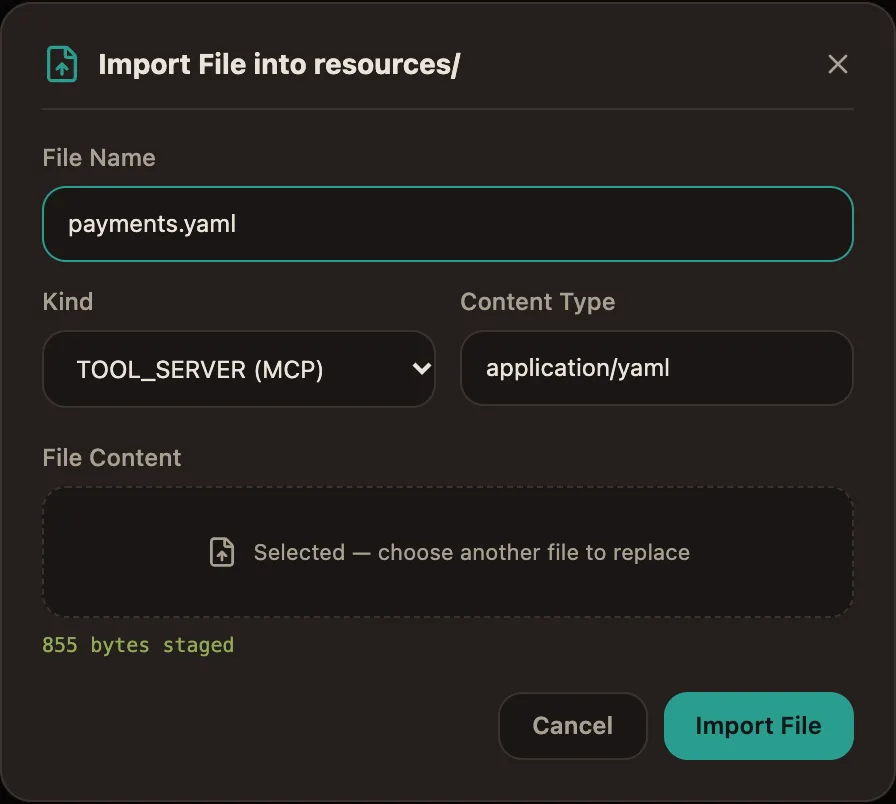

The engine validates the document on every save:

- `get_order` is a **read**: no side effects, the agent calls it freely.
- `refund` is **approval_required**: someone in `finance` approves each call,
  with its exact arguments, before it runs. A late approval (four hours) is
  marked escalated.
- `idempotency: none` says the payments service cannot deduplicate a refund.
  You will see in step 10 why that matters.

The URL is the stub on the worker's loopback; a real server must use `https`.
A project **tool credential** would carry its token — the document only names
it, never the secret.

## 4. Paste the process

Click **+** next to *Project*, choose **Paste APL**, paste
[`examples/apl/refund-agent.apl.yaml`](https://github.com/bashizip/abada-platform/blob/dev/examples/apl/refund-agent.apl.yaml)
and name it `refund_agent`. The agent step is the heart of it:

```yaml
- id: handle
  type: agent
  description: Check the order and refund the customer
  model: gemini-3.6-flash
  prompt: |
    A customer asks for a refund. Look up the order with the get_order tool.
    Refund the amount paid with the refund tool only when the order was
    delivered damaged or never delivered; otherwise refund nothing.
    Answer with whether you refunded, the amount and a one-sentence reason.
  inputs:
    request: ${request}
  tools:
    - payments/get_order
    - payments/refund
  max_turns: 6
  budget_usd: 0.05
  result_variable: decision
  output_schema:
    type: object
    required: [refunded, reason]
    properties:
      refunded: { type: boolean }
      amount: { type: number }
      reason: { type: string }
  on_invalid_output: manual
  on_error: manual
  on_timeout: { after: P2D, then: manual }
  next: done
```

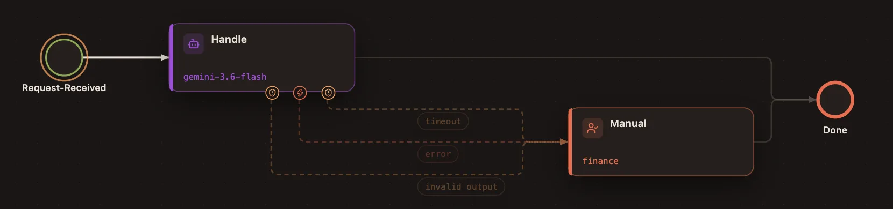

Whatever goes wrong — an invalid answer, a failure, two days without an
answer — the request reaches a person in finance instead of getting lost.

## 5. Read the agent's tools and limits

Click the **Handle** step. In the inspector, the tools come from the project's
tool servers, each with the policy its server declares:

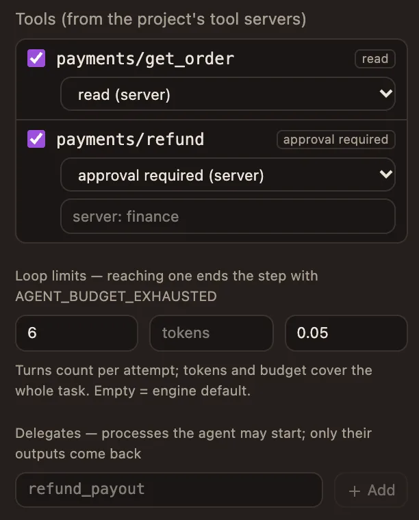

- A step can only **tighten** a policy — make a write approval-required, or
  name its own approvers — never loosen it. Deployment refuses a looser one.
- **Loop limits** bound the conversation: six model calls per attempt, and a
  budget of five cents for the whole task. Reaching a limit ends the step with
  `AGENT_BUDGET_EXHAUSTED`, which `on_error` routes to finance here.

## 6. Give the model a price

The budget is computed by the engine from token counts and the prices you set,
never reported by a worker. Open **Settings → Model Prices** and add a price
for `gemini-3.6-flash` (here 0.30 and 2.50 dollars per million input and
output tokens):

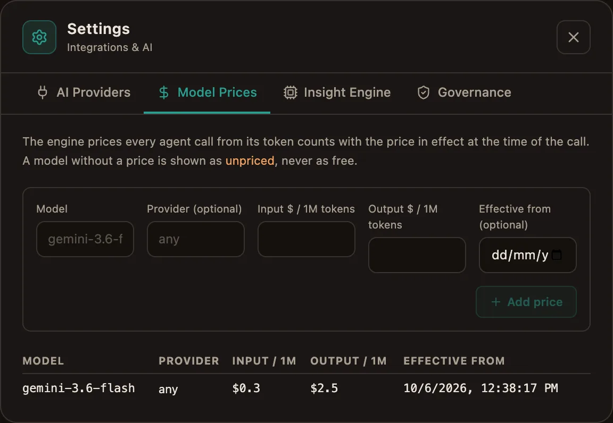

Without a price, a step with `budget_usd` fails closed: an unpriced call is
never counted as free.

## 7. Deploy and start

Click **Deploy & Start** with this payload:

```json
{
  "request": {
    "order_id": "A-1042",
    "message": "My kettle arrived broken, I want my money back."
  }
}
```

Open the instance from **Operations**. The header shows **Live**: the page
follows the project's event stream and refreshes by itself.

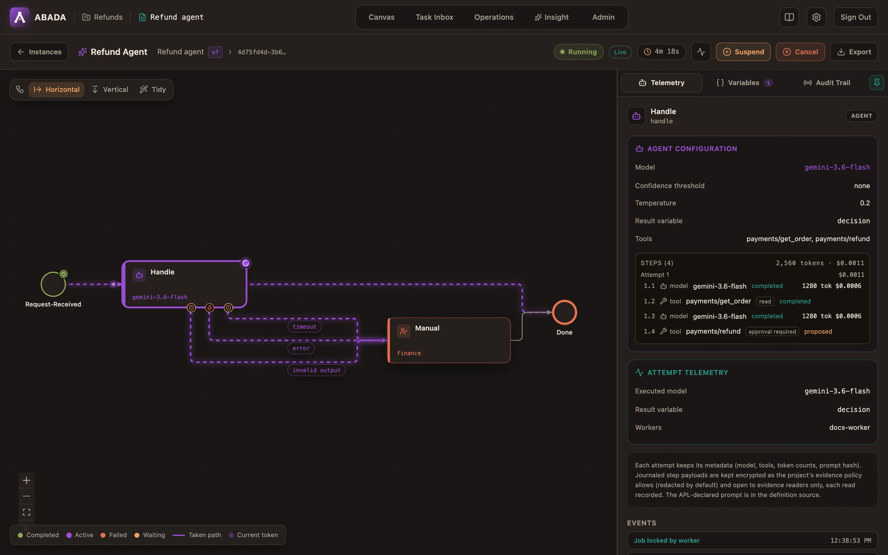

The agent's steps, in order, with their cost:

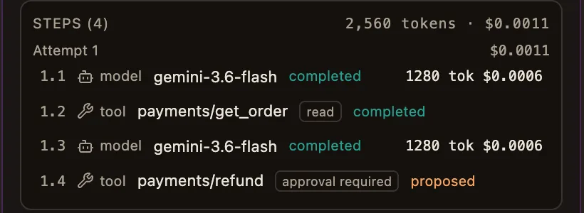

The agent read the order, saw the kettle arrived broken and proposed a refund of
the amount paid. Nothing has been paid: the work is **parked** — no worker holds
it, nothing is spent — until a person decides.

## 8. Make the payments server crash

Before bob approves, arm the stub's crash: the next refund will take effect,
then the server fails before answering, as a server crashing mid-write would.

```bash
docker compose --env-file .env.dev -f compose.yaml -f compose.dev.yaml \
  -f scripts/dev/m3-demo/compose.demo.yaml --profile agent \
  exec payments-mcp touch /tmp/payments-crash-next-refund
```

## 9. Bob approves the refund

Sign in as **bob** and open the **Task Inbox**: the approval is offered to
`finance`. It shows the exact call the agent proposed:

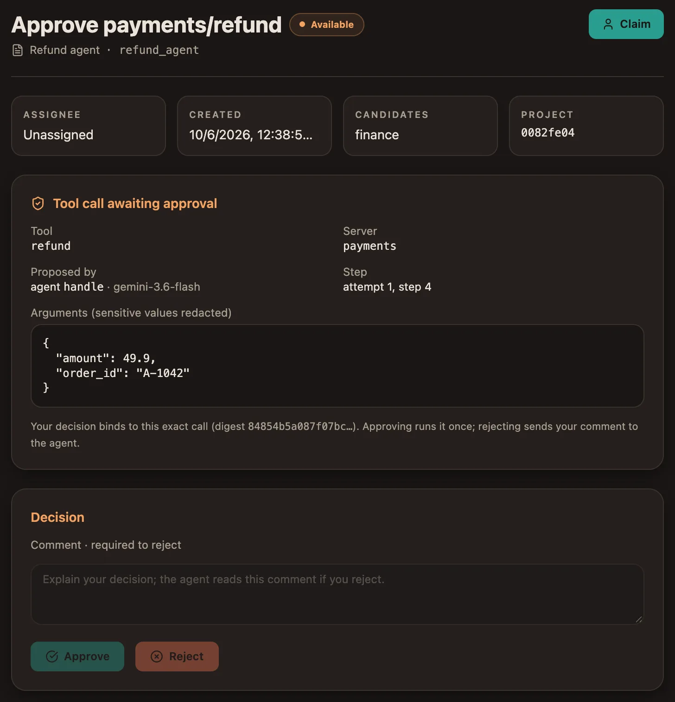

Claim it and click **Approve**. The decision binds to this exact call: the
worker may run `refund` once, with these arguments and no others. A rejection
would need a comment, which the agent reads before it continues.

Only a person in the approver groups can decide. A worker credential never can,
and a project role is not enough.

## 10. The write's outcome is unknown

The worker runs the approved refund. The payments service applies it — and
crashes before answering. A few seconds later, as alice, open **Operations**:

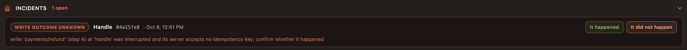

The refund was journaled **before** it ran, so the engine knows it started and
never finished. The payments service takes no idempotency key, so sending it
again could pay the customer twice: the engine never hands that work out again.
The step is `OUTCOME_UNKNOWN`, the approval is kept with it, and the process
waits for a person.

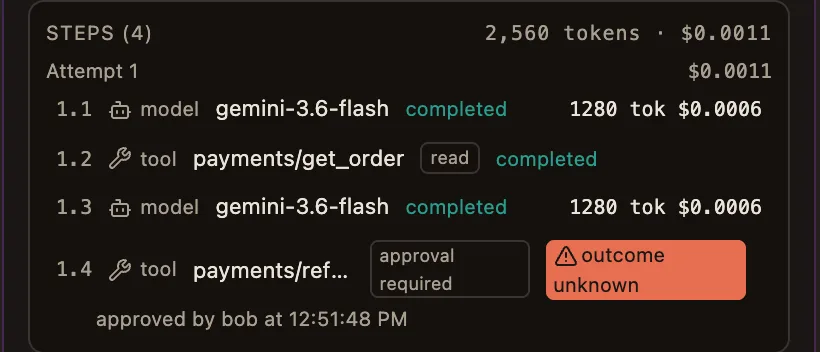

<Aside type="tip" title="With an idempotency key">
  When a tool server declares `idempotency: key`, the engine gives every write
  a key that stays the same across crashes and leases. The worker re-sends the
  write with the same key, and the server applies it once — no incident.
</Aside>

## 11. Check, then confirm

Check what really happened in the payments system. Here, the stub lists its
refunds:

```bash
docker compose --env-file .env.dev -f compose.yaml -f compose.dev.yaml \
  -f scripts/dev/m3-demo/compose.demo.yaml --profile agent \
  exec payments-mcp wget -qO- http://127.0.0.1:8765/refunds
```

```json
[{"refund_id": "R-0001", "order_id": "A-1042", "amount": 49.9, "at": "…"}]
```

The refund happened, so click **It happened**. The agent resumes the same
attempt from its journal and reads that the refund was performed: it does not
call the tool again, it answers.

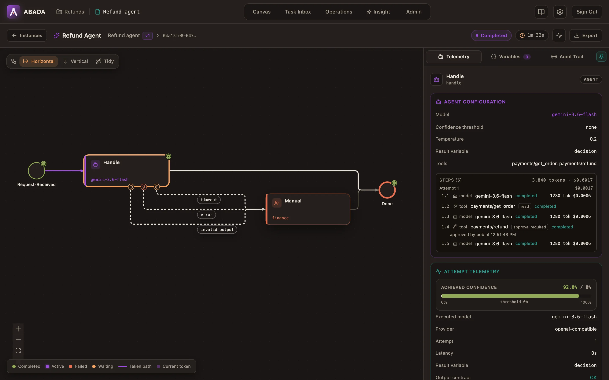

Had you clicked **It did not happen**, the agent would have read that, and
could propose the refund again — through a new approval.

## 12. Read what it cost

The step inspector shows the whole conversation and what it cost:

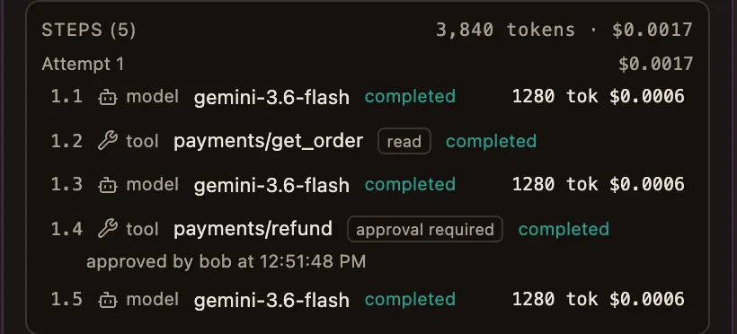

- Bob's approval stays on the refund step; who confirmed the crash outcome is
  recorded with the incident in the **Audit Trail**.
- Each model call is priced with the price in effect when it ran; the
  inspector totals the task (here 0.0017 dollars for 3,840 tokens).

The agent's answer passed the output contract and is in **Variables**:

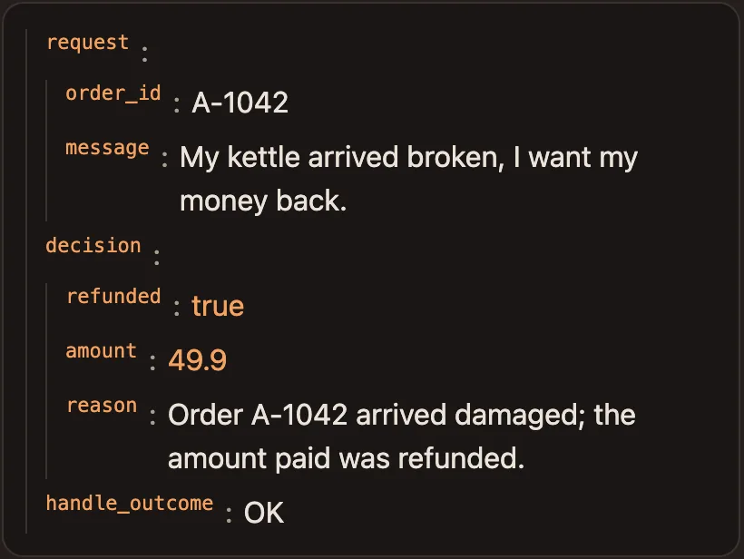

## 13. Payloads need a role

Click a step to read its payloads — the prompt, the model's reply, the tool's
arguments and result:

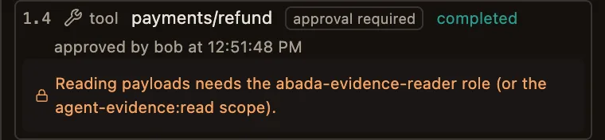

Alice administers the platform, but administration does not imply reading
evidence. Payloads are kept as the project's evidence policy allows (redacted
by default, 30 days), encrypted, and readable only by members with the
`abada-evidence-reader` role; every read is recorded.

## What you built

- An agent that **acts** through a governed tool server: it reads freely,
  and every refund waits for a person in finance.
- A write that survived a **crash** without being repeated, with a person
  confirming what happened.
- **Bounded** turns and spend, priced by the engine, with every step, its cost
  and its approver on the instance page.

## Next steps

<LinkCard title="Use cases" href="/user/use-cases/" description="Support triage: a routing agent that delegates a fraud check to a governed child process." />
<LinkCard title="Approving an agent's tool call" href="/user/process-patterns/#approving-an-agents-tool-call" description="Approvers on the node, rejections with comments and approval SLAs." />
<LinkCard title="Agent Worker execution" href="/architecture/agent-worker/" description="The tool loop, the step journal and the waiting states." />
