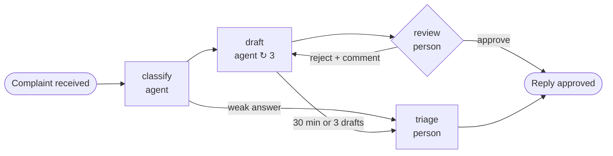
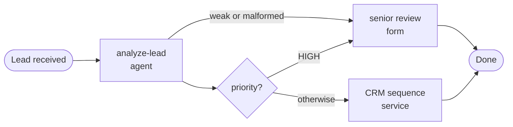
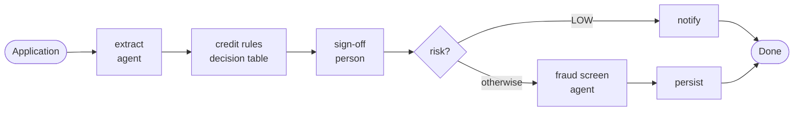
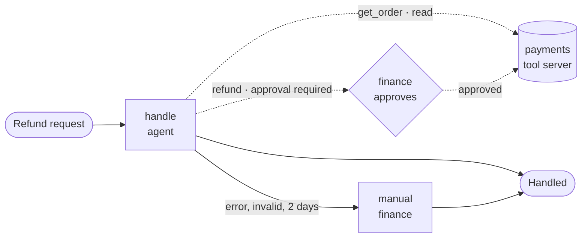
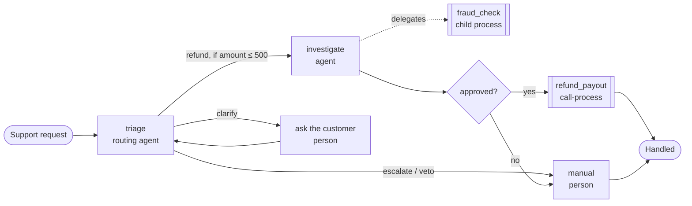

import { Aside, Badge, LinkCard } from '@astrojs/starlight/components';

Each use case below is a complete APL document in
[`examples/apl/`](https://github.com/bashizip/abada-platform/tree/dev/examples/apl).
A test deploys every one of them into a project and starts it on PostgreSQL
(`ExampleGalleryTest`), so the files on this page always run.

To try one, open Studio, click **+** next to *Project*, choose **Paste APL**,
paste the file and use **Deploy & Start**. The [Concepts](/concepts/) page
explains each capability the cases use.

| Use case | Agents | Rules | People | Shows |
| --- | --- | --- | --- | --- |
| [Complaint reply](#complaint-reply) | classify, draft | confidence routes | review with comment | rework loop, timeout, fallback model, SLA |
| [Lead triage](#lead-triage) | classify | priority condition | senior review form | weak answers go to a person |
| [KYC onboarding](#kyc-onboarding) | extract, screen | decision table | sign-off | deterministic law after AI advice |
| [Refund agent](#refund-agent) | acts with tools | limits, budget | approves the write | tools, approval, crash safety, cost |
| [Support triage](#support-triage) | routes, investigates | route veto, payout rule | fraud review | routing agent, delegation, call-process |

## Complaint reply

**The problem.** Customer complaints need a fast, polite answer, but nothing
should reach a customer without a person's approval.

- **Agents advise.** One agent classifies the complaint; a second drafts the
  reply, falling back to another model when the first is rate-limited.
- **People decide.** A support lead approves the draft or rejects it **with a
  comment**, which the drafting agent reads on its next attempt. The review is
  escalated to managers after four hours.
- **Bounded.** At most three drafts, and thirty minutes for drafting, before a
  manager takes over.

File: [`complaint-reply.apl.yaml`](https://github.com/bashizip/abada-platform/blob/dev/examples/apl/complaint-reply.apl.yaml) ·
Built step by step in [Tutorial: a reviewed AI reply](/user/first-workflow/).

## Lead triage

**The problem.** Sales leads arrive faster than a team can read them; the
important ones must reach a senior seller with the context they need.

- **Agents advise, rules decide.** The agent classifies the lead's priority
  against a schema with an 85% confidence threshold; a condition routes on the
  result.
- **People decide.** High-priority leads, and any answer the engine rejects,
  go to a senior sales review with a form.

File: [`lead-triage-demo.apl.yaml`](https://github.com/bashizip/abada-platform/blob/dev/examples/apl/lead-triage-demo.apl.yaml)

## KYC onboarding

**The problem.** A credit application needs data extracted from documents, a
risk classification that auditors can reproduce, and a human sign-off.

- **Rules decide.** A native decision table classifies the risk inside the
  transaction, with a mandatory `otherwise` rule: no input falls through
  silently. Every application is recorded as `DECISION_TABLE_APPLIED`.
- **People decide.** A senior credit officer signs off within a 24-hour SLA.

File: [`kyc-onboarding.apl.yaml`](https://github.com/bashizip/abada-platform/blob/dev/examples/apl/kyc-onboarding.apl.yaml) ·
the canonical example of the APL specification.

## Refund agent

<Badge text="1.1.0-rc.2 · on dev" variant="caution" />

**The problem.** Refund requests are repetitive, but a refund moves money: an
agent can do the checking, and a person must approve every payment.

- **The agent acts.** It reads the order with `payments/get_order` and, when
  the order arrived damaged or was lost, proposes `payments/refund`.
- **A person approves the write.** The refund runs only after someone in
  `finance` approves the exact call, with its arguments.
- **Crash safety.** The payments service takes no idempotency key, so an
  interrupted refund is never re-sent; an incident asks a person what
  happened.
- **Bounded cost.** Six model calls per attempt and five cents per task, priced
  by the engine.

Files: [`refund-agent.apl.yaml`](https://github.com/bashizip/abada-platform/blob/dev/examples/apl/refund-agent.apl.yaml)
and the tool server
[`tool-servers/payments.yaml`](https://github.com/bashizip/abada-platform/blob/dev/examples/apl/tool-servers/payments.yaml).
A stub payments server for local runs is in
[`scripts/dev/m3-demo/`](https://github.com/bashizip/abada-platform/tree/dev/scripts/dev/m3-demo).

<LinkCard title="Tutorial: an agent that acts" href="/user/tutorial-agent-that-acts/" description="Run the refund agent end to end, including the crash, with a screenshot at every step." />

## Support triage

<Badge text="1.1.0-rc.2 · on dev" variant="caution" />

**The problem.** Support requests need routing, and refunds above a certain
risk need a fraud check that has its own reviewers and its own audit trail.

- **The agent chooses the route,** among `refund`, `clarify` and `escalate`.
  The engine refuses a refund route for an amount above 500, whatever the
  agent says, and sends the request to a person instead.
- **The agent delegates.** The investigating agent may start a `fraud_check`
  child process, which has its own agent, its own confidence threshold and its
  own fraud analysts. Only the child's `verdict` comes back.
- **Rules decide the payout.** A condition pays out only an approved
  investigation, through a `call-process` step to `refund_payout`; only
  `payout_id` comes back.
- **Lineage.** Both children appear under **Called processes** on the instance
  page, linked to the step that started them.

Files: [`support-triage.apl.yaml`](https://github.com/bashizip/abada-platform/blob/dev/examples/apl/support-triage.apl.yaml),
[`fraud-check.apl.yaml`](https://github.com/bashizip/abada-platform/blob/dev/examples/apl/fraud-check.apl.yaml) and
[`refund-payout.apl.yaml`](https://github.com/bashizip/abada-platform/blob/dev/examples/apl/refund-payout.apl.yaml).

<Aside type="note" title="Deploy the children first">
  Child versions are pinned when the parent is deployed, so deploy
  `fraud_check` and `refund_payout` before `support_triage`. The payout child
  waits for a `payments.payout` service worker, like any `engine-task`.
</Aside>
